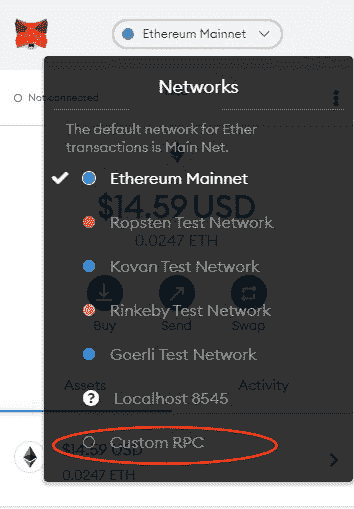
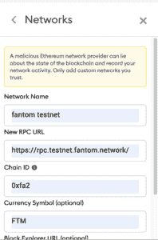

# 如何在 Fantom 区块链上构建和部署智能合约

> 原文：<https://blog.chain.link/how-to-build-and-deploy-a-smart-contract-on-the-fantom-blockchain/>

随着多链生态系统的增长，像 Fantom 这样的区块链提供高吞吐量、低交易成本和即时终结，这些对于希望在大多数第一层区块链提供的基础上实现主要可扩展性和成本效益升级的开发人员来说是至关重要的功能。Fantom 是 EVM 兼容的，所以 dApps 和现有的开发者基础设施可以很容易地移植到这个越来越流行的链上。

[Chainlink 价格馈送](https://chain.link/solutions/defi) 在 Fantom mainnet 上可用，可用于在 Fantom 上构建需要分散、防篡改数据输入的应用程序。在本技术教程中，我们将带您了解如何使用 Chainlink oracles 中的价格数据在 Fantom 区块链上构建和部署智能合约。

## 什么是 Fantom？

Fantom 是一种高吞吐量的区块链，具有低交易成本和即时终结性。由于其 EVM 兼容性，它被许多以太坊开发者用作扩展其 dApps 的一种方式。以太坊开发人员可以使用标准以太坊开发工具轻松部署他们现有的合同，同时使用更快的区块链，增加他们能够构建的 dApps 类型的多样性。

## 带风扇的建筑

在 Fantom 上构建和部署合同就像在以太坊或其他 EVM 兼容链上一样简单。第一步是选择一个开发框架，允许你在链上启动你的合同。在本教程中，我们将使用混音，但可以随意使用任何其他基于实体的工具，如 [安全帽](https://github.com/smartcontractkit/hardhat-starter-kit) ， [布朗尼](https://github.com/smartcontractkit/chainlink-mix) ，或 [松露](https://github.com/smartcontractkit/truffle-starter-kit) 。

## 建立合同

我们需要做的第一件事是为价格提要导入必要的 Chainlink 契约，即“AggregatorV3Interface.sol ”,它包含从现有的预聚合分散价格提要中检索数据的接口。要使用这个接口，我们需要知道价格提要位于哪里—这个细节可以在 [Chainlink Fantom 提要](https://docs.chain.link/docs/fantom-price-feeds/) 文档中找到。我们使用 FTM/USD 提要的地址，所以我们可以简单地初始化价格提要接口，在构造契约时将该地址作为唯一的参数，就像这样:` price feed = aggregator v3 interface(0xe 04676 B9 a9 a 2973 BCB 0d 1478 b5 E1 e 9098 BBB 7 f 3d)；`

```
// SPDX-License-Identifier: MIT
pragma solidity 0.8;

import "@chainlink/contracts/src/v0.8/interfaces/AggregatorV3Interface.sol";

contract FantomLinkFeeds {

    AggregatorV3Interface internal priceFeed;

    /**
    * Network: Fantom Testnet
    * Aggregator: FTM/USD
    * Address: 0xe04676B9A9A2973BCb0D1478b5E1E9098BBB7f3D
    * URL: https://docs.chain.link/docs/fantom-price-feeds/
    */
    constructor() {
        priceFeed = AggregatorV3Interface(0xe04676B9A9A2973BCb0D1478b5E1E9098BBB7f3D);
    }

    /**
    * Returns the latest price
    */
    function getLatestPrice() public view returns (int) {
    (
        uint80 roundID, 
        int price,
        uint startedAt,
        uint timeStamp,
        uint80 answeredInRound
    ) = priceFeed.latestRoundData();
        return price;
    }
}
```

初始化后，我们可以通过调用聚合器的函数“latestRoundData()”从聚合器接口获取最新的价格数据，如“getLatestPriceData()”所示。这返回了关于提要的多点信息，但是我们只关心价格，所以我们只返回价格。因为这个函数不修改任何东西，只是从聚合器接口读取数据，所以它被定义为一个视图函数，幸运的是它不需要 gas。

## 部署合同

部署这段代码很简单，而且由于 Fantom 的 EVM 兼容性，对标准以太坊部署路径只需做很少的修改。首先在编译器选项卡下用 Remix 编译合同——只需点击“编译 FantomLinkFeeds.sol”。然后，进入 Deploy 选项卡，将环境设置为 Injected Web3(元掩码)，并为 Fantom 的 testnet 配置元掩码。为此，只需将这些设置作为“自定义 RPC”添加到元掩码网络中。



<figcaption id="caption-attachment-2984" class="wp-caption-text">Select Custom RPC on MetaMask</figcaption>


**网络名称:** Fantom testnet

**新建 RPC 网址:**https://RPC . testnet . fantom . network/

**ChainID:** 0xfa2

**符号** : FTM



<figcaption id="caption-attachment-2985" class="wp-caption-text">Custom RPC Set Up</figcaption>


然后进入 [水龙头.风扇.网络](https://faucet.fantom.network/) 检索一些免费的 testnet FTM 用于部署您的合同。有关此设置过程的更多信息，您可以查看 [Fantom 文档](https://docs.fantom.foundation/tutorials/deploy-a-smart-contract) 。

现在合同已经完成，您的网络设置为 Fantom testnet，并且您的地址由 testnet FTM 提供资金，您只需选择“FantomLinkFeeds”合同并单击“部署”即可部署到网络。您的合同现在在 Fantom testnet 上生效，并准备使用 Chainlink 消费真实世界的数据。


<figcaption id="caption-attachment-2986" class="wp-caption-text">Deploying to Fantom</figcaption>


只需调用“getLatestPrice”函数，您将看到返回精确到八位小数的 FTM/USD 响应，此处的值为$2.66。

通过一个简单的导入、一个初始化 feed 的构造器和一个读取价格数据的函数，您无需支付任何费用，就可以使用 Chainlink 的行业标准价格数据来启用您的智能合同。

## 总结

对于来自以太坊生态系统的开发者来说，Fantom 是一个有吸引力的前景，因为它结合了 EVM 兼容性、高速度和低成本。当与 Chainlink 分散式 oracle networks 结合使用时，Fantom 变得更加强大，开发人员可以使用离线数据和事件。Chainlink 价格馈送提供高质量的聚合价格数据，可用于各种有用的应用程序，如货币市场、算法稳定帐户、衍生品、预测市场和资产管理平台。

现在，您已经知道如何使用 Fantom 构建和部署智能合约，您可以更深入地探索该链，或者使用其他 EVM 兼容链，例如 Polygon、xDai 或其他侧链和第 2 层解决方案，它们使用我们在本教程中使用的相同工具。如果你更喜欢安全帽、核仁巧克力饼或松露巧克力饼，尝试使用 [链式启动套件](https://blog.chain.link/starter-kit-showcase/) 中的一种来启动你的开发之旅。

访问[chain . link](https://chain.link)或阅读[docs . chain . link](https://docs.chain.link)了解更多关于 Chainlink 的信息。要讨论整合，[联系专家](https://chainlinkcommunity.typeform.com/to/OYQO67EF)。