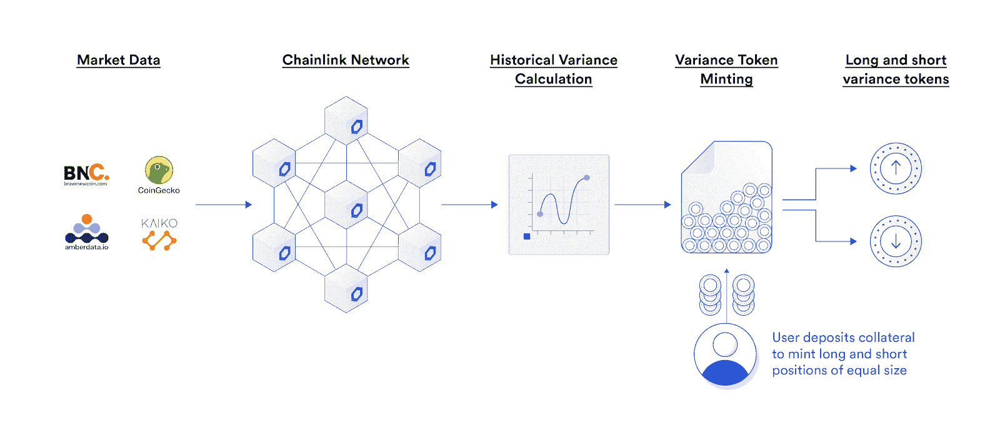
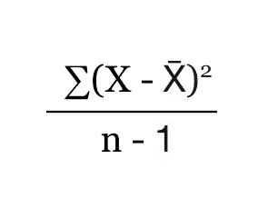

# 如何计算违约差异掉期的价格波动性

> 原文：<https://blog.chain.link/how-to-calculate-price-volatility-for-defi-variance-swaps/>

在他获奖的 Chainlink hackathon 提交材料中，智能合同开发者 Max Feldman 使用 [Chainlink Price Feeds](https://chain.link/solutions/defi) 计算方差互换 [DeFi](https://chain.link/education/defi) 产品的链上价格波动。在本教程中，Max 解释了如何从 Chainlink 价格反馈中计算波动性，并使用该数据触发[智能合约](https://chain.link/education/smart-contracts)衍生品，展示了分散式基础设施如何扩展以支持传统金融工具和应用的又一个例子。

[*由马克斯·费尔德曼*](https://github.com/MaxFeldman1)

差额互换是一种金融工具，通常在传统金融机构之间进行场外交易。这是一项在给定时间内支付或接收给定资产对的年度差异的协议。方差是波动性的度量。(这里有一个有用的[方差交换机制的视频演练](https://www.youtube.com/watch?v=SKn0zqHXZ9M)。)在 [2020 Chainlink 虚拟黑客马拉松](https://blog.chain.link/congratulations-to-the-winners-of-the-chainlink-virtual-hackathon-2020/)期间，我利用 Chainlink 价格反馈的力量建立了 Feldmex 方差掉期，这是有史以来第一个链上纯波动性产品。

与传统金融中的方差互换不同，Feldmex 方差互换要统一得多，并且适合于易于使用的 ERC20 令牌包装器。Feldmex 方差掉期可以直接从用户的以太坊钱包进行交易，而不是在柜台交易，这使得个人和公司都能够利用分散的基础设施来对冲波动风险。

## DeFi 方差交换架构

###### 铸造掉期

Feldmex 方差互换有一个最大支付上限，超过这个上限，互换不会产生更多收益。在传统金融中，这些被称为上限差异互换。支出是有上限的，因为方差的可能值没有上限，我们必须确保我们的智能合约不会支付比它们持有的更多的资金。

此外，为了防止我们的系统因无法承受的提款而承担责任，我们必须确保所有未平仓头寸都有足够的抵押品。我们可以更进一步，设计系统，使得每当用户存入等于最大支付金额的支付资产时，互换数量为 *x* ，协议铸造 *x* 数量的长期差异代币(在期末支付年度差异的代币)，以及 *x* 数量的短期差异代币(支付支付上限减去长期差异代币的支付的代币)。因此，当用户进行掉期交易时，每个头寸都有足够的担保，多头头寸的总数将等于空头头寸的总数。



<figcaption id="caption-attachment-1837" class="wp-caption-text">How the Feldmex system mints long and short variance tokens based on Chainlink oracle-supplied historical market data.</figcaption>


根据 Feldmex 团队设定的掉期交易费率，用户将被收取一定比例的费用，该比例不超过 2.55%。我们将在后面讨论这些费用的战略目的。

###### 稳健的货币互换

以下功能可在“varianceSwapHandler”合同中找到。

以下功能可在`varianceSwapHandler`合同中找到。

```
function mintVariance(address _to, uint _amount, bool _transfer) public {
    IERC20 pa = IERC20(payoutAssetAddress);
    uint _feeAdjustedCap = feeAdjustedCap;
    uint _subUnits = subUnits;
    uint _payoutAssetReserves = payoutAssetReserves;

    if (_transfer) {
        uint transferAmount = _amount.mul(_feeAdjustedCap);
        transferAmount = transferAmount.div(_subUnits).add(transferAmount%_subUnits==0 ? 0 : 1);
        pa.transferFrom(msg.sender, address(this), transferAmount);
    }

    uint newReserves = pa.balanceOf(address(this)).sub(_payoutAssetReserves);
    //requiredNewReserves == amount*_feeAdjCap / subUnitsVarSwaps
    //maxAmount == newReserves*_subUnitsVarSwaps/_feeAdjCap
    uint maxAmt = newReserves.mul(_subUnits).div(_feeAdjustedCap);
    require(maxAmt >= _amount, "you attempted to mint too many swaps on too little collateral");
    uint _fee = _amount.mul(_feeAdjustedCap).sub(_amount.mul(cap)).div(_subUnits);

    pa.transfer(sendFeeTo, _fee);
    payoutAssetReserves = newReserves.sub(_fee).add(_payoutAssetReserves);
    balanceLong[_to] = maxAmt.add(balanceLong[_to]);
    balanceShort[_to] = maxAmt.add(balanceShort[_to]);
    totalSupplyLong = maxAmt.add(totalSupplyLong);
    totalSupplyShort = maxAmt.add(totalSupplyShort);
    emit Mint(_to, maxAmt);
}
```

当进行交换时，我们首先用存储变量的值初始化几个局部变量，以节省函数后面的时间。然后，我们检查用户是否希望合同调用`transferFrom`向合同发送资金。接下来，我们检查合同中支出资产的新准备金的金额，并找到相应的互换金额，该金额可能会随着余额的增加而产生。这些检查确保未结头寸有足够的抵押品用于支付，并且有相等数量的多头和空头头寸。现在，我们终于可以用新创造的掉期交易来贷记`_to`地址了。

###### 刻录交换

焚烧掉期是铸造掉期的反向过程。用户可以将 *x* 数量的长差额代币和 *x* 数量的短差额代币兑换为 *x* 倍的掉期最高支付额。这一切之所以成为可能，是因为一个长方差代币加一个短方差代币将总是产生单个互换的最大支付。

###### 固化中的刻录交换

```
function burnVariance(uint _amount, address _to) public {
    require(balanceLong[msg.sender] >= _amount && balanceShort[msg.sender] >= _amount);
    balanceLong[msg.sender] = balanceLong[msg.sender].sub(_amount);
    balanceShort[msg.sender] = balanceShort[msg.sender].sub(_amount);
    uint transferAmount = cap.mul(_amount).div(subUnits);
    payoutAssetReserves = payoutAssetReserves.sub(transferAmount);

    IERC20(payoutAssetAddress).transfer(_to, transferAmount);
    totalSupplyLong = totalSupplyLong.sub(_amount);
    totalSupplyShort = totalSupplyShort.sub(_amount);
    emit Burn(msg.sender, _amount);
}
```

在刻录掉期时，我们首先确保用户希望刻录的金额小于或等于用户的多空差异令牌余额。接下来，我们从用户的多空方差代币余额中扣除`_amount`。然后，我们将支付资产中相应的互换价值转移到`_to`地址。最后我们从`totalSupplyLong`和`totalSupplyShort`中减去`_amount`。这确保了用户不能多次要求支付相同的交换代币。

###### 流动性激励

为了向用户提供流动性并优化市场效率，Feldmex 方差互换协议旨在通过平台产生的费用奖励流动性提供商。

## 利用 Chainlink 寻找差异

资产对的方差被定义为给定期间每日百分比回报率的方差。这意味着当我们想要寻找方差时，我们需要获取资产对从期初到期末的历史每日价格。 [Chainlink 价格馈送](https://data.chain.link/)允许我们访问历史价格。为了从 Chainlink 的价格 oracle 中找到历史价格，我创建了一个与 Chainlink 网络交互的 Oracle 契约。那么，我究竟是如何从 oracle 获得每个时间戳之前的历史价格的呢？

让我们分解代码。

###### 使用 Chainlink 查找历史价格

首先，让我们看看 oracle 构造函数。

```
constructor (address _aggregatorAddress) public {
    aggregatorAddress = _aggregatorAddress;
    fluxAggregatorAddress = address(AggregatorFacade(_aggregatorAddress).aggregator());
    ai2 = AggregatorInterface(fluxAggregatorAddress);
}
```

首先，我们传入 Chainlink 引用契约的地址(在 https://docs.chain.link/docs/reference-contracts 的[找到地址)。然后，我们存储地址，并从原始聚合器契约中获取流量聚合器地址。我们这样做是因为 flux aggregator 契约实现了我们稍后将使用的`AggregatorInterface`(现在称为`AggregatorV3Interface`)。最初的聚合器合同只是一个代理，通过与流量聚合器进行交互，我们获得了节省汽油的额外好处。](https://docs.chain.link/docs/reference-contracts)

###### 介绍一些助手功能

```
function fetchRoundBehind(uint80 _roundId) public view returns (uint, uint80) {
    uint timestamp = ai2.getTimestamp(_roundId);

    while (timestamp == 0 && _roundId != 0) {
        _roundId--;
        timestamp = ai2.getTimestamp(_roundId);
    }

    return (timestamp, _roundId);
}
```

`fetchRoundBehind`确保带有`id _roundId`的轮次没有填充空数据，如果填充了空数据，它会找到它之前的轮次，并初始化数据。一旦它找到具有初始化数据的前一轮，它返回两个值。第一个是回合的时间戳，它是从 Chainlink 聚合器 ai2 检索的，第二个是最后一轮的回合 ID。应该注意的是，如果 ID 为`_roundId`的回合没有填充空数据，那么它的时间戳和 ID 将被返回。

```
function foremostRoundWithSameTimestamp(uint _roundId) internal view returns (uint) {
    uint timestamp = ai2.getTimestamp(_roundId);
    _roundId++;

    while (timestamp == ai2.getTimestamp(_roundId)) _roundId++;
        return _roundId-1;
}
```

`foremostRoundWithSameTimestamp`不言自明。它返回最后一轮的 id，其时间戳等于 id 为`_roundId`的一轮的时间戳。

###### 现在谈谈甲骨文合约的实质

有趣的部分是用于获得任何时间戳之前的非空轮的轮 ID 的函数。让我们来看看。

```
function fetchRoundAtTimestamp(uint timestamp) public view returns (uint) {
    uint80 latest = uint80(ai2.latestRound());
    (uint fetchedTime, uint80 fetchedRound) = fetchRoundBehind(latest);
    if (timestamp >= fetchedTime) return fetchedRound;
    latest = fetchedRound;
    uint80 back;
    uint80 next;
    uint80 round = latest >> 1;

    do {
        (fetchedTime, fetchedRound) = fetchRoundBehind(round);

        if (fetchedTime > timestamp) {
            latest = fetchedRound;
            next = (back + fetchedRound) >> 1;
        }
        else if (fetchedTime < timestamp) {
            back = round;
            next = (latest + round) >> 1;
        }
        else return foremostRoundWithSameTimestamp(fetchedRound);

        round = next;
    } while (next != back);

    (,back) = fetchRoundBehind(back);
    return foremostRoundWithSameTimestamp(back);
}
```

在函数开始时，我们初始化一些变量，如果传递的时间戳来自未来，则返回最近一轮。否则，我们将在每次循环中执行二分搜索法，对照我们想要的时间戳检查循环的时间戳。在这个搜索中，我们跟踪时间戳小于目标时间戳的最远的前一轮，以及时间戳大于目标时间戳的最远的后一轮。我们退出循环后的第一行 Solidity 是 *`(,back) = fetchRoundBehind(back);`* 这一行的目的是确保 ID 为`back`的 round 没有填充空数据。现在，我们需要做的就是确保 back 之前没有与 back 具有相同时间戳的轮次。

为此，我们可以返回`returnRoundWithSameTimestamp(back)`。我们现在已经成功地返回了时间戳参数之前的那一轮的 ID。这个简单的函数让我们可以访问 Chainlink 提供的所有链上历史价格数据！

###### 计算方差

现在我们有了一种方法，可以通过 Chainlink 轻松访问历史价格数据，我们可以构建任意数量的使用这些数据的有趣应用程序。

计算方差现在相当容易！我们可以在 varianceSwapHandler 合同中设置一个函数，将每日百分比回报数据写入存储。然后，我们只需要在另一个契约中创建一个函数，可以通过`delegatecall`调用该函数来计算每日百分比回报的方差，并将结果写入存储。

```
function seriesVariance() public {
    uint _seriesTermInflator = seriesTermInflator;
    uint seriesLength = dailyReturns.length; //gas savings
    int meanDailyReturn = summationDailyReturns.div(seriesLength.toInt());
    uint summationVariance;
    int inner;

    for (uint i = 0; i < seriesLength; i++) {
        inner = dailyReturns[i] - meanDailyReturn;
        summationVariance += inner.mul(inner).toUint().div(_seriesTermInflator);
    }

    result = summationVariance.div(seriesLength.sub(1)).mul(payoutAtVarianceOf1).mul(annualizer).div(_seriesTermInflator).div(annualizerInflator);
}
```

`seriesVariance()`可以在 BigMath 契约中找到。该函数通过`delegatecall`调用，计算每日百分比回报的方差。它首先找到平均每日百分比回报。然后，它根据以下公式计算样本方差:


然后，该函数将`result`存储变量设置为无上限的长期差异代币支付。

完成现在你有了一个工作分散差异互换合同。要了解我是如何为 Chainlink 虚拟黑客马拉松实现这一点的，您可以观看这个视频。

[https://www.youtube.com/embed/7TfJDED2Bhc?feature=oembed](https://www.youtube.com/embed/7TfJDED2Bhc?feature=oembed)

您可以通过以下链接与 Kovan testnet 上的应用程序进行互动:[https://feldmex.com](https://feldmex.com)

## Feldmex 的未来

首要任务是进入 mainnet 并改进 UI。Feldmex 也有很大的机会扩展到各种其他类型的衍生品，即其他类型的掉期合约。这次黑客马拉松帮助我们实现了将传统金融工具转化为高度自动化和透明的去中心化协议的广阔前景。我们希望这一系统设计能成为在快速增长的 DeFi 环境中对冲波动风险的有益机制。

### 关于这个话题的更多信息

*   [智能合同开发者使用 Chainlink 的主要方式](https://blog.chain.link/smart-contract-api-price-random/)
*   [使用 Chainlink 外部适配器获取智能合约中的 IPFS 数据](https://blog.chain.link/fetch-ipfs-api-data-token-distribution/)
*   [用链状神谕制作威士忌加密支付](https://blog.chain.link/craft-whiskey-crypto-payments-with-chainlink-oracles/)

如果你是一个对使用 Chainlink 增强 DeFi 智能合约感兴趣的开发者，请联系这里的[或访问](https://chainlink.typeform.com/to/gEwrPO)[开发者文档](https://docs.chain.link/)。您还可以订阅 [Chainlink 简讯](https://chn.lk/newsletter)，了解 Chainlink 堆栈中的最新信息。

[网站](https://chain.link/) | [推特](https://twitter.com/chainlink) | [不和](https://discordapp.com/invite/aSK4zew)|[Reddit](https://www.reddit.com/r/Chainlink/)|[YouTube](https://www.youtube.com/channel/UCnjkrlqaWEBSnKZQ71gdyFA)|[电报](https://t.me/chainlinkofficial) | [事件](https://blog.chain.link/tag/events/) | [GitHub](https://github.com/smartcontractkit/chainlink) | [价格供稿](https://feeds.chain.link/) | [DeFi](https://defi.chain.link/)