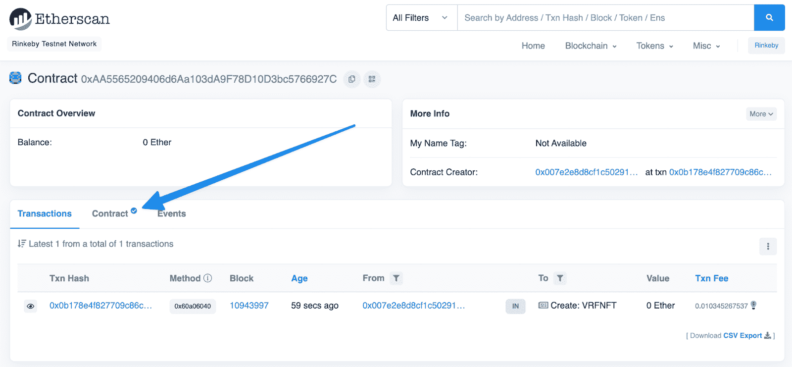

# 如何铸造 NFT

> 原文：<https://blog.chain.link/how-to-mint-an-nft/>

非金融资产是区块链资产的一种重要形式。它们受欢迎程度的上升标志着区块链正在超越加密货币、稳定硬币、治理代币和公用代币。在本技术教程中，您将学习如何创建一个 NFT 并将其部署到以太坊区块链。

## 什么是 NFT？

在研究如何创建 NFT 之前，有必要了解一下 NFT 是什么。NFT 是 *不可替代的* ，或者说是唯一的，令牌。不可替代的项目不能互换。这意味着持有者关心的是他们持有哪个特定的代币，而不是多少。交易卡是一个很好的例子，说明了 NFT 可以代表什么。要深入了解 NFTs，请查看 [什么是 NFT？T11】](https://chain.link/education/nfts)

## “铸造”NFT 意味着什么？

铸造是创造 NFT 的过程。这是指数字资产存储在区块链上。了解铸造过程中储存了什么是很重要的。它可能是一件完整的艺术品，在这种情况下，整个 NFT 及其元数据存储在“链上”，或者它可能是使用 IPFS 等工具离线存储的信息的引用。不管存储的是什么数据，思考铸造的最简单方法是将其视为创建 NFT 的过程。

## **铸造你的 NFT**

所以你决定要铸造你的第一个 NFT。你如何开始？你可以使用 NFT 市场，如 [OpenSea](https://opensea.io) 或 mint，通过智能合同直接进入区块链。让我们来看看两者。

## **在公海上制造 NFT**

在 OpenSea 上制造一个 NFT 很简单。它包括两个步骤。

首先，将你的钱包连接到 OpenSea。

<video autoplay="autoplay" loop="loop" muted="" width="800" height="450"><source src="https://blog.chain.link/wp-content/uploads/2022/07/NFT-1.webm" type="video/webm">T2】</video>

连接钱包后，点击“创建”并填写相关信息。请注意，如果您没有收藏，可能需要先创建一个收藏。“收藏”部分有帮助说明。

<video autoplay="autoplay" loop="loop" muted="" width="800" height="450"><source src="https://blog.chain.link/wp-content/uploads/2022/07/Create-new-NFT.webm" type="video/webm">T2】</video>

如果你想要一个更程序化的方法来制造 NFT，部署一个智能合约到像以太坊这样的区块链可能是一个更好的选择。

## **直接从智能合约中造币**

如果你遇到一个 NFT 项目的合同，想直接从[Etherscan](https://etherscan.io/)这样的工具中赚钱，如果合同已经被验证，你可以这样做。“合同”旁边的复选标记是首先要查找的内容。这意味着合同得到验证。

如果合同已经过验证，您应该能够直接从 Etherscan 与其进行交互。您需要选择“合同”，然后选择“写合同”。在那里，您应该看到可以与之交互的功能。你会寻找薄荷功能；它可能被命名为 `safeMint` 。在您连接您的钱包并提供您的地址后，您应该能够将 NFT 铸造到您的钱包中。

<video autoplay="autoplay" loop="loop" muted="" width="800" height="450"><source src="https://blog.chain.link/wp-content/uploads/2022/07/Minting-an-NFT-to-your-wallet-with-Etherscan.webm" type="video/webm">T2】</video>

## **通过创建智能合同创造非功能性交易**

构建智能合约来创造非功能性交易是一个更深入的话题。下面的教程将带你完成不同的过程。

*   [如何创建一个 NFT 游戏](https://blog.chain.link/how-to-create-an-nft-game/)
*   [如何创建 NFT](https://blog.chain.link/how-to-create-an-nft/)
*   
*   [如何创建创成艺术 NFTs](https://blog.chain.link/how-to-create-generative-art-nfts/)
*   [如何创建 NFT 域名](https://blog.chain.link/how-to-create-nft-domain-names/)
*   [打造、部署、销售自己的动态 NFT](https://blog.chain.link/build-deploy-and-sell-your-own-dynamic-nft/)
*   [如何在多边形上建立动态 NFTs](https://blog.chain.link/how-to-build-dynamic-nfts-on-polygon/)

## **何去何从**

如果你想了解更多关于建立一个成功的 NFT 项目的信息，请查看 一个详细介绍让你的项目起步的基本步骤和注意事项的指南——NFT 项目不仅仅是图像背后的代码。 

<figcaption id="caption-attachment-5082" class="wp-caption-text">A downloadable guide to building a successful NFT project.</figcaption>

要了解更多，请访问[chain . link](https://chain.link/)，订阅 [Chainlink 简讯](https://chn.lk/newsletter) ，并关注 Chainlink 上的[Twitter](https://twitter.com/chainlink)，[YouTube](https://www.youtube.com/channel/UCnjkrlqaWEBSnKZQ71gdyFA)，以及[Reddit](https://www.reddit.com/r/Chainlink/)。