# 如何打桩链环(链环)

> 原文：<https://blog.chain.link/how-to-stake-chainlink-link/>

关注本博客，逐步了解如何在最近发布的 Chainlink Staking v0.1 中添加链接。

## 为什么是 Stake LINK？

作为[chain LINK Economics 2.0](https://chain.link/economics)的核心计划，Chainlink Staking 使链接令牌持有者和节点运营商能够因帮助提高甲骨文服务的加密经济安全性而获得奖励。由于 Chainlink 网络已经实现了超过 6.6 万亿美元的交易量，因此网络的安全性必须能够与 Chainlink 支持的应用中不断增长的价值相匹配。Staking v0.1 的推出标志着 Chainlink 可持续发展和安全新时代的一个重要里程碑。

随着 Chainlink Staking v0.1 现已面向公众开放，社区成员可以在有限大小的 v0.1 Staking 池中下注多达 7，000 个链接。普通访问为更广泛的链接令牌持有者提供了在 v0.1 中入股的机会，但受最初有限的 2500 万链接上限和其他适用参与要求的限制。

在最初的 v0.1 池中，22.5M 链路以先到先得的方式分配给社群利益相关者，而 2.5M 链路分配并保留给节点运营商利益相关者。Staked 链接和奖励将被锁定，直到 Staking v0.2 发布，该版本计划在大约 9-12 个月内发布。请注意，赌注 v0.1 由以太坊区块链上的非托管智能合约组成，因此一旦解锁启用，除了赌注者自己，任何人都不能移动 v0.1 中的赌注链接。

在参与 Chainlink 赌注登记之前，作为赌注登记者，您必须了解并熟悉赌注登记池参数，例如锁定期、警报、赌注登记奖励和其他关键机制。参考最近这篇关于 [发布的博客，详细了解 Staking v0.1](https://blog.chain.link/chainlink-staking-launch-details/) 的设计。

## 饥饿先决条件

为了开始锁定链接，您必须:

*   将以太坊主网上的链接令牌放在自行保管的 Web3 钱包或 Web3 钱包支持的硬件钱包中。
*   至少有 1 个链接要下注。
*   有足够的 ETH 支付以太坊交易费用。

### 自我监护

Chainlink Staking v0.1 支持多种流行的支持 Web3 的钱包，包括 [元掩码](https://metamask.io/) ， [比特币基地钱包](https://www.coinbase.com/wallet) ，[Wallet connect](https://walletconnect.com/)-兼容钱包，以及智能合约钱包，如[Argent](https://www.argent.xyz/)和 [硬件钱包如](https://gnosis-safe.io/)[Trezor](https://trezor.io/)和[Ledger](https://www.ledger.com/)可以像 MetaMask 一样连接到 Web3 钱包，以便访问 Web3 dApps。

**如果你还没有自行保管你的链接代币**，请观看下面的视频，了解在 MetaMask、Trezor One 或 Ledger Nano 钱包中自行保管基于以太坊的代币的过程。

[https://www.youtube.com/embed/D8OMlCP_e-M?feature=oembed](https://www.youtube.com/embed/D8OMlCP_e-M?feature=oembed)

**如果你有——或者计划建立——一个硬件钱包**，下面的视频教程提供了如何将其连接到 MetaMask 的分步说明。

[https://www.youtube.com/embed/uI2NpkiUKsQ?feature=oembed](https://www.youtube.com/embed/uI2NpkiUKsQ?feature=oembed)

### 最低要求和以太坊燃气费

要成功参与 Staking v0.1， **你必须在自己保管的钱包中至少有 1 个链接** 。为了下注，必须在以太坊主网上进行连锁交易，也就是说 **你必须有足够的 ETH 来支付交易气费** 。

请注意，以太坊交易费/天然气价格不可预测且易变，由全球网络活动决定。对于当前燃气费用的估算，可以参考 [Etherscan 燃气追踪器](https://etherscan.io/gastracker) 。在向以太坊网络广播任何交易之前，请确保检查您的 Web3 钱包中的估计交易费用，以确保您对该金额感到满意。请注意，如果交易费用太低，您的交易可能会延迟一段时间才能得到确认。您的 Web3 钱包将估计交易的汽油限额，否则将设置 150K 汽油的默认值。

此外，因为 LINK 是一个 [ERC-677 令牌](https://github.com/ethereum/EIPs/issues/677) (ERC-20 兼容附加功能)，所以只需要单笔交易就可以入股。注意，以太坊主网上 Staking v0.1 的官方合约地址位于[0x 3 Fe B1 e 09 B4 bb 0 e 7 f 0387 ce e092 a 52 e 85797 ab 889](https://etherscan.io/address/0x3feB1e09b4bb0E7f0387CeE092a52e85797ab889#code)。

要了解更多以太坊网络，请参考 [以太坊基金会的学习枢纽](https://ethereum.org/en/learn/) 。有关您的 Web3 钱包的具体问题，请咨询该钱包提供商的官方支持渠道。

## 如何锁定链接

*注意:这些教程基于 Goerli testnet，仅供演示之用。虽然这些教程准确地反映了以太坊 mainnet 上的打桩过程，但下面的视频、GIF 和截图中的具体打桩参数和煤气费可能与 Chainlink 打桩 v0.1 的 mainnet 实现有所不同。T3】*

### 视频教程

[https://www.youtube.com/embed/wfSETSSDG6c?feature=oembed](https://www.youtube.com/embed/wfSETSSDG6c?feature=oembed)

### GIF 教程

### 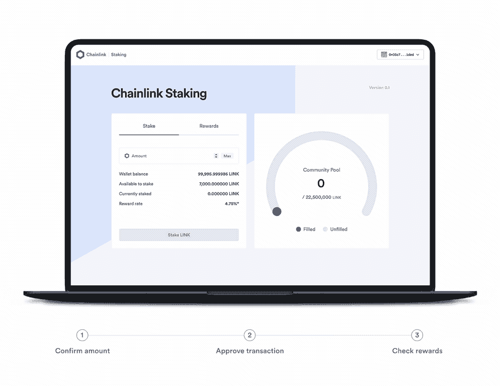

### 逐步编写的教程(MetaMask)

在本教程中，我们将展示如何使用 MetaMask wallet 来下注 LINK。

#### **1。进入[链节锁定网页](https://staking.chain.link/)。**

确保验证您浏览器中的 URL 是正确的官方 Chainlink Staking 网站。收藏起来备查:[https://staking . chain . link](https://staking.chain.link)。

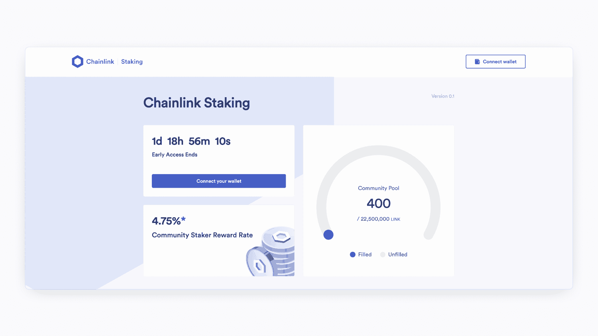

#### 2.点按“连接钱包”

点击网页右上角的“连接钱包”按钮。

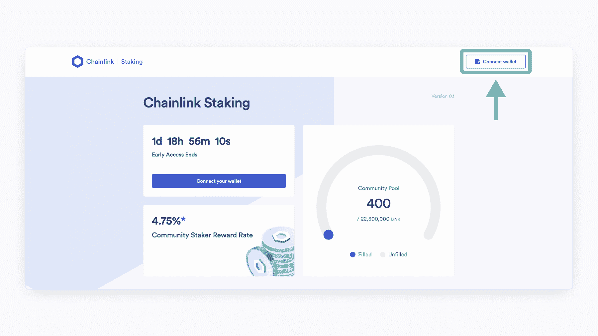

#### 3.选择你的钱包。

选择存放您的 LINK tokens 和 ETH 的 Web3 钱包。在这个例子中，我们将使用元掩码。

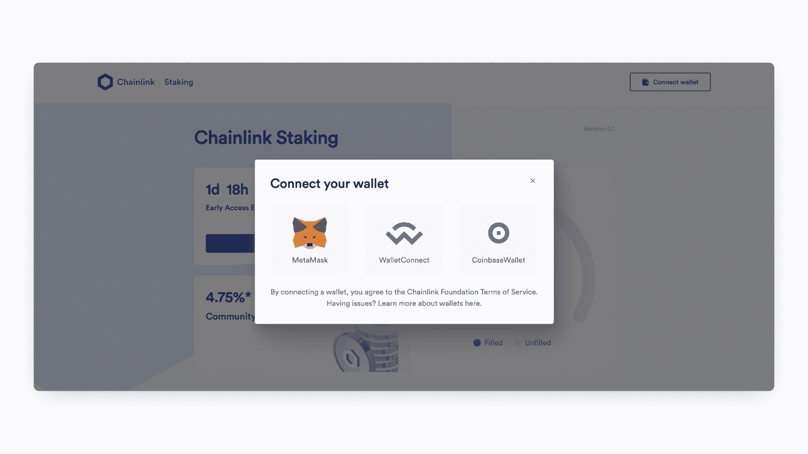

#### 4.选择您的钱包帐户。

如果您只有一个帐户，请单击唯一选项。

如果您的元掩码连接了多个钱包，请点击保存您的链接令牌的钱包地址。

然后按“下一步”,将您的钱包连接到 Chainlink Staking 网页。

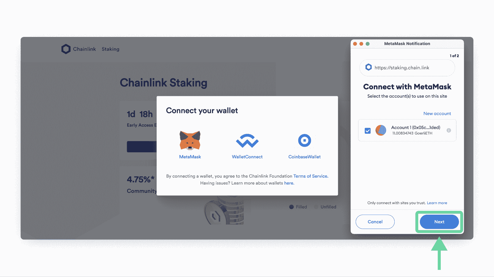

#### 5.按“连接”

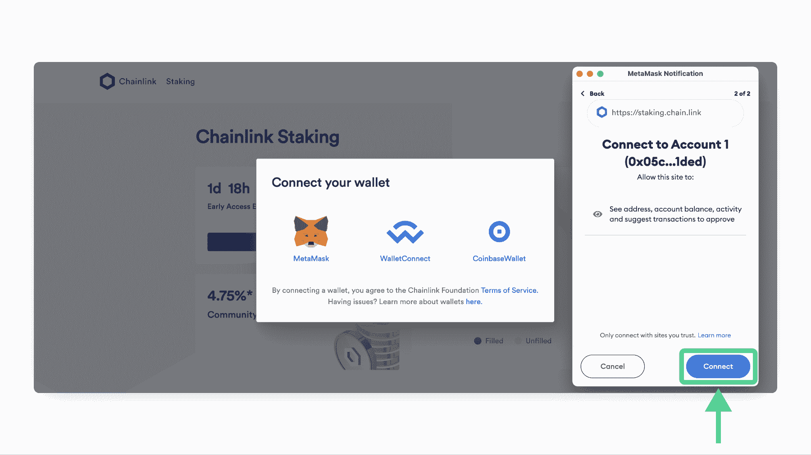

完成此步骤后，您将返回到 Chainlink Staking 网页，您的钱包地址将显示在右上角。

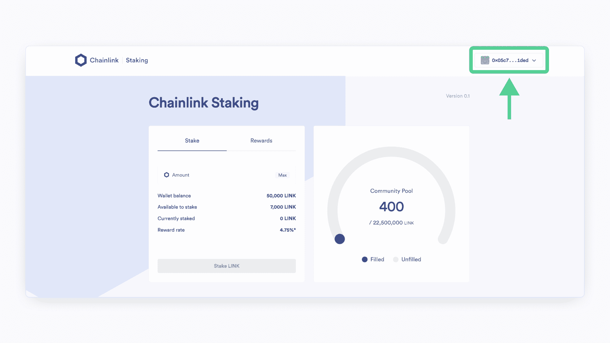

#### 6.输入您想要下注的链接数量。

您输入的值不能超过您钱包中的链接令牌数，也不能超过“可下注金额”旁边列出的数字

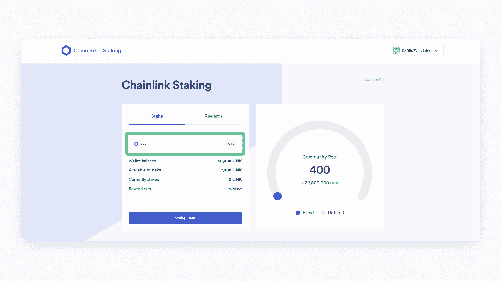

#### 7.按下“木桩链接”

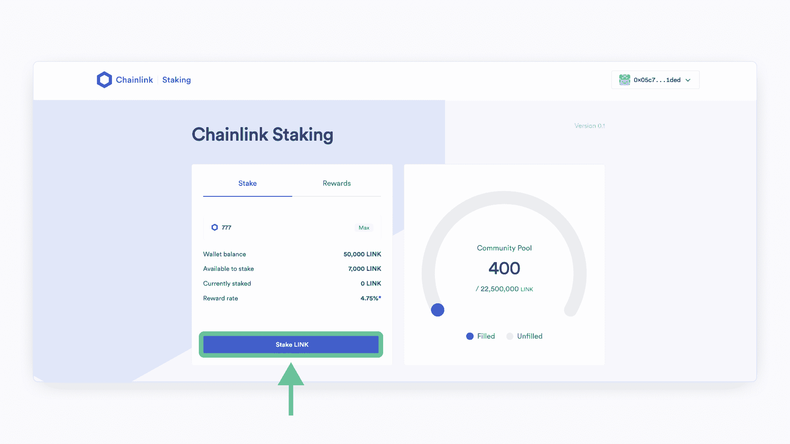

#### 8.按“接受并继续”

在继续下一步之前，请务必阅读本页的服务条款。

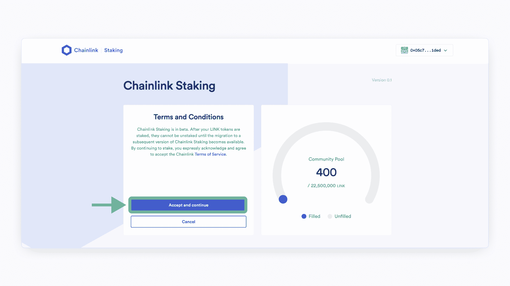

#### 9.批准交易。

然后，你的 Web3 钱包将会弹出，并要求你确认交易。验证您是否同意支付网络交易费用所需的 ETH 估计金额。 **按下** 按钮将交易广播到以太网。

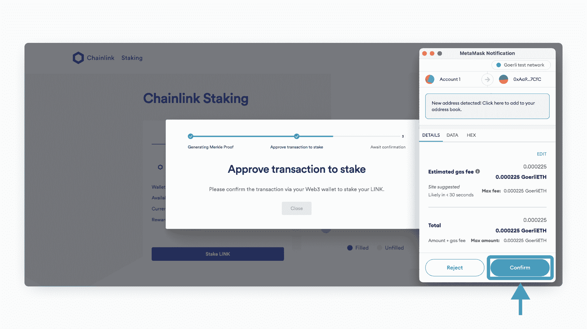

#### 10.等待确认。

如果您看到此屏幕，您的交易已成功广播到以太坊网络，现在正在等待确认。确认您的交易所需的时间将取决于网络活动和油价。如果您需要以更高的油价重新提交交易，请咨询您的钱包提供商的官方支持。

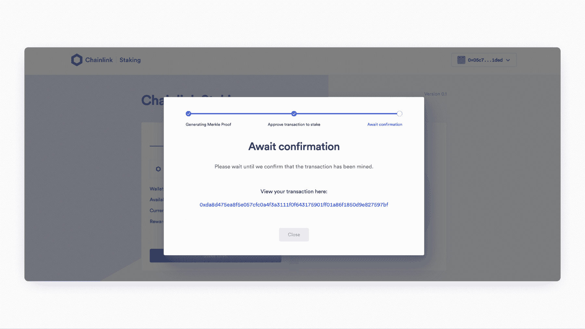

#### 11.你完了！

如果你看到类似下面截图的页面，恭喜你！您已成功在 Staking v0.1 中下注您的链接。要在 Etherscan 上查看您的交易，请单击下面的链接“在此查看您的交易”  

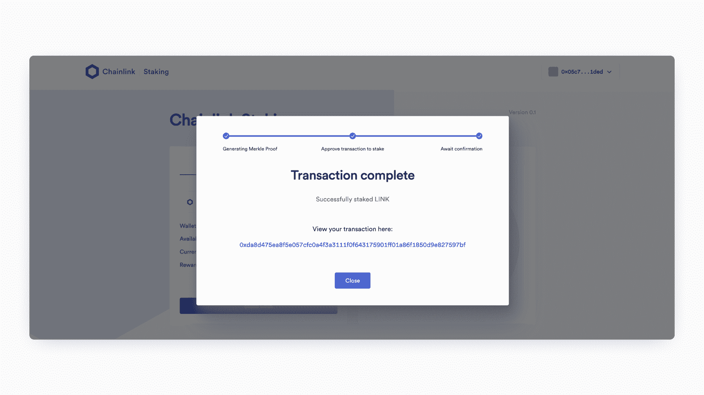

**要确认您的赌注余额** 、 ，请按“关闭”返回网页，查看“当前赌注”对应的数字

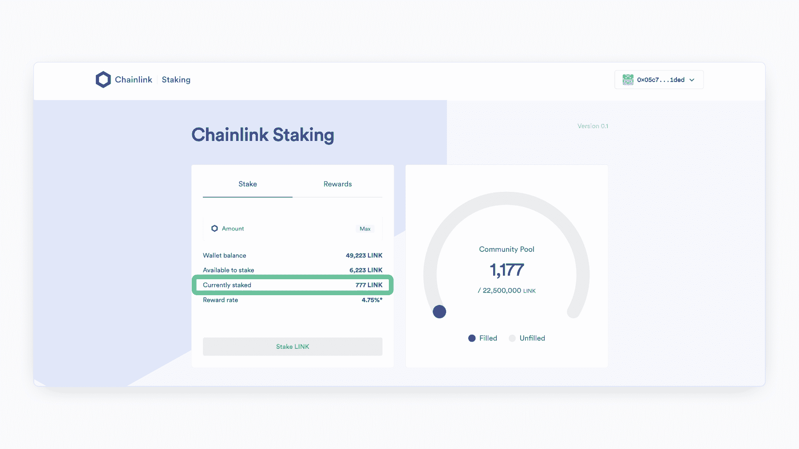

**要查看您的奖励** ，请按“奖励”标签。“赌注奖励”部分将会更新，以对应您在帮助保护 Chainlink 网络时获得的链接奖励金额。

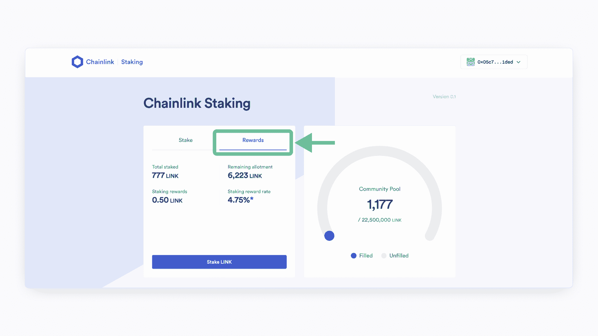

## 更多关于链环定位的资源

Chainlink Staking 是一项名为 Chainlink Economics 2.0 的更大计划的一部分，旨在将 Chainlink 网络带入一个可持续发展、加密经济安全和更深层次价值获取的新时代。

要了解更多关于 Chainlink Staking v0.1 的信息，请浏览以下资源:

*   [跑马圈地 v0.1 推出详情](https://blog.chain.link/chainlink-staking-launch-details/)
*   [检查您的提前获取资格](https://blog.chain.link/chainlink-staking-early-access-eligibility-app/)
*   [链环打桩路线图](https://blog.chain.link/chainlink-staking-roadmap/)
*   [链环锁紧 v 0.1–直接锁紧指南](https://ipfs.io/ipfs/QmcijdbXwwCK1bUHnKaaxR9K7jv1n65cefxsDiK7urg7Sj)

—

*免责声明:本文仅供参考，包含关于未来的陈述，包括预期的计划、产品和功能、开发以及这些新产品和功能的推出时间表。这些陈述只是预测，反映了当前对未来事件的信念和期望；它们建立在假设的基础上，随时都有风险、不确定性和变化。Staking 接口按“原样”提供，没有任何形式的陈述、保证或担保。虽然我们相信这些陈述是基于合理的假设，但我们不能保证任何预期的计划、产品或功能将按规定实施或完全实施，也不能保证实际结果不会与这些陈述中表达的结果有重大差异。所有声明仅在首次发布的日期有效，我们可能不会更新此帖子作为回应。T3】*