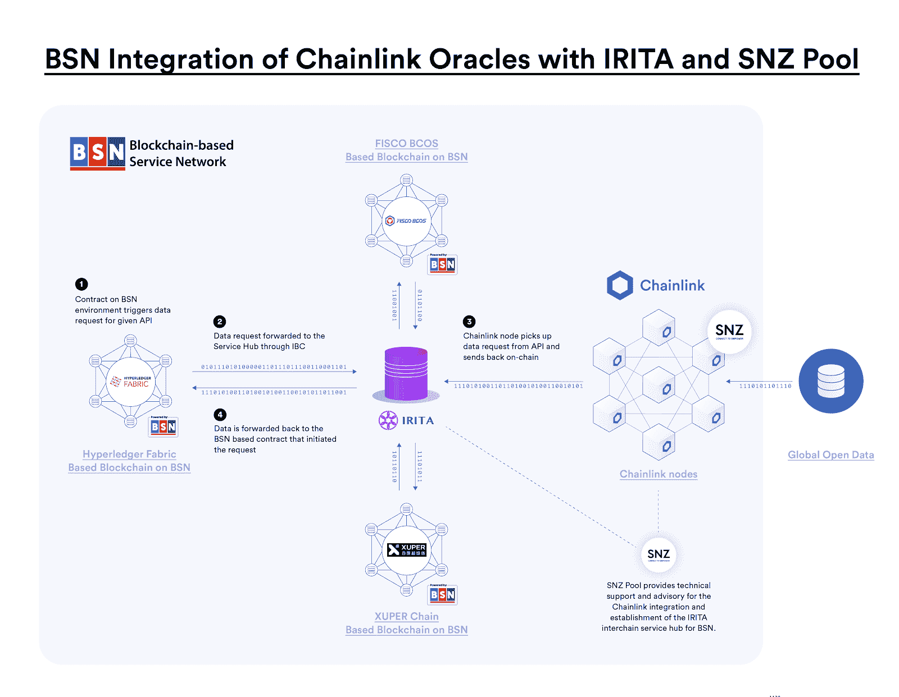

# IRISnet 获得拨款，在 BSN 本地集成 Chainlink

> 原文：<https://blog.chain.link/irisnet-receives-grant-to-natively-integrate-chainlink-on-bsn/>

[Chainlink 社区资助计划](https://blog.chain.link/introducing-the-chainlink-community-grant-program/)为许多开发团队和研究人员提供财政资源，帮助他们构建一个更具功能性和易用性的 Chainlink 网络。我们鼓励有才华的个人开发者和开发团队在这里[申请资助项目](https://chainlinkgrants.typeform.com/to/efEbsq)，或者如果你是一名研究人员并且想要合作，[联系我们](/cdn-cgi/l/email-protection#92e0f7e1f7f3e0f1fad2f1faf3fbfcfefbfcf9fef3f0e1bcf1fdff)。

我们很高兴地宣布， [IRISnet](https://www.irisnet.org/) ，一个链间区块链协议，其核心开发团队包括[卞杰](https://www.bianjie.ai/)(一个总部位于上海的国家级获奖区块链技术团队)，已被选为区块链集成资助的接受者，作为 Chainlink 社区资助计划的一部分。IRISnet 获得了一笔赠款，用于完成 Chainlink 在中国[区块链服务网络(BSN)](https://bsnbase.io/g/main/index) 上的本地集成，使中国和世界各地的政府和企业能够以高度安全可靠的方式将经过验证的真实世界数据整合到他们的 BSN 应用程序中。

IRISnet 是下一代分布式应用的链内服务中心，拥有一个名为 IRITA 的区块链联盟产品。IRISnet 采用 Cosmos/IRIS-SDK 构建，通过统一的服务模型实现跨链互操作性。IRISnet 的核心开发团队卞杰专注于区块链和大数据相关产品技术研发、应用平台建设、解决方案咨询。

BSN 是一个跨云、跨门户和跨框架的全球公共基础设施网络，用于部署和运行所有类型的基于区块链的分布式应用(dApps)。其区块链基础设施服务层旨在成为公司访问低成本区块链云计算服务的一站式商店。它得到了中国主要实体和企业的支持，其创始财团合作伙伴包括中国国家信息中心、中国移动、中国银联和红枣科技。

整合将涉及多种技术和多方，包括 oracle 技术的 Chainlink T1、IRISnet 的 IRITA 作为许可的链间枢纽、oracle 服务运营商的 SNZ 池运营 chain link 节点，以及托管底层区块链的基础层 BSN。Chainlink 将通过 IRITA 的链间服务中心集成到 BSN，该中心允许 BSN 区块链公司从 Chainlink oracles 请求和接收外部链外数据。

作为资助的一部分，IRISnet 将为整合提供几个关键组件，包括:

*   验证和修改 Chainlink 合同，以确保与 BSN 和 IRITA 的兼容性
*   在 BSN 和 IRITA 测试和部署所有组件
*   为集成提供监控解决方案

<figcaption id="caption-attachment-614" class="wp-caption-text">A generalized framework on how Chainlink will initially integrate with BSN</figcaption>

IRISnet 的联合创始人 Harriet Cao 表示:“我们很高兴能够获得 Chainlink 社区的资助，将其行业领先的 oracle 解决方案集成到 BSN，以支持中国和世界各地不断增长的分布式应用程序开发浪潮。“我们很高兴能让 BSN 的所有区块链都能访问并轻松使用 Chainlink oracle 服务，这不仅将 Chainlink 扩展到更多的区块链环境，还将有助于支持 BSN 以合理的价格向小型和大型企业提供一整套区块链公共基础设施的愿景。”

通过 Chainlink 社区资助计划，我们期待继续为越来越多的 Chainlink 生态系统团队和研究人员提供支持，他们正在研究和构建关键工具和基础设施，以加速开发[混合智能合同](https://blog.chain.link/hybrid-smart-contracts-explained/)和安全的 oracle 网络。我们将继续支持社区，将其作为 Chainlink 快速增长的关键驱动力，因为只有团结起来，我们才能使混合智能合同成为数字协议的主导形式。

## 关于 Chainlink 资助计划

如果你想了解更多关于资助项目的信息，请查看我们最近的博客文章,它进一步阐述了资助项目的目标和提交标准。如果您想参与 Chainlink Grant 计划，请[在此](https://chainlinkgrants.typeform.com/to/efEbsq)申请。Chainlink 社区赠款以现金和/或 link 形式提供。