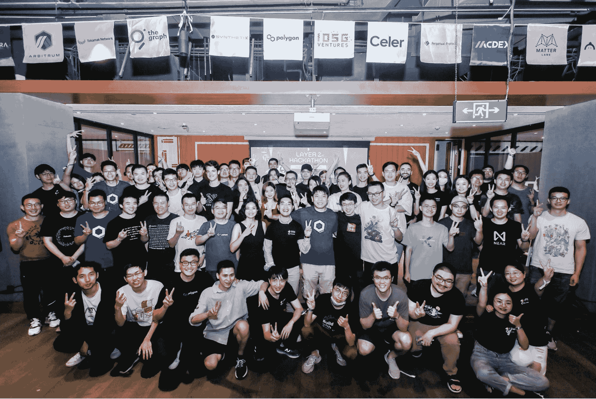

# 展示第 2 层黑客马拉松的 Chainlink 获奖者

> 原文：<https://blog.chain.link/layer2-hackathon-2021-winners/>

*chain link 2021 秋季黑客马拉松于 10 月 22 日拉开帷幕。* [*今天报名。*](https://chain.link/hackathon?utm_medium=referral&utm_source=chainlink-blog&utm_campaign=fall-2021-hackathon&utm_content=showcasing-the-chainlink-prize-winners-from-the-layer-2-hackathon)

由 Chainlink 和 [IOSG 合资公司](https://iosg.vc/)共同组织的、在上海举办的第二层黑客马拉松赛正式结束了！共收到 109 份项目申请，17 个项目中有 14 个进入最后一轮，使用 Chainlink 创建[混合智能合同](https://blog.chain.link/hybrid-smart-contracts-explained/)应用程序。

我们欣喜地看到，仅在 48 小时内，团队就能够迅速将他们的想法转化为工作原型，并开辟新的价值流。开发人员展示了如何通过 Chainlink 分散式 oracle networks 将他们的智能合同连接到外部数据和离线计算，从而开发出各种高级用例。

感谢第二层黑客马拉松的所有参与者、赞助商和评委，感谢他们共同展示了第二层技术的巨大潜力，并使这次黑客马拉松取得了巨大的成功。让我们来看看 5 个获奖项目，它们分享了总价值 8000 美元的 Chainlink 奖金。

### **标志**

价值 2000 美元的大奖由 [Objk](https://github.com/IOSGVentures/Layer2Hackathon/issues/20) 获得。Objk 开发了一个中间件解决方案，该解决方案使用 Chainlink 分散式 oracle 网络来获取链上数据，对其应用高级分析，然后将其作为数据反馈广播回链上，供[智能合同](https://chain.link/education/smart-contracts)使用。

该团队在其演示中表示，虽然 Synthetix 具有明显的优势，如低滑点和无交易对手风险，但挑战之一是用户必须手动对冲债务池。当用户不积极重新平衡他们的头寸以匹配当前的债务池比率时，这可能导致系统性风险。

Objk 创建了一种处理关于债务池状态的区块链数据的方法，并在链上交付，所有这些都使用 Chainlink 支持的分散式 oracle 网络。这使得 Synthetix 能够开发嵌入式债务池再平衡工具，该工具也有可能增加 TVL。在整合发生之前，Objk 将为用户提供一个手动重新平衡债务的工具。

### acy

价值 1500 美元的奖金授予了 [AcySwap](https://github.com/IOSGVentures/Layer2Hackathon/issues/17) ，这是一个 AMM DEX，它在 Polygon 上开发了一个 flash 套利功能，以更好地保护用户免受攻击(如抢注)造成的损失。该项目使用 Chainlink 价格馈送作为交换令牌时的额外保护层，当池的汇率偏离 Chainlink 价格数据太远时，充当恢复交易的断路器。

### **流体道**

[FluidDAO](https://github.com/IOSGVentures/Layer2Hackathon/issues/21) 获得了价值 1500 美元的奖金，用于帮助 DAO 监控和监督他们赞助的项目。他们的项目能够在筹款后对资金进行适当的管理和分配。FluidDAO 集成了 Chainlink 价格馈送，以帮助 DAO 评估其“捐赠和投票”策略，并在使用 USDT 铸造原生 DAO 令牌时提供汇率。

### **BoboSwap**

价值 1500 美元的奖金也授予了[【BoboSwap](https://github.com/IOSGVentures/Layer2Hackathon/issues/29)】,这是一家总部位于 AMM 的交易所，它在 SushiSwap 和 QuickSwap 等 Polygon 上汇总了来自多个 AMM 交易所的订单。BoboSwap 集成的 Chainlink 价格馈送在交易池和 Chainlink 价格馈送之间的价格差距超过某个阈值(例如 10%)时停止交易，有效地充当断路器，以防止用户招致大规模滑点。

### **图元**

[图元](https://github.com/IOSGVentures/Layer2Hackathon/issues/24) 为元宇宙创建了一个基于链上 [NFT](https://chain.link/education/nfts) 的证书系统，赢得了价值 1500 美元的奖金。在现实世界中，中央集权机构向人们颁发证书，以表彰他们的独特成就。比如毕业证，中国的大学以及教育部都有颁发，任何人都可以在官网上验证。这些证书以一种任何人都容易理解的形式展示了一个学生在他们一生中某个时期的成就。

在 Web 3.0 世界中，元硅酸盐创建了一个 NFT，它代表了一个去中心化和可视化的证书。元复制多边形上的集成链接，从外部 API 将真实世界的数据链接到链上，以安全可靠的方式对 NFT 进行身份验证。

## **加入即将到来的 Chainlink 黑客马拉松**

祝贺获奖者，感谢所有在第 2 层黑客马拉松中使用 Chainlink 的团队和开发人员。我们总是很高兴看到 Chainlink 分散式 Oracle Networks 如何支持新项目的增长，并从整体上扩展智能合同生态系统。

我们希望在 Chainlink 帮助赞助的两个即将到来的黑客马拉松上看到开发者:

*   [Solana 点火黑客马拉松](https://solana.com/ignition)8 月 31 日-10 月 8 日
*   [多边形授权黑客马拉松](https://polygontech.medium.com/polygon-announces-polygon-grants-hackathon-100k-in-prizes-vc-funding-and-more-bf19314eedb3) 从2021 年 8 月 30 日-10 月 22 日

如果您是一名开发人员，并且您需要资源将您的应用程序连接到[chain link Price Feeds](https://docs.chain.link/docs/using-chainlink-reference-contracts)，[chain link VRF](https://docs.chain.link/docs/chainlink-vrf)，[chain link Automation](https://docs.chain.link/docs/chainlink-automation/introduction/)，或者访问任何 API ，请访问 [开发人员文档 想讨论一个集成？](https://docs.chain.link/) [找专家谈](https://chainlinkcommunity.typeform.com/to/OYQO67EF?page=announcement) 。T46
T48】

[网站](https://chain.link/) | [推特](https://www.twitter.com/chainlink)|[Reddit](https://www.reddit.com/r/Chainlink/)|[YouTube](https://www.youtube.com/channel/UCnjkrlqaWEBSnKZQ71gdyFA)|[电报](https://t.me/chainlinkofficial)|[GitHub](https://github.com/smartcontractkit/chainlink)

*[chain link 2021 秋季黑客马拉松](https://chain.link/hackathon) 于 2021 年 10 月 22 日开赛。无论您是开发人员、创作人员、艺术家、区块链专家，还是该领域的新手，这个黑客马拉松都是启动您的智能合同开发之旅并向行业领先的导师学习的最佳场所。立即锁定您的席位，争夺超过$ 300，000 的奖金。T9】*

[Sign up today](https://chain.link/hackathon?utm_medium=referral&utm_source=chainlink-blog&utm_campaign=fall-2021-hackathon&utm_content=showcasing-the-chainlink-prize-winners-from-the-layer-2-hackathon)