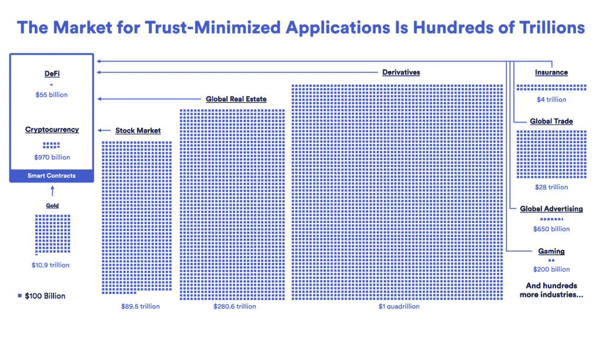
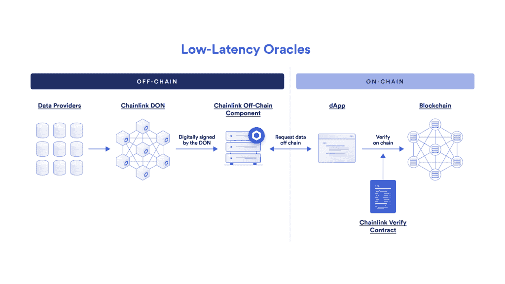
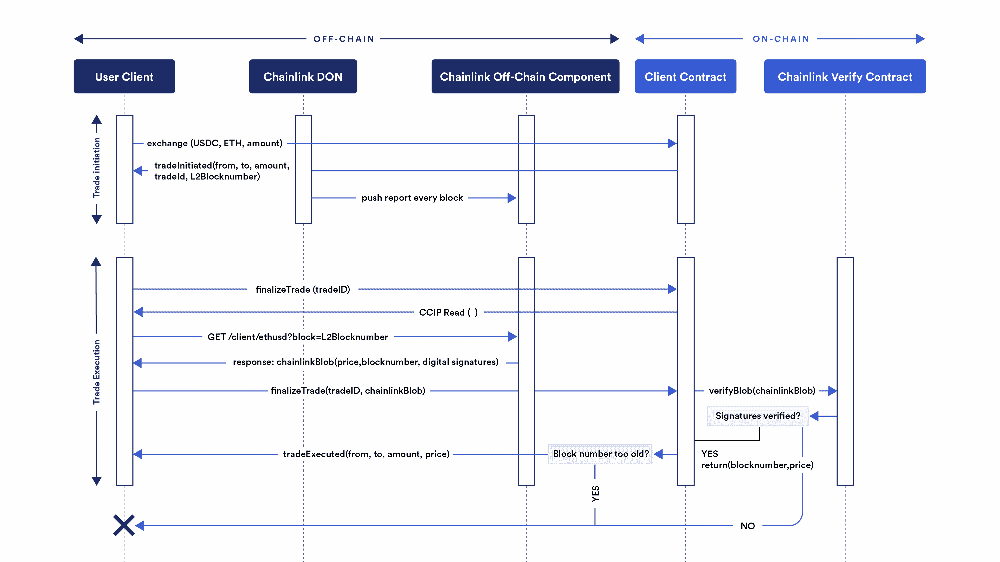

# 为 DeFi 衍生品市场推出低延迟 Oracle 解决方案

> 原文：<https://blog.chain.link/low-latency-oracle-solution/>

获得 [DeFi 衍生品](https://blog.chain.link/solving-deep-seated-trust-problems-in-derivatives-using-chainlink-enabled-smart-contracts/) 市场为 Web3 带来了巨大的价值。在全球传统金融市场中，衍生品价值超过 1000 亿美元，为基于 DeFi 的替代产品提供了大量颠覆和改进的机会。在本帖中，我们将介绍 Chainlink 正在构建的创新解决方案——超低延迟拉式价格预测工具，以支持和保护这个巨大的链上市场。

<figcaption id="caption-attachment-4898" class="wp-caption-text">Derivatives represent $1 quadrillion in value within the global economy.</figcaption>

## DeFi 衍生品市场的技术挑战

DeFi 衍生品使用一种 [混合智能合约](https://blog.chain.link/hybrid-smart-contracts-explained/) 基础设施，将基于区块链的逻辑与非链 oracle 计算相结合。链上合同记录状态变化，并在网络上冗余地存储合同，而 oracles 将合同连接到外部输入，以检索基础市场数据并触发结算输出。

建立 DeFi 衍生品协议涉及几个复杂的技术问题，这在历史上减缓了 Web3 生态系统中衍生品市场的成熟。在本节中，我们将介绍链上衍生产品需要解决的关键技术挑战，以获得更广泛的采用。

### 数据延迟和新鲜度

延迟是指流程完成所需的时间延迟。在区块链的上下文中，延迟通常指的是从传播开始到完成一个事务所花费的时间。对于 oracle networks，延迟是指 oracle 报告在链上得到确认所需的时间。此外，oracle networks 中的延迟指的是数据点的陈旧性(或新鲜度)，指的是自上次更新以来已经过去了多长时间。

由于加密资产的价格会在极短的时间内以分数的形式波动，而且交易者会寻求以最新价格获得资产，因此 DeFi 衍生品平台，尤其是链上永久期货，必须能够访问最新更新的市场数据，并以低延迟的方式提供。延迟增加或新鲜度降低会导致交易执行不佳，从而为通过 [最大可提取价值](https://blog.chain.link/what-is-miner-extractable-value-mev/) (MEV)等技术提取价值打开了窗口，因为交易者可以可靠地预测链上 oracle 价格更新的方向，甚至提前几秒钟。这种价值提取机会可以出现在 mempool(未确认的区块链交易所在的位置)或集中交易所，这些交易所在价格大幅波动期间占总交易量的很大份额。

### 缺乏数据隐私预结算增加了 MEV 和前置风险

如果 oracle price 数据在被 DeFi 衍生协议消费之前公开，例如在跨链桥接数据之前或在交易内存池中查看另一个区块链上的数据，那么恶意参与者可以通过抢先运行 oracle update 从交易者那里获取价值。交易结算前公开可见的 oracle 数据可能会导致与高数据延迟和新鲜度降低相同的价值提取问题(甚至会导致其他问题)。DeFi 衍生协议通常通过增加用户的交易费用来克服这种动态，代价是成为竞争力较弱的协议。

### 基础设施和维护成本

从单一来源提取的数据，甚至是没有适当加权的一组交换数据，都可能带来停机或操纵攻击的重大风险。交易量可以很容易地从一个市场转移到另一个市场，由于缺乏流动性的市场对资产的定价不正确，合约面临巨大的失败风险。维护价格反馈 oracle 至关重要，因为必须持续监控 oracle networks 以确保其正常运行，并评估不断变化的区块链环境以识别新的风险和关注领域。

## 来自 Chainlink 的基于拉取的新型低延迟 Oracle 解决方案

鉴于衍生产品在 DeFi 领域的巨大潜力及其不断扩大的应用，我们很自豪地推出一款正在开发中的全新 oracle 金融市场数据解决方案，该解决方案在架构设计上有所改进，专为满足衍生产品 dApps 的独特要求而定制。我们预计这种新的基于 pull-based 的 Chainlink oracle 解决方案的可测试版本将于今年年底准备就绪。

该架构利用高速数据提供商结合 Chainlink 分散式 Oracle Networks 向链外衍生 dApps 提供高频定价数据，同时仍提供链上验证。

<figcaption id="caption-attachment-4899" class="wp-caption-text">The off-chain and on-chain design of the low-latency Chainlink oracle solution.</figcaption>

与 [Chainlink 价格馈送](https://data.chain.link)——更新链上参考合同的分散式 oracle 网络——相比，这种新的 oracle 解决方案采用基于拉的方法，按块生成 oracle 报告，用户可以离线检索这些报告，并通过链上交易自动验证。这种方法引入了这些重要的好处:

*   **超低延迟: oracle 更新是按数据块生成的，用户可以离线检索这些数据块，并使用链上事务进行原子验证，从而将更新延迟降低多个数量级。T3】**
*   **抢先规避:** 在交易结算之前，价格保持保密，提供了一种解决方案，通过保护定价信息不被潜在套利者发现来规避抢先风险。 如果没有预结算甲骨文隐私，恶意行为者可以继续从交易者那里榨取价值，从而降低 DeFi 项目在衍生品领域保持竞争力的能力。
*   **高能效:** 验证基于拉式的全新 Chainlink oracle 解决方案的 oracle 更新的成本非常高，并且不需要将数据发布到单独的区块链，就可以在链上交付。

这种新的 oracle 解决方案将由支持 Chainlink 数据馈送的世界级 oracle 节点的集合来保护，仅在 2022 年就已经保护了数万亿美元的交易量。此外，单个节点签名也将直接在链上验证，以增加信任最小化保证，并基于 L2 块号(或时间戳)进行粒度陈旧性检查。这种混合架构是经过深思熟虑的设计选择，能够提供 DeFi 衍生协议所需的低延迟数据馈送，而不会影响基本的安全性和可靠性要求。

让我们更详细地解释这个解决方案，以及它是如何一步一步地工作的。对于这个例子，我们将假设一个 DeFi 项目在第 2 层链(如乐观)上使用这个解决方案。

在第一阶段，

*   假设用户提交了一笔 10 ETH 的交易，以美元等稳定货币支付，比如 USDC。
*   这是 DeFi 衍生产品项目的客户合同，该合同承诺将其作为市场订单进行交易。

在下一阶段，

*   交易结算流程在 L2 链的区块编号启动后开始。
*   按需 oracle 返回带有价格、时间戳、L2 块号和数字签名的 blob。
*   它包含在结算交易中，以便 Chainlink verify 合同可以验证数字签名并解开价格、时间戳和 L2 区块号。
*   这些都返回给客户合同，以执行失效检查并结算交易。如果任何检查失败，事务将恢复。如果没有，交易就结束了。

<figcaption id="caption-attachment-4918" class="wp-caption-text">A technical workflow of the low-latency oracle solution.</figcaption>

这一全新的 oracle 解决方案旨在帮助满足 DeFi 衍生产品所需的低延迟、低成本要求，同时帮助降低套利、抢先交易和 MEV、数据质量和可用性以及协议安全性的其他关键技术因素的风险。我们很高兴能够通过可靠的 oracle 基础设施帮助实现这一关键的财务原语，并为更多用户带来他们期望的安全保证。

[Register Your Interest](https://chainlinkcommunity.typeform.com/to/ZAjfV6df)

*了解更多 Chainlink，订阅* [*Chainlink 快讯*](https://pages.chain.link/subscribe?utm_medium=referral&utm_source=chainlink-blog&utm_content=low-latency-oracle-solution) *并关注官方*[*Chainlink 推特*](https://twitter.com/chainlink) *了解最新 chain link 消息和公告。*