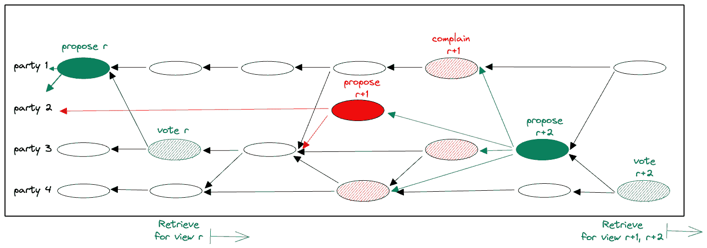

# DAG 上的 MEV 电阻

> 原文：<https://blog.chain.link/mev-resistance-on-a-dag/>

*作者:达丽娅·马尔基和帕维尔·萨拉乔斯基*

## 摘要

最近关于[*“DAG 上的最大可提取值(MEV)保护”*](https://arxiv.org/abs/2208.00940) 探索整合 [“盲目订单-公平”](https://arxiv.org/pdf/2203.11520.pdf)—一种引入的防止 [最大可提取值(MEV)利用的措施](https://arxiv.org/pdf/1904.05234.pdf)—进入 [基于 DAG 的 BFT 共识方法](https://dahliamalkhi.github.io/posts/2022/06/dag-bft/)

为了满足基于 DAG 的 BFT 共识的高事务提交吞吐量，盲顺序公平的性能也需要扩展。如果交易开始落后于一致同意的订购吞吐量，未结算交易的积压可能会越来越多；并且可能会阻止客户端根据最后提交的状态提交事务。这篇文章解释了一个高级解决方案框架，并比较了在其中实现盲/开的不同选项。

## 背景

### MEV

在过去的几年里，我们已经看到人们对加密货币平台及其应用的兴趣激增，例如分散式金融协议提供了对金融工具的抗审查和开放访问；或者不可替换的令牌。这些系统中的许多容易受到 MEV 攻击，恶意的共识领导者可以注入交易或改变用户交易的顺序，以最大化其利润。因此，不足为奇的是，与此同时，我们目睹了 MEV 专业化现象的兴起，其中出现了一个由 MEV 机会“搜寻者”和合作矿工组成的完整的 MEV 开发生态系统。

黛安等人在 [【闪光男孩 2.0，S&P 2020】](https://arxiv.org/pdf/1904.05234.pdf)*“通过包含、排除或重新安排块内交易所能获得的利润”* 中引入了一个衡量指标，称为矿工可提取价值(MEV)。[【MEV-explore】](https://explore.flashbots.net/)估计自 2020 年 1 月 1 日以来，以太坊上提取的 MEV 金额接近 7 亿美元。然而，可以有把握地假设提取的总 MEV 要高得多，因为 MEV-explore 将其估计值限制为仅一个区块链、几个方案和有限数量的可检测 MEV 技术。虽然很难说所有的 MEV 都是“坏的”(例如，市场套利可以消除市场无效率)，但它通常会引入一些负外部性，如:

*   网络拥塞:特别是在低成本链上，MEV 参与者经常试图通过发送大量冗余交易来增加他们利用 MEV 机会的机会，向底层对等网络发送垃圾邮件
*   链拥塞:许多这样的交易最终到达链，使得链更加拥塞，
*   更高的区块链成本:在争夺有利可图的 MEV 机会的同时，MEV 参与者出价更高的天然气价格来优先考虑他们的交易，这导致常规用户的整体区块链成本更高，
*   共识稳定性:一些链上交易可以创造如此有利可图的 MEV 机会，以至于矿商可能会利用他们提取的交易创建一个替代的链分叉，这引入了共识不稳定性风险。

### 公平排序

在这篇博客文章中，我们重点关注传统(或利害关系证明)BFT 设置中的共识级 MEV 缓解技术，其中已知一组 N=3F+1 方，称为 *验证方* 。基本上有两种类型的抗 MEV 顺序公平特性:

**盲目的秩序——公平。**MEV 的一条主要防线源于在不看交易内容的情况下提交交易指令。这种 MEV 抵抗的概念，在这里被称为盲顺序公平，由 Heimbach 和 Wattenhofer 在 [【关于防止事务重新排序的 SoK，2022】](https://arxiv.org/pdf/2203.11520.pdf)中使用，并被定义为

> *“任何一方在看到交易内容后，都不可能包含或排除交易。此外，任何一方都不应在其已经观察到其内容的任何交易之前插入自己的交易。”【T2*

基于时间的订单公平性。MEV 保护的另一个强有力的措施是通过同时向所有验证器发送交易，并在大多数验证器处使用相对到达顺序来确定最终排序。特别是，这种顺序公平的概念确保了

> *“如果足够多的参与方在另一个 tx’之前接收到事务 tx，则在最终提交顺序中，tx’不在 tx 之前排序。”T3】*

这可以防止能够分析网络流量和交易内容的强大对手对验证器收到的交易进行重新排序、审查和前/后运行。此外，基于时间的顺序公平对用户和共识提议者之间的潜在共谋具有更强的保护，因为验证者明确地将相对顺序输入到协议中。在最近的几部作品中，基于时间的顺序公平被用在各种风格中，包括[【Aequitas，CRYPTO 2020】](https://eprint.iacr.org/2020/269.pdf)[【蓬蓬，OSDI 2020】](https://www.usenix.org/system/files/osdi20-zhang_yunhao_0.pdf)[【Themis，2021】](https://eprint.iacr.org/2021/1465.pdf)[【温迪成长，FC 2021】](https://link.springer.com/chapter/10.1007/978-3-662-63958-0_17)

在文献中发现的另一个公平概念，不提供顺序公平，围绕着参与公平:

**参与公平性。** 一种不同的公平观念旨在确保抵制审查或更强的参与公平观念。参与股权保证区块链包含一定比例的诚实贡献(又名“链质量”)。几个 BFT 协议解决了参与公平性问题，包括[【Prime，IEEE TDSC 2010】](https://ieeexplore.ieee.org/document/5654509)[【fair ledger，2019】](https://arxiv.org/pdf/1906.03819.pdf)[【HoneyBadger，CCS 2016】](https://eprint.iacr.org/2016/199.pdf)等等。在分层的基于 DAG 的 BFT 协议中，如[【Aleph，AFT 2019】](https://arxiv.org/pdf/1908.05156.pdf)[【DAG-Rider，PODC 2021】](https://arxiv.org/pdf/2102.08325.pdf)[【Tusk，2021】](https://arxiv.org/abs/2105.11827)[【牛鲨，2022】](https://arxiv.org/pdf/2201.05677.pdf)值得注意的是，参与股权并不能阻止腐败方在已经观察到其他交易后注入交易，也不能阻止腐败领导人在阅读交易后重新排序交易，这违反了盲目的和基于时间的顺序公平。

## BFT 共识中的盲秩序公平框架

针对 MEV 的第一道防线是隐藏交易信息，直到“盲目地”提交提交指令。这防止任何一方在提交订单之前观察交易的内容，因此满足盲订单公平。我们现在引入一个框架，用于在 BFT 共识中集成盲顺序公平保护，在经典(或利害关系证明)设置中，具有一组已知的 N=3F+1 验证器。

核心解决方案是一种标准的 k/n 秘密共享方法。对于每笔交易`tx`，用户(“爱丽丝”)挑选一个秘密对称密钥 `tx-key` ，并将其加密的 `tx` 发送给验证者。秘密共享允许爱丽丝与验证者共享 `tx-key` ，使得需要 F+1 份来重构 `tx-key` ，并且在它被提交(盲目地)到全序之前，没有任何一组 F 个坏方可以打开它。诚实的验证者首先等待提交一个不可见的事务顺序，然后才打开它们。同时，在将事务提交给总排序之前，验证器确保它们可以打开它。

`Disperse/Retrieve` **。** 更正式地说，一个共享协议有两个抽象功能，“ `Disperse` ”和“ `Retrieve` ”。 `Disperse` 允许一家 ***经销商*** 向验证者 `tx-key` 传播股票的秘密，并附有如下保证:

*   **隐藏:** 一组 F 坏验证器无法重构 `tx-key`。
*   **绑定** :在 `Disperse(tx-key)` 在一个诚实验证器处成功完成后，任意一组诚实 F+1 验证器做 `Retrieve(tx-key)` 可以重构生成一个唯一的结果。
*   **有效性:** 如果庄家是诚实的，那么从 `Retrieve(tx-key)` 通过任意 F+1 个诚实的验证者得到的结果就是 `tx-key`。

值得注意的是，`Disperse/Retrieve`**不** 是否需要某些性质，这些性质可能是文献中的一些用例需要的，但不是这里的框架:

*   当 `Disperse` 完成时，并不保证 `Retrieve` 能够重构出经销商承诺的产值。
*   不要求个人股份可以收回。
*   不要求能够使用 `tx-key` 导出其他值，同时对 `tx-key` 本身保密。

放松这些要求将在下面的方法 3 和 4 中发挥重要作用。

## 分散/回收方法

### 方法 1:门限加密

使用门限加密来实现 `Disperse/Retrieve` 是很简单的，这样，一个公共加密“ `E()` ”就为用户所知，而私有解密“ `D()` ”在验证器之间共享(在设置时)回想一下，对于每个 tx，用户选择一个特定于交易的对称密钥 `tx-key` 并发送用其加密的 `tx` 。对 `Disperse(tx-key)` ，用户附加 `E(tx-key)` ，用全局门限密钥加密的交易密钥。一旦一个 `tx` 被提交给总排序， `Retrieve(tx-key)` 被每个验证器实现，生成其解密份额为 `D(tx-key)` 。验证者可以尝试应用 F+1 个有效的解密份额来解密 tx。

绑定源于两个属性。第一，一个诚实方的门限总能成功生成 F+1 个有效的解密份额 `E(tx-key)` 。第二，一些门限密码术方案允许验证验证者正在贡献正确的解密份额，因此通过检索 F+1 个有效的门限份额，保证了唯一的结果。

**属性** :

*   需要可信设置或阈值加密的(计算成本高的)分布式设置。
*   约 300μs 对于 `Disperse` 在标准硬件上使用[【TD H2，EuroCrypt 1998】](https://link.springer.com/content/pdf/10.1007/BFb0054113.pdf)。没有多余的信息。
*   16 取 6 方案中 `Retrieve` 约 3500μs。

### 方法 2:可验证秘密共享(VSS)

用户 `Disperse(tx-key)` 的另一种方式是 [【沙米尔的秘密共享方案，CACM 1979】](https://dl.acm.org/doi/pdf/10.1145/359168.359176)。“香草”秘密共享方案有两个成分:一个共享函数“ `SS-share(secret s)` ”创建 N 个值，“ `SS-combine(F+1 shares)` ”重构秘密 s.

到 `Disperse(tx-key)` ，用户通过 `SS-share(tx-key)` 将 `tx-key` 的个股发送给各个验证人。一组 F+1 份额持有人在 `Retrieve` 期间揭示自己的股份，并通过 `SS-combine()` 【重组】 `tx-key` 将股份组合起来。

在当今的计算环境中，合并份额比阈值加密快三个数量级，只需几微秒(参见属性注释)。但是， `Disperse` 用 N-F 验证器完成后，“香草” `SS-share()/SS-combine()` 不保证绑定 **:** 首先，不是每一组 F+1 诚实验证器都可以持有 `Disperse` 阶段的股份。第二，从不同组的 F+1 验证器中检索份额可能会导致从 `SS-combine()` 得到不同的输出。

VSS 方案支持通过 share `VSS-verification(share, commit value)`进行绑定。`VSS-verification()` 允许验证器检查份额是否与承诺值`s`’一致，使得应用于 `SS-combine()` 的任何一组 F+1 份额导致输出`s`’。当验证器接收到共享时，它应该在确认之前验证共享。 `Disperse` 当有 N-F 个可验证份额的确认时完成，证明有效份额由 F+1 个诚实验证者持有，并保证由 F+1 的任何子集进行唯一的重构。

可以添加一个份额恢复功能 `VSS-recovery(F+1 share-holders)` ，以允许验证器 在 `Retrieve` 之前获得其单独的份额。

**属性:**

*   不需要可信设置。
*   O(N )通信复杂度为 `Disperse` (如使用[【HBA CSS，NDSS 2022】](https://eprint.iacr.org/2021/159.pdf)[【ea VSS-SC，CT-RSA 2013】](https://eprint.iacr.org/2012/619))。用户需要将共享秘密发送给各个验证者。
*   O(N )通信复杂度为 `Retrieve` 。可选 O(N )用于由 F+1 诚实验证者恢复丢失的股份。

### 方法 3: AVID-M

VSS 提供比必要的 更强的保证，以满足 `Disperse/Retrieve` 的绑定需求。 具体来说， `Disperse` 只需要保证一个唯一的秘密重建结果，不需要成功。借用[【dispersed ledger，NSDI 2022】](https://arxiv.org/pdf/2110.04371.pdf)的一个关键技术叫做 AVID-M，验证者可以完全避免在 `Disperse` 期间验证股份(代价高昂)。相反，他们在 `Retrieve` 期间验证,(整个)共享会有唯一的结果(廉价)。其工作原理如下。

到 `Disperse(tx-key)` ，用户通过 `SS-share(tx-key)` 向验证者发送个人股票。此外，用户组合 Merkle-tree 中的所有份额，认证根，并向每个份额发送成员资格证明，即，到根的 Merkle 树路径。当一个验证器接收到一个共享时，它应该在确认该共享之前根据认证的根来验证 Merkle 树证明。 `Disperse` 当有 N-F 个确认时完成，保证未篡改的股份由 F+1 个诚实的确认者持有。

在 `Retrieve(tx-key)` 期间，F+1 个验证者揭示单个股票，附上 Merkle 树路径以证明股票未被篡改。注意，F+1 共享可以通过只检查根上的一个签名来验证。验证器使用 `SS-combine()` 来尝试重构 `tx-key` 。

然后他们 **后验证** 发送给验证者的 F+1(未修改)股份的每个子集将会有相同的结果。为此，验证器不需要等待丢失的份额，也不需要尝试 F+1 个份额的组合。而且，它不需要和别人交流。验证器只是生成丢失的部分，并重新编码 Merkle 树。然后，它将重新生成的 Merkle 树与发送方认证的根进行比较。如果比较失败，经销商有故障，验证机拒绝 `tx` 。绑定成立，因为验证后的结果——成功或失败——在 `Disperse` 完成时变得固定。无论输入 F+1(未篡改)份额的哪个子集，每个验证器都会得到相同的结果，从而确保绑定。

该方案的一个变体是让用户提交并分散一个简单的股份散列向量，而不是 Merkle 树。分散散列向量(全部)导致比分散 Merkle 根更高的通信复杂度(例如，使用[【NDSS 2022】](https://eprint.iacr.org/2021/159.pdf)的二次)以及更高的计算成本，但是降低了整体`Retrieve` 复杂度(到二次)。

**属性:**

*   不需要可信设置。
*   大致为 50μs，O(N )整体通信为`Disperse` (O(N )带哈希向量承诺) 。用户需要将股份私下发送给个人验证者，并附上 Merkle 证明。
*   大约 50μs 和 O(N * log(N))总体通信为`Retrieve` (O(N ) 带有散列向量承诺) ，包括后验证，在 16 取 6 方案中。

### 方法 4:混合

即使在 `Disperse` 完成之后，VSS 和 AVID-M 都可能需要在 `Retrieve` 期间与一组特定的 F+1 诚实验证器进行交互。这意味着 `Retrieve` 的等待时间受这组特定的 F+1“股东”的影响，而 **不是** 最快的 F+1 诚实验证器的速度。使用门限加密消除了这种依赖性，但是会导致计算开销很大。

混合方法结合了门限加密和 AVID-M 的优点。在混合方法中， `Retrieve` 在稳定状态下使用(快速)秘密共享，并在网络不稳定期间退回到门限加密，避免等待特定的 F+1 验证器。

`Disperse(tx-key)` 分两部分实现。首先，用户应用 `AVID-M` 向当事人发送个人股份和凭证。第二，作为回退，它发送验证器 `E(tx-key)` 。曾经 `tx` 致力于总`Retrieve(tx-key)`有快轨和慢轨。在快速通道中，每一个为 `tx-key` 持有 AVID-M 的验证器都揭示了这一点。不持有 `tx-key` 的 AVID-M 份额的验证器揭示了阈值密钥解密份额。在慢速跟踪中，验证者可能放弃等待 AVID-M 份额，并揭示阈值密钥解密份额，即使他们已经揭示了 AVID-M 份额。

**`Retrieve`后** (快速或慢速路径)检查 AVID-M 后验证以及 `E(tx-key)` 是否与 AVID-M 分散一致。更具体地说，验证器简单地重新加密 `tx-key` ，并在重构后重新编码 AVID-M Merkle 树。它将两者与发送者的进行比较。如果比较失败，经销商有缺陷，验证机拒绝 `tx` 。同样，验证后的结果——成功或失败——在 `Disperse` 完成后就固定了。无论输入哪个方案和 F+1(未篡改)份额的哪个子集，每个验证器都会得到相同的结果，从而确保绑定。

**属性:**

*   需要可信设置或阈值加密的(计算成本高的)分布式设置。
*   大致 360μs，O(N * log(N)) (O(N)带哈希向量承诺)整体通信为 `Disperse` 十六取六方案 。 用户需要私下向每个验证者发送 AVID-M 共享。一个用户在 `tx` 的广播上捎带 `E(tx-key)` 而没有额外的消息。
*   大致 50μs 和 O(N * log(N)) (O(N)用一个散列向量承诺)整体通信对于一个快速的 `Retrieve` 在一个 6 取 16 的方案中，3500μs 对于一个慢速的 `Retrieve` 。两者的后验证都需要大约 400μs。
*   `Retrieve` 乐观快速，另外，可能以最快的 F+1 诚实验证者的速度前进。

## 菲诺:盲目的秩序——DAG 上的公平

在基于 DAG 的共识协议中(前一篇文章 [的主题](https://blog.chain.link/bft-on-a-dag/) )，验证器通过可靠且因果有序的传输来广播尚未确认的事务摘要块。DAG 方法的出现是每个共识消息对于形成提交事务的总排序具有直接效用。

DAG 传输公开了两个 API，broadcast()和 deliver()。当验证器将广播消息传递到其本地 DAG 时，它具有以下保证:

*   **可靠性:** 消息最终会有副本，所有诚实的验证者都可以下载它
*   **不含糊:** 由每个验证器对消息进行编号。如果一个诚实的验证者从一个特定的发送者那里传递了第 k 条消息，那么该消息被它的发送者认证，其他诚实的验证者传递与发送者第 k 条消息相同的消息。
*   **因果排序:** 该消息携带对发送者先前传递的消息(包括其自己的)的显式引用。前置任务在消息传递之前在本地传递。

注意，不同验证器上的 Dag 在任何时候都可能略有不同。由于消息调度，这在分布式系统中是不可避免的。然而，基于 DAG 的一致性协议允许每个验证器解释其本地 DAG，从而得出形成总排序的自主结论。

可靠性、明确性和因果排序极大地简化了盲排序公平性的实现:

*   当 `tx` 被广播时，DAG 传输从 N-F 个验证器收集它们接收到了 `tx-key` 的份额的确认。这保证了如果 `tx` 是提交排序的候选，那么它已经完成了 `Disperse` 阶段。
*   当验证器观察到 `tx` 在其本地 DAG 中被提交时，共享 `Retrieve` 自动且自主地启动。
*   广播股票进入 DAG 允许每个人观察 `tx` 被打开，即使他们没有主动参与取回。此外，它允许在所有未决提交交易显示 F+1 股之前暂停共识进展。

### Fino 概述

[Fino](https://arxiv.org/abs/2208.00940) 将盲顺序公平保护合并到部分同步模型的 BFT 协议中，骑在 DAG 传输上。

为了在 DAG 上构建盲顺序公平，我们需要一个简单的基线 DAG-BFT 算法基础。Fino 采用极简主义和纯粹主义的方法，强调以下关键原则:

*   零 DAG 延迟–Fino 从不要求 DAG 等待依赖于一致步骤/计时器的输入，并避免对 DAG 结构的任何类型的严格限制(例如分层)。
*   简单——Fino 很可能是将 BFT 共识嵌入 DAG 的最简单方式。
*   部分同步–该解决方案保证当网络稳定时，只需要两次广播延迟就能达成一致决策。排序决策成批提交 DAG 中累积的所有事务。

需要注意的是，我们的 `Disperse/Retrieve` 框架有可能构建在其他 DAG-BFT 系统上。

**观点。** 协议以一个视图接一个视图的方式运行。每个视图都有编号，就像 view(r)一样，并且有一个每个人都知道的指定领导者。

**查看变化。** 当两个条件满足时，一个验证器进入视图(r+1)，viewA 和 viewB:

*   当验证器的本地 DAG 包含 F+1 个关于提案(r)的有效投票或 2F+1 个关于视图(r)的有效投诉(r)时，viewA 被满足。
*   当本地 DAG 中的每个提交事务 `tx` 都已完成 `Disperse(tx-key)` 时，viewB 得到满足。请注意，viewB 在没有打开已提交事务的情况下会阻止进度。

**求婚** 。验证器定期将加密的交易打包成一批，并使用 DAG 传输来广播它们。 当一个领导者进入一个新的视图(r)时，其广播被解释为 `proposal(r)` 。隐式地， `proposal(r)` 建议提交事务总计-对建议的因果历史中的所有消息进行排序。一个领袖的 `proposal(r)` 在进入视野(r)中是正当的才有效。

**投票** 。当验证器看到有效的领导者提议时，它会广播 `vote(r)` 。如果一个验证器的 `vote(r)` 跟随一个有效的 `proposal(r)` ，那么它就是有效的。

**招摇撞骗。每当领导者的 `proposal(r)` 在本地 DAG 中具有 F+1 个有效投票时，该提议及其因果历史变为已提交。验证器处理已提交的 `proposal(r)` 如下:**

 ****订购提交。** 设 r '为最高观 r' < r 为其中 `proposal(r’)` 在 `proposal(r)` 的因果历史中。递归地， `proposal(r’)` 就是命令。尚未被排序的 `proposal(r)` 的剩余因果前置任务被附加到提交序列(在该批中，可以使用任何确定性规则将部分排序线性化为总排序来完成排序。)

**分享揭示** 。对于每个新提交的事务 `tx` ，启动 `Retrieve(tx-key)` 过程。股票被承载在 DAG 广播上，该广播因果地跟随决策。一个成功的 `Retrieve` 重构 `tx-key` 并用它解密`tx`；`Retrieve` 可能会失败如果 `tx` 的发送方行为不当，在这种情况下 `tx` 会被拒绝。

**抱怨** 。如果一个验证器放弃等待 view(r)中的提交，它会广播 `complaint(r)` 。注意，一个 `vote(r)` 被一个验证器确认为因果地跟随着一个 `complaint(r)` 被验证器确认，如果存在，则不被解释为有效投票。

**关于快乐路径延迟的说明。在稳定时期，任何诚实的验证者都不会抱怨诚实的领导者。如果 `tx` 由 view(r)中的诚实领导者提出，它将获得 F+1 票，并在一个网络延迟内提交。在又一个网络等待时间内，诚实的验证者将发布一个包含 `tx` 份额的消息。每个人都可以申请 `Retrieve(tx-key)` ，或者打开 `tx` 或者拒绝它。综上所述，在快乐路径中，盲目提交并打开 `tx` 会在提交后发生三次网络延迟。**

**例子场景。图 1 展示了几个 Fino 场景。在第一个视图(view(r))中， `proposal(r)` 变成提交。commit 为 `proposal(r)` 的因果过去中的每一个事务`tx` 设置一个排序，并使能它们的 `Retrieve` 。**

一个稍微复杂一点的场景出现在 view(r+1)中。这种观点之所以失效，是因为政党没有注意到领导人的提议正在付诸实施，而是在广播抱怨。进入视图(r+2)是通过 2F+1 对视图(r+1)的投诉实现的。当 `proposal(r+2)` 本身被提交时，它也间接提交 `proposal(r+1)` 。此后， `Retrieve` 对每一笔待提交的事务都启动，包括`proposal(r+1)``proposal(r+2)`中的事务。

<figcaption id="caption-attachment-4824" class="wp-caption-text">Figure 1: A commit of `proposal(r)` is followed by `Retrieve`. A commit of `proposal(r+2)` causes an indirect commit of `proposal(r+1)`, followed by `Retrieve` of both.</figcaption>

#### 致谢

*特别感谢*[Nibesh Shrestha](https://www.linkedin.com/in/nibesh-shrestha-73485380/)*提出在 AVID-M 设置中使用哈希向量提交的想法，并探索实现它的方法。T11】*

*多多感谢*[*Soumya Basu*](http://www.soumyabasu.com/)[*Christian Cachin*](https://crypto.unibe.ch/cc/)[*Ari Juels*](https://www.arijuels.com/)**