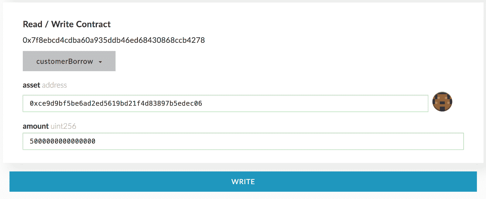
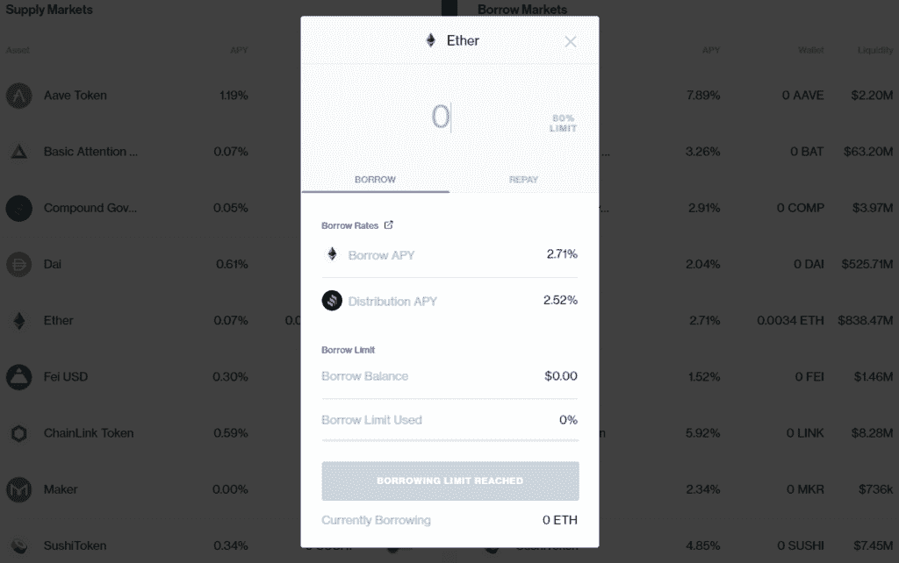
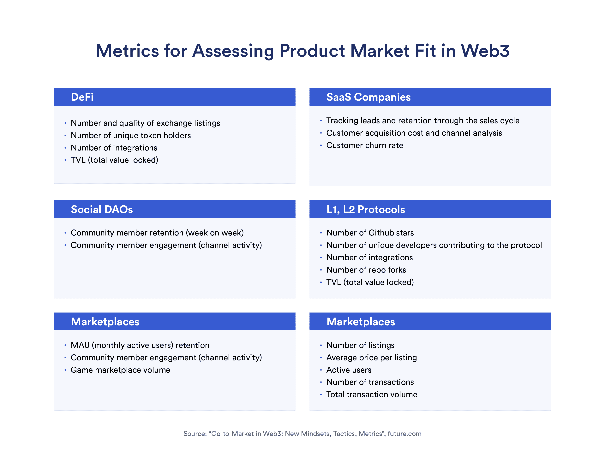

# 如何知道你的产品何时适合市场，以及下一步该做什么

> 原文：<https://blog.chain.link/product-market-fit-what-to-do-next/>

在讨论 [Web3 的上市策略](https://blog.chain.link/a-guide-to-building-web3-products/) 时，我们简要地谈到了产品-市场契合度的概念。然而，这是一个值得进一步研究的微妙话题。讨论往往集中在如何实现产品与市场的契合，而没有恰当地解释你如何知道你何时找到了契合点，以及这对你的产品策略意味着什么。

考虑到这一点，本指南试图回答以下问题:

*   Web3 的产品-市场契合度是什么样的？
*   你如何知道你已经实现了产品与市场的契合？
*   你如何衡量产品市场是否适合 Web3？
*   谁的工作是跟踪产品与市场的契合度？
*   当你达到产品与市场的契合度时，你会怎么做？

[https://www.youtube.com/embed/-wXCHWR1FCg?feature=oembed](https://www.youtube.com/embed/-wXCHWR1FCg?feature=oembed)

## 什么是产品与市场的契合度？

产品-市场契合这个术语是马克·安德森创造的，用来描述完美满足市场需求的产品。最初，Andreessen 并没有提供具体的描述来说明如何判断何时患有这种疾病。他认为，产品与市场的契合度是一个明确无误的里程碑——当达到这一契合度时，一家初创公司将被新客户的数量淹没，几乎跟不上需求。

然而,《黑客成长》的作者肖恩·埃利斯在这个定义中加入了他自己的细微差别。对埃利斯来说，安德森似乎把产品市场描绘成一个最终目标，而不是一个连续的过程。但这与他自己的经历不符。埃利斯指出，他在 Uporaor 和 LogMeIn 担任营销副总裁期间，“确实不得不围绕一个产品进行迭代和强化”。埃利斯的观点是，产品与市场的匹配是反复出现的，并且需要是可衡量的。这就是为什么他发明了现在著名的“肖恩·埃利斯测试”来评估产品与市场的契合度

## 在 Web3 中，您如何跟踪产品与市场的契合度？

在 Web3 中跟踪产品与市场的契合度不像在 Web2 中那样简单。首先，Web3 是分散的，通常是匿名的。这使得很难依赖传统的产品分析工具，如 Google Analytics、Mixpanel 或 Amplitude。没有第三方 cookie 跟踪来给你提供对你的受众的精细洞察——许多人会说这是一件好事。

尽管如此，Web3 的创始人需要某种可量化的指标来帮助他们确定他们何时找到了产品市场契合度。这些指标可以是用户反馈得分、TVL(锁定的总交易量)、交易数量、唯一钱包的数量、NFT 的底价等等。

### **谨防误导性指标**

如您所见，这些指标在很大程度上取决于被测 Web3 产品的类型。稍后，将会更详细地介绍度量标准，但是首先，确定可能会产生误导的度量标准非常重要。

Web3 对爆炸性网络效应的倾向可以被认为是福也是祸。一方面，它可以让项目快速发展。另一方面，它会掩盖项目的真正效用。这是一个问题，因为效用传统上是用来衡量产品市场适合度的标准。

例如，一家通过赠品和流动性激励推动增长的初创公司并不一定能实现产品与市场的契合。通常，这种采用是通过营销和激励工程而不是效用来驱动的。

当然，效用并不是所有类型的 Web3 项目的先决条件。许多 NFT 没有直接的效用，但是买家经常被艺术品的质量以及项目的品牌和社区所吸引。然而，即使在这种情况下，也很难判断购买行为是否表明真正的产品市场契合度，而不是短期投机。

那么什么指标是可靠的呢？答案有很多要素。首先是一个 Web3 产品的目标市场的性质。

### 你的目标是蓝海还是红海市场？

当试图理解如何评估产品与市场的契合度时，确定产品是否针对“蓝海”和“红海”市场是很有用的。W. Chan Kim 和 renée maoborgne 在 2004 年出版的《蓝海战略》一书中介绍了这种思维模式。

这个概念很重要，因为它有助于形成产品策略，并指出哪些指标对评估产品与市场的契合度有用。对于 Web3 来说尤其如此，因为许多新市场尚未出现。

#### 红色海洋

“红海”是一个已知的、可量化的市场，有既定的用户需求，许多产品和品牌在其中争夺市场份额。

在 Web3 中，DeFi 产品和 NFT 收藏品的市场现在可以被认为是“红海”,因为有固定的需求。

例如，DeFi 项目的市场份额相对容易量化。人们可以查看项目的 TVL，并将其与所有 DeFi 协议的总 TVL 进行比较。在撰写本文时，Defi Llama 列出了 TVL 的总 Defi 为 885.3 亿美元，其中 MakerDAO 所占份额最大，为 9.5%，即 85.6 亿美元。

因此，市场份额很容易计算，因为 DeFi 现在有很大的需求，并且有许多市场参与者可以与之比较。

#### 蓝色的海洋

“蓝海”市场是一个未知和未开发的市场。这意味着创业公司需要表明对其产品的需求，并创造一个新型市场

由于蓝海产品本质上是新生的，很难定义当前的 Web3 示例。一些例子可能是许多刚刚开始进入 Web3 的 Web2 市场，如参数保险和房地产。

人们还可以回顾 2014 年 stablecoins 的出现。BitUSD 是第一批 stablecoin 产品之一，但当时很难计算其市场份额，因为它处于蓝海市场，几乎没有任何现有的 stable coin 产品可以与之相比。在这种情况下，我们需要查看其他指标，如用户反馈或产品参与度。

面向用户的指标是必不可少的，因为区块链技术的新颖性在历史上激发了为不存在的问题提供解决方案的项目。在某些情况下，没有明确的理由说明为什么某种产品或服务需要出现在区块链上。这是因为他们的创始人没有花时间去寻找合适的问题解决方案——这就是为什么用户研究对于渴望创造蓝海市场的项目如此重要。

### **产品市场拟合迭代的一个例子**

DeFi protocol Compound 提供了一个具体的例子，体现了肖恩·埃利斯的“迭代实现产品-市场匹配”的理念。Compound 成立于 2018 年，是一个对加密资产感兴趣的去中心化市场，作为以太坊上的智能合约运行。

在与 a16z 的杰西·瓦尔登 的对话中，Compound 创始人罗伯特·莱什纳描述了 Compound 如何迭代三个基本版本，以便它能够“将来自社区用户的反馈整合到构建更好产品的循环中”。

根据 Leshner 的说法，迭代过程如下:

1.  测试版
    这是复合智能合约的早期未发布版本，面向创始人私下认识的一小批早期用户。它的主要目的是让这些用户私下测试和沙盒的核心思想，赚取利息的加密资产。  T10】
2.  **Initial Mainnet Version** The first mainnet version of Compound was launched in 2018, and gave the founders the chance to get early feedback from the wider market. The original process for interacting with the smart contract was clunky and more oriented toward technical users, but the team learned a great deal about how to improve the product.

    

    <figcaption id="caption-attachment-4296" class="wp-caption-text">早期版本复合用户界面</figcaption>

    

3.  **Final Mainnet Version** The Compound team made some significant changes in response to user and developer feedback, such as introducing risk parameters for each asset and streamlining the codebase so that it was easier for developers to work with. This version is considered to be the “final” version—it could also be considered the version with which Compound found true product-market fit.

    

    <figcaption id="caption-attachment-4297" class="wp-caption-text">当前复合用户界面</figcaption>

    

## 你如何衡量产品市场是否适合 Web3？

正如我们已经注意到的，产品与市场的契合度看起来是不同的，这取决于你正在开发的产品类型。这也意味着您需要使用不同类型的指标来跟踪它。

#### 能够表明产品市场适合度的上市指标

衡量特定 Web3 走向市场战略成功与否的指标可以表明产品与市场的契合度。在“[Web3 走向市场:新的思维模式、策略、指标](https://future.com/go-to-market-in-web3/) ”中，a16z 的 Maggie Hsu 为主要的 web 3 垂直市场提出了以下指标:

然而，这些指标只有在你有一个与之比较的基准时才有意义。在一个红海市场中，这相对简单:你可以将你的指标与现有的参与者和整个市场进行比较。

如果你认为自己处于一个蓝海市场，唯一的比较点就是你自己在更早时间点的指标快照。换句话说，您的度量标准改进的速度。

然而，一个更好的衡量成功的方法是询问你的用户。

#### 用户指标

一个流行的基准是所谓的“肖恩·埃利斯测试”(肖恩·埃利斯是 Dropbox 的第一个营销人员，也是该测试的作者)。这个指标特别适合早期创业公司，它让用户回答一个简单的多项选择调查问题。

##### 如果您不能再使用[产品]，您会有什么感受？

根据 Ellis 的说法，当至少 40%的用户表示如果他们不能再使用该产品，他们会“非常失望”,那么该产品就可能达到产品市场适合度。埃利斯通过比较他合作过的 100 家初创公司的调查结果，得出了这个 40%的基准。他发现，那些达到 40%以上的人通常能够持续扩大业务规模，而那些明显低于 40%的人似乎总是在挣扎。

同样，这一标准并不总是适用于没有任何明确用途的项目，比如 NFT 艺术项目。这并不意味着用户调查不能提供任何见解。例如，2022 年初，一群柏林艺术市场专家开始评估买家购买非功能性艺术品的动机。结果是 NFT 上的 [美术+科技报道](https://www.arttechreport.com/) 海内。该报告提供了许多关于买家动机的详细见解。当然，这份报告旨在评估整个市场的状况。然而，同样的调查方法可以很容易地适用于评估一个特定的 NFT 社区的动机。

#### 社区和社会指标

注意，社区和社会指标经常出现在 Hsu 的上市指标列表中。这是因为社区与大多数 Web3 创业公司的成功有着内在的联系。特别是对于 NFT 和基于游戏的项目，社区参与度可以作为产品市场契合度的早期指标。

在决定具体的衡量标准时，一个好的起点是社区工具供应商休息室提供的社区成功衡量标准的 [详细列表](https://www.commonroom.io/blog/community-health-success-metrics) 。该列表包括一些指标，如积极回馈社区的成员百分比，以及至少有一个回复的帖子和消息的百分比。

面向社区的 Web3 项目还应该监控本地社区平台之外的讨论，即其他社交媒体平台上的讨论。在这里，跟踪衡量社交媒体参与度的指标很重要，如 [到达、印象、回应和品牌提及](https://keyhole.co/blog/social-media-marketing-metrics-that-matter/) 。

对于许多 Web3 初创公司来说，这些指标并不是核心的成功指标，但它们可以提供一个项目与产品市场契合度的补充反馈。

## 在 Web3 中，跟踪产品的市场适合度是谁的工作？

这个问题很少被提及，因为 Web3 行业还很年轻，缺乏标准化的工作角色。然而，考虑这个问题很重要，因为在这样一个快速发展的行业中，真正的所有权至关重要。

对于非常早期的创业公司，典型的答案是“创始人——创始人做一切事情”。但是在传统的 Web2 创业公司中，跟踪产品指标是产品经理的工作。他们有时间和技能来进行正确的调查并得出正确的报告。

然而在 Web3 领域，产品经理并不总是固定的。这是因为许多 Web3 团队不理解产品经理是做什么的。事实上，许多 Web3 团队并不需要产品经理来获得成功。

Alchemy 的产品负责人 Jason Shah， [指出](https://www.lennysnewsletter.com/p/a-product-managers-guide-to-web3) 在创建一个 DeFi 协议或者运行一个 NFT drop 的时候，团队主要只需要一个开发者，一个社区经理，一个协议设计师(DeFi)或者一个美工(NFTs)。他指出，当用户体验(UX)成为优先事项时，或者当存在超出单个专家能力的混合活动(如营销、增长、业务发展、社区管理、产品分析等)时，Web3 团队通常会聘请产品经理。

一般来说，没有必要雇佣产品经理来跟踪产品与市场的契合度，但是多了解一下产品经理的工作并决定谁将在你的团队中担任产品经理是很有用的。

## 当 Web3 团队实现了产品与市场的契合时，他们应该做些什么？

产品与市场的契合表明你的创业公司走上了正轨，但这并不意味着你要坚持同样的策略。相反，这是一个信号，改变齿轮，开始专注于不同的目标。

如果我们回到 Compound 的案例，可以看到团队在发现产品符合市场需求后改变了策略。他们通过两种方式做到了这一点:

*   他们更加关注开发者社区建设
*   他们更多地考虑如何分散所有权。

#### 加大对社区建设的投资

虽然该团队有一个本地 dApp，但复合协议是(现在仍然是)核心产品。这意味着 Compound 需要开发人员在它的协议之上进行构建，这样它就可以扩大覆盖范围。一旦团队发现他们的产品有市场，他们就投入更多的时间在 [建立开发者社区](https://blog.chain.link/building-and-scaling-a-web3-developer-community/) 。正如 Leshner 所说，“我们花了很多时间做大多数人觉得无聊的事情，”具体来说就是:

*   改进和扩充技术文件。
*   编写用例和端到端教程。
*   在 Discord 和 Github 上回答问题并回复来自开发者社区的消息。
*   更新他们的网站，展示其他开发者基于该协议开发的产品。

#### 分散所有权的规划

根据 Leshner 的说法，如果你还在迭代你的 MVP，那么去中心化是个坏主意。当你“由委员会设计”时，你不能适应得太快。相反，目标是“从一个极端高效的位置开始”，这意味着复合团队可以快速工作，因为他们正在制定所有的决策。

然而，一旦他们发现产品符合市场，这种观点就转变了。他们开始迭代他们的方式走向社区所有权。这最终导致了几个重要的里程碑:

*   **发行治理令牌**  2020 年 4 月，Compound 根据用户的链上活动向其分配补偿令牌。这种令牌赋予了持有者对任何网络决策进行提议和投票的权利。这包括关于使用激励、平台将支持的资产以及 Compound 的治理机制本身的决策。
*   **移交管理密钥**许多项目使用管理密钥来授权对代码库的重大更改和对网络协议的升级。通常，一个集中的团队持有管理密钥，这意味着外部开发人员不能进行重大更改。Compound 也是如此，但在 2020 年 6 月，该团队将管理密钥的控制权移交给了他们的社区。这意味着社区可以实施他们投票支持的变革。

当然，并不是所有的 Web3 项目都注定要去中心化。例如，已经构建了交易所、NFT 市场和基础设施平台等产品的 Web3 团队通常选择保持更加集中化。对于这些团队来说，找到产品市场契合度通常是一个信号，表明他们应该开始寻找新的 Web3 市场。

#### 关注新的 Web3 市场

对于大多数 dApps 和技术提供商来说，每个区块链代表一个独立的市场。因此，这些产品的常见模式是首先在一个特定的链上找到产品市场适合度，然后扩展对新链的支持。例如，Chainlink 技术最初支持以太坊，但后来升级到支持其他 EVM 兼容链，如 Avalanche 和 Polygon，以及非 EVM 链，如 Solana。这种产品与市场的契合可能是一个信号，表明投资者需要对下一个支持链进行更多研究。

新市场也可以按照垂直市场进行评估，如 GameFi 和 NFTs。例如，2022 年 2 月，区块链基础设施提供商 Alchemy 发布了一个 [NFT API](https://twitter.com/alchemyplatform/status/1489330992787726338?lang=en) ，以简化构建基于 NFT 的项目的任务。Alchemy 已经找到了适合其核心产品 Supernode 的产品市场，因此能够扩展其产品套件，以应对蓬勃发展的 NFT 市场。如果没有适合 Supernode 的产品市场信号，将资源转移到支持新市场是没有意义的。

## **产品与市场的契合是一个反复的过程，而不是一次性事件**

产品与市场的匹配常常被认为是一次性事件，而实际上它是一种可以获得但很容易失去的品质。因此，产品与市场的匹配需要不断重新评估。当外部条件发生变化时，例如当市场情绪发生变化或当市场因竞争加剧而变得饱和时，这种重新评估至关重要。在设定新的内部目标时，例如打入新的市场或与新的技术生态系统整合，重新评估产品与市场的契合度也至关重要。

无论哪种情况，你都需要看你的产品是否仍然解决了用户问题，或者增加了足够的价值。用户最初喜欢的同一产品可能不适合当前的市场状况，或者当你试图将它引入新市场时，它可能会表现平平。

这就是为什么持续监控表明产品与市场契合度的指标非常重要——尤其是那些表明市场和社区对你的产品的看法的指标。

## **适用于带链环的启动**

[Startup with chain link](https://chainlinklabs.com/startup?utm_medium=referral&utm_source=chainlink-blog&utm_content=product-market-fit-what-to-do-next)专为支持 Web3 创始人而打造，为他们提供世界一流的资源，协助他们踏上创业之旅。该项目帮助初创公司从最初的构思和验证到建立一个工作系统和培养社区。

正在打造独特而有趣的产品、服务或产品的 Web3 创始团队被邀请到 [申请](https://chainlinklabs.com/startup?utm_medium=referral&utm_source=chainlink-blog&utm_content=product-market-fit-what-to-do-next) 。 更多的 Web3 启动资源直接发送到你的收件箱 ， [注册 Chainlink 简讯](https://pages.chain.link/subscribe?utm_medium=referral&utm_source=chainlink-blog&utm_content=product-market-fit-what-to-do-next) 。