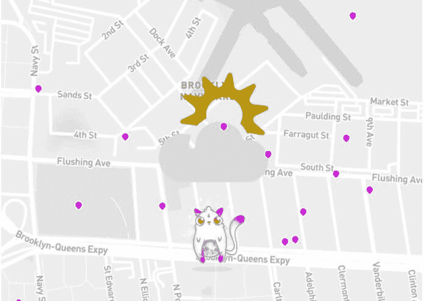
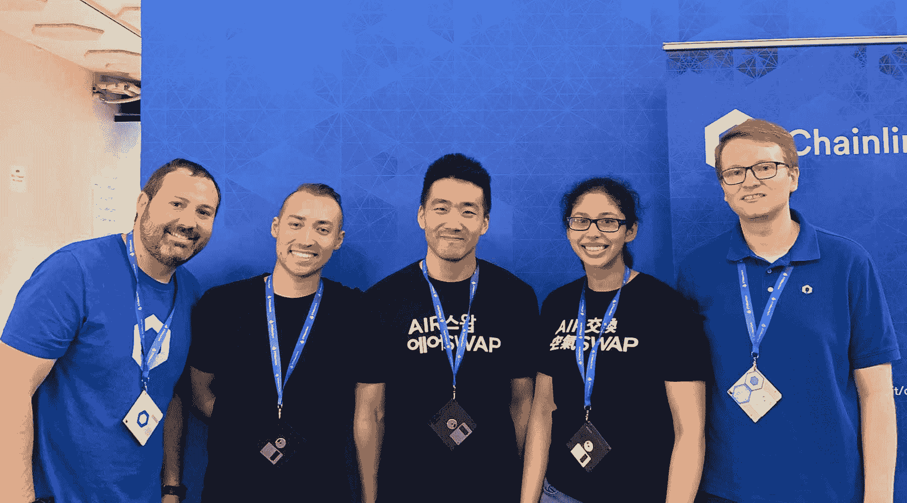

# 来自 ETHNewYork 黑客马拉松的获奖项目

> 原文：<https://blog.chain.link/showcasing-the-winning-projects-from-the-ethnewyork-hackathon/>

在上周的五月 ETHNewYork 黑客马拉松上，我们支持了许多将 chain link[Oracle](https://chain.link/education/blockchain-oracles)集成到他们的智能合同中的团队。我们向在区块链以太坊上展示 Chainlink 最佳工作应用的两个顶级团队颁发了 5000 美元的奖金。

### 第一名:法式吐司猫咪

由布莱恩·周、迪帕·萨沙耶和伊森·韦塞尔组成的三人组“法国烤面包小猫”获得了令人垂涎的第一名，奖金为 4000 美元。在已经很受欢迎的 Dapp CryptoKitties(一款基于 ETH 的区块链游戏，允许用户购买、出售和繁殖稀有的数字猫)的基础上，French Toast Kitty 是一款 Dapp，它使 Cryptokitty 的主人能够使用真实世界的数据与他们的 Cryptokitty 进行交互。它扩展了 CryptoKitties 的功能，在数字地图上呈现猫咪，并根据天气情况显示与猫咪一起享受的相关活动。例如，它会在晴天推荐附近的公园，在雨天推荐有趣的博物馆。

<figcaption id="caption-attachment-440" class="wp-caption-text">法国土司凯蒂图</figcaption>

French Toast Kitty 使用 Chainlink oracles 根据用户的搜索位置标准从 MetaWeather.com API 收集天气数据。天气数据决定了推荐的活动。该团队指出，“将真实世界的数据带到区块链可能很难，但 Chainlink 使可靠、安全地获取真实世界的数据变得容易。”

虽然稀有收藏品总是一件事，但法国吐司 Kitty 是少数几个利用数据推动用户与数字收藏品互动的项目之一。该团队认为，“我们将继续看到收藏品的变化。”事实上，他们已经在为他们的 Dapp 开发额外的功能，比如“猫的动画和给小猫一个他们自己的想法。”

<figcaption id="caption-attachment-439" class="wp-caption-text">法国土司凯蒂队</figcaption>

### 评委选择奖:Blocksolid

由 Saga Arvidsdotter、Juan Mayen、Sam Steele 和 Katia Shatkin 组成的四人团队 Blocksolid 赢得了 1，000 美元的评委选择奖。Blocksolid Dapp 允许世界上的任何人将 ETH(很快菲亚特将通过 WYRE)捐赠给一个智能合同，用于支付发展中地区的互联网服务。Blocksolid 构建了一个互联网脚本，可以扫描互联网连接，并识别不同位置的互联网正常运行时间。非政府组织可以监控 Dapp 仪表板上的指标，并使用这些数据让 ISP(互联网服务提供商)对其服务水平负责，并确定需要额外互联网资源支持的地理位置。

<figcaption id="caption-attachment-438" class="wp-caption-text">The Blocksolid Dashboard</figcaption>

Blocksolid 使用 Chainlink oracles 将脚本收集的数据转发给一个[智能契约](https://chain.link/education/smart-contracts)。正如 BlockSolid 的 Katia 所说，“智能合同允许或阻止互联网服务提供商根据收集的正常运行时间数据提取资金。这激励互联网提供商提供可靠的服务，并为非政府组织捐赠资金提供端到端的透明度。Chainlink 的技术是该项目的核心，使我们能够安全地将数据从 ISP 端点传送到智能合同。”

向第三世界国家提供可靠的互联网连接将有助于纠正经济差距。接入互联网可以帮助欠发达地区解决教育差距，并确保人们获得可靠和准确的信息。

两位黑客马拉松获胜者展示了 Chainlink 如何通过允许外部数据触发区块链的状态变化来扩展智能合约的功能。对外部资源和数据的访问开辟了一系列新的用例，这些用例以前是开发人员的禁区。