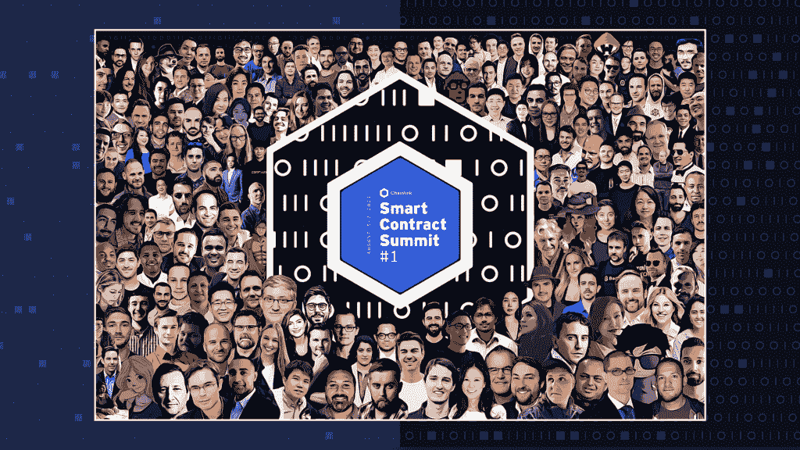

# 智能合同峰会#1 的 7 大要点

> 原文：<https://blog.chain.link/smart-contract-summit-1-takeaways/>

[智能合约峰会#1](http://smartcontractsummit.io) 正式结束！从我们才华横溢的演讲者和小组成员到我们热情洋溢的社区成员，感谢所有帮助峰会成为 2021 年区块链行业最大事件之一的人。

来自全球 140 多个国家的 15，000 多名与会者齐聚一堂，聆听 200 多位行业领先的创始人、研究人员和开发人员探讨区块链生态系统中最重要的创新和合作。从开发人员速度跑和对公平交易排序的前沿研究，到进入区块链空间的新企业参与者，再到 Sergey Nazarov 宣布 [【跨链互操作性协议】(CCIP)](https://blog.chain.link/introducing-the-cross-chain-interoperability-protocol-ccip/) 的重要主题演讲，SmartCon #1 展示了在[智能合约](https://chain.link/education/smart-contracts)领域发生的巨大创新浪潮的精彩快照。

虽然有太多的重要进展需要统计，但这里还是回顾一下今年峰会最重要的声明和趋势。

## 1.离线和跨链服务为开发者提供了构建 dApps 的下一代工具包

[https://www.youtube.com/embed/btbIgwJy29s?feature=oembed](https://www.youtube.com/embed/btbIgwJy29s?feature=oembed)

 随着 [混合智能合约](https://blog.chain.link/hybrid-smart-contracts-explained/) 的兴起，开发者正在意识到安全的链外服务对于扩展 dApps 功能的强大，从可验证的随机性到低成本的自动化。SmartCon 向与会者展示了由 Chainlink 网络支持的信任最小化的链外计算的持续扩展，包括 mainnet 上 Chainlink Automation 的推出、Chainlink 公平排序服务的介绍(FSS)以及宣布的跨链互操作性协议(CCIP):

*   Chainlink 联合创始人 Sergey Nazarov 宣布了[【CCIP】、](https://blog.chain.link/introducing-the-cross-chain-interoperability-protocol-ccip/) 跨链互操作协议，这是一个新的开源标准，用于智能合同如何在区块链进行互操作，实现跨链消息/命令和令牌移动。CCIP 旨在建立数百个区块链网络之间的通用连接，包括私有和公共网络，解锁孤立的令牌，并为所有链上生态系统提供跨链应用。
*   [chain link Automation](https://blog.chain.link/chainlink-automation-is-now-live-on-mainnet/)mainnet 的推出为开发人员提供了一种高度安全可靠的方式来根据预定义的条件触发智能合同——消除手动流程，引入高级 dApp 用例，并将资源转移回核心产品开发。
*   Chainlink Labs 的首席科学家 Ari Juels 解释了目前正在开发的 Chainlink 公平排序服务(chain link Fair Sequencing Services)将如何为广泛讨论的问题提供一个分散的解决方案，这些问题是[【miner-extractable value(MEV)](https://blog.chain.link/what-is-miner-extractable-value-mev/)】，为整个区块链空间的交易订单完整性建立一个更加经济公平的系统。

## 2.全球企业正在链上移动

[https://www.youtube.com/embed/8E7OAJtbAn4?feature=oembed](https://www.youtube.com/embed/8E7OAJtbAn4?feature=oembed)

今年的 SmartCon 展示了世界上一些最大的企业如何通过为智能合约开发商提供有价值的数据和服务来提升其基础设施，以支持各种分散式应用。

*   [谷歌云正在与 Chainlink](https://medium.com/google-cloud/hedging-against-bad-weather-with-cloud-datasets-and-blockchain-oracles-7ba3e0150304) 合作，使智能合约能够在谷歌 BigQuery 上查询 NOAA 天气数据集，以基于 9000 多个站点的可靠天气测量结果为链条参数保险供电。
*   亚马逊网络服务(AWS)合作伙伴网络与 Chainlink Labs 合作开发了 AWS Chainlink Quickstart，这是一种一键式解决方案，可在几分钟内在 AWS 云上启动高度安全、可用且可用于生产的 Chainlink 节点。
*   瑞士领先的电信公司 Swisscom 的 [现在运行自己的 Chainlink 节点](https://www.swisscom.ch/en/magazine/new-technologies/swisscom-to-become-part-of-the-worlds-largest-oracle-network/) 以进一步保护 [Chainlink 数据馈送](https://data.chain.link/) ，为业内最广泛使用的价格馈送增加了另一层强大的安全性和分散性。

## 3.从金融包容性到环境可持续性，智能合同正在提升社会影响力

[https://www.youtube.com/embed/xs9UXSJrf6Y?feature=oembed](https://www.youtube.com/embed/xs9UXSJrf6Y?feature=oembed)

多位演讲者上台解释了如何利用区块链技术和智能合同来推进社会影响计划，并实现更加开放、公平和透明的全球经济体系。

*   在社会影响圆桌会议上，来自 exMachina 和 GoodDollar 的社会公益项目负责人讨论了区块链科技和 chain link decentralized[oracles](https://chain.link/education/blockchain-oracles)如何通过利用与高质量天气和市场数据相关的自动化、确定性智能合同来解决气候变化和收入差距方面的关键问题。
*   来自绿色世界运动的 Marc Barasch 和来自开放地球基金会的 Martin Wainstein，一位 [Chainlink 社区赠款获得者](https://blog.chain.link/open-earth-receives-grant-for-c02-oracle/) ，讨论了他们通过混合智能合同建立精确跟踪碳排放的开源基础设施的计划。
*   联合国儿童基金会资助的 protocol Treejer 谈到使用 [Chainlink VRF](https://chain.link/solutions/chainlink-vrf) 生成 10，000 个可验证的随机 NFT，代表在现实世界中种植的实体树木，激励用户为农村地区的种植者提供小额贷款。
*   总部位于区块链的初创公司 ZuzLab 的创始人 Seth Goldstein 和企业家 Cemil Türün 解释了数字身份和声誉如何成为当地社区金融联系的重要工具，从而减少财富不平等并实现可持续的当地经济。
*   Teller Labs 首席执行官 Ryan Berkun、张帆和 Lorenz Breidenbach 解释了 DECO 的使用案例，DECO 是一种用于智能合同的隐私保护 oracle 协议，可以在开放的数字生态系统中转变数据所有权。

## 4.CeFi 平台正在分散化，而 DeFi 正在加速

[https://www.youtube.com/embed/HuiqGXePcuQ?feature=oembed](https://www.youtube.com/embed/HuiqGXePcuQ?feature=oembed)

 随着 [DeFi](https://chain.link/education/defi) 平台在采用和创新方面的快速发展，越来越多的 CeFi 机构正在通过分散其基础设施和集成 DeFi 协议来实现更可靠、透明和更高收益的金融产品，从而打入区块链生态系统。

*   来自 Ampleforth、Frax Finance、Fei Protocol 和 TrustToken 的创始人讨论了 stablecoins 的未来，从算法货币到储备支持的代币，以及他们如何利用 [【链节自动化】](https://chain.link/automation) 和 [储备证明](https://chain.link/solutions/proof-of-reserve) 来确保完全自主和透明的协议。
*   off chain Labs 的联合创始人 Ed Felten 详细介绍了基于以太坊构建的第 2 层协议 Arbitrum 如何通过其旗舰级汇总链 Arbitrum One 使网络交易更快、更便宜、更具可扩展性，该链拥有一个广泛的生态系统合作伙伴列表，可随时用于测试版和 mainnet 发布。

## 5.游戏和 DeFi 正在向动态 NFTs 靠拢

[https://www.youtube.com/embed/d7BGlcaANR8?feature=oembed](https://www.youtube.com/embed/d7BGlcaANR8?feature=oembed)

 [NFT](https://chain.link/education/nfts)领域的众多项目负责人来到 SmartCon 展示新一代游戏 dApps，从玩到赚的 NFT 应用程序到使用 DeFi 包装的 NFT 作为可玩角色的多游戏平台。Chainlink 网络为这一波新兴的区块链游戏提供了广泛的 oracle 功能，例如将游戏内的令牌链接到链外数据，为游戏内的皇室战斗生成防篡改的随机性，以及自动收获游戏内的收益。

*   Axie Infinity 的联合创始人亚历山大·拉森(Aleksander Larsen)向与会者介绍了 Axie 团队构建流行的“玩到赚”游戏的过程，阐述了游戏内经济对于创建可持续和持久的 [玩到赚平台](https://blog.chain.link/what-is-play-to-earn/) 的重要性。
*   Aavegotchi 的联合创始人杰西·约翰逊展示了 aToken 驱动的 Aavegotchi、动态 NFT，它们在游戏中使用，从 Aave 协议借用的令牌中铸造， [利用 Chainlink VRF](https://chain.link/case-studies/aavegotchi) 来创建可验证的随机和可证明的公平玩家体验。
*   位于 NFT 的项目创始人和大型区块链 NFT 生态系统(如韩国的 Klaytn)齐聚一堂，讨论游戏挣钱革命、GameFi 的不同方面，以及将动态 NFT 引入元宇宙和主流。

## 6.全生态系统计划正在推动智能合同创新

[https://www.youtube.com/embed/s-jju6AhDeE?feature=oembed](https://www.youtube.com/embed/s-jju6AhDeE?feature=oembed)

 随着多链生态系统的快速扩张，Web 3.0 堆栈所有层和多个区块链的项目正在合作探索新的智能合约用例，并为 dApps 提供更强大的功能，从保密机制到跨链开发。T3
T5】

*   比特币基地前首席技术官和 a16z Balaji Srinivasan 的 GP 宣布与 Chainlink 合作，资助开发一个 [分散和抗审查的通货膨胀仪表板](https://1729.com/inflation) ，它将提供一个加密签名的全球通货膨胀真相来源。获胜者将获得 Balaji 的 10 万美元投资和来自 [Chainlink 赠款计划](https://chain.link/community/grants) 的 10 万美元赠款。
*   来自 [智能合同研究论坛](https://www.smartcontractresearch.org/) 、卡耐基梅隆大学和法兰克福学派的知名学者聚集在一起进行小组讨论，探讨各种共识机制和隐私解决方案，如 [零知识证明(ZKPs)](https://blog.chain.link/what-is-a-zero-knowledge-proof-zkp/) 等，以促进机构采用区块链。
*   [Chainlink 和 Filecoin 启动了一项联合资助计划](https://blog.chain.link/announcing-the-chainlink-and-filecoin-joint-grant-program/) 以支持开发人员构建混合智能合同，利用 Chainlink 分散式 oracles 和 Filecoin 不可变存储之间的双向连接。

## 7.对密码真实性的需求正在激增

[https://www.youtube.com/embed/AEtBPbmIRKQ?feature=oembed](https://www.youtube.com/embed/AEtBPbmIRKQ?feature=oembed)

Chainlink 联合创始人谢尔盖·纳扎罗夫(Sergey Nazarov)在简要回顾了基于信任的合同的简短历史后，在他的主题演讲中强调了 SmartCon #1 的底线:加密真相绝对优于在历史上辜负了社会的软弱的“相信我们”纸面承诺。用户不断涌入 DeFi 生态系统，大企业越来越多地采用智能合同，就是这种全球意识的证明。

在过去三天的 SmartCon 大会上，从 DeFi 协议到 CeFi 机构到游戏 dApps，从保险巨头到云计算领域的领导者，各种项目和行业的广泛参与清楚地证明了跨行业对构建分散式系统的兴趣，这种系统将一切与加密真理联系起来，并最终实现一个公平、公正的世界。

## **加入 Chainlink 生态系统**

再次感谢所有帮助 Smart Contract Summit #1 成为我们行业巅峰盛会的人。如果没有出色的演讲者、开发人员、研究人员和与会者聚在一起庆祝过去一年取得的快速进步，这一切都是不可能的。

要了解 Chainlink 的最新动态，请在 [Twitter](https://twitter.com/chainlink?ref_src=twsrc%5Egoogle%7Ctwcamp%5Eserp%7Ctwgr%5Eauthor) 上关注 Chainlink，注册 [Chainlink 简讯](https://chn.lk/newsletter) ，订阅 [Chainlink YouTube 频道](https://www.youtube.com/channel/UCnjkrlqaWEBSnKZQ71gdyFA) 。对于那些希望重新观看过去 3 天发生的演示、小组讨论和其他活动的人，我们将在 [Chainlink YouTube 频道、](https://www.youtube.com/channel/UCnjkrlqaWEBSnKZQ71gdyFA) 中添加 SmartCon 活动的录音，敬请关注。

希望使用 Chainlink 进行构建的开发人员和团队应该访问 [开发人员文档](https://docs.chain.link) ，加入关于我们 [不和谐](https://discord.com/invite/aSK4zew) 的技术讨论，或者 [联系专家](https://chainlinkcommunity.typeform.com/to/OYQO67EF?page=blog) 。