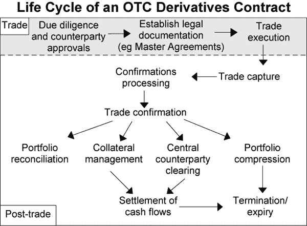
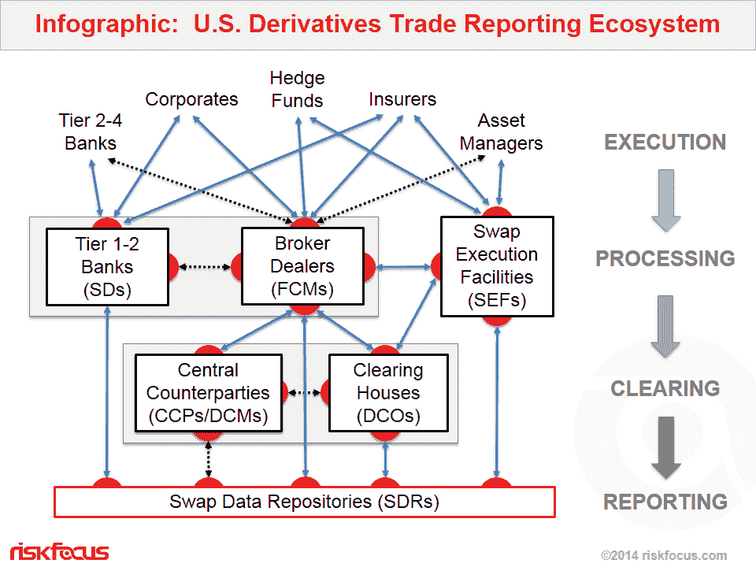
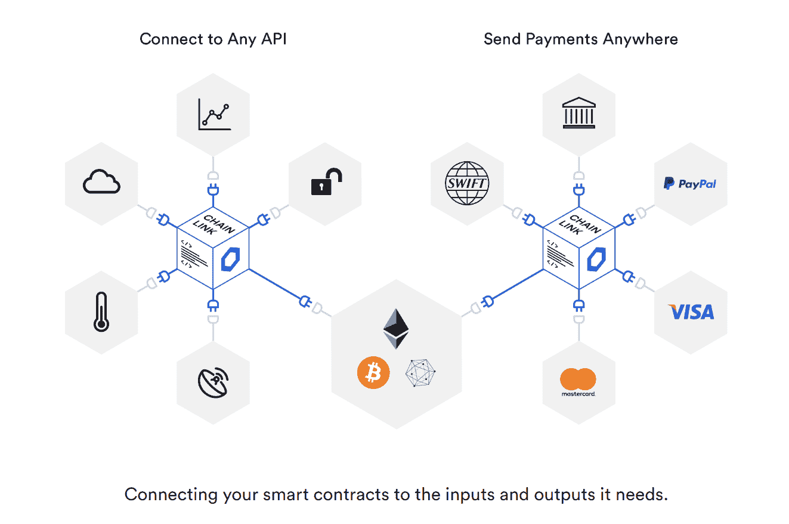

# 使用支持 Chainlink 的智能合约解决衍生品中的深层信任问题

> 原文：<https://blog.chain.link/solving-deep-seated-trust-problems-in-derivatives-using-chainlink-enabled-smart-contracts/>

感谢 SwapChain.io 的 Daniel Goodman 帮助审阅本文，并提供了对衍生品行业的见解。

衍生工具是一种金融工具，其价值基于基础资产或实体。衍生品在全球各行各业根深蒂固，被用于对冲运营风险、管理价格波动风险、获得通常难以获得的资产或市场等。

按名义价值计算，衍生品是世界上最大的市场，估计价值在 500 万亿到 1.2 万亿美元之间。这是一个高风险、深层次相互关联的环境，需要大量的管理费用来建立交易对手之间的信任，并需要密集的监管来避免导致全球金融体系系统性风险的重大失衡。

支持 Chainlink 的[智能合约](https://chain.link/education/smart-contracts)为衍生品市场带来了范式转变，其核心是低开销信任、确定性执行/结算以及各方之间的信息对等。这些新的衍生品智能合约不仅有助于防止全球灾难，还可以通过自动化提高多方效率，并通过降低准入门槛和可定制的选项扩大市场规模，从而增强衍生品的运营功能。

## 了解衍生品市场

衍生品行业分为两类:交易所交易衍生品和场外交易衍生品。

**交易所交易衍生品**是在交易所向公司或个人出售的标准、受监管的产品。它们被数字化成标准格式(买方、卖方、金额等)。)并由美国商品期货交易委员会(CFTC)等政府机构监管。交易所交易的衍生品目前约占整个衍生品市场的 15-25%。世界上一些最大的衍生品交易所包括芝加哥商品交易所集团、欧洲期货交易所和韩国交易所。

大多数交易所实行中央对手方清算所(CCP)，由几个清算成员组成(不包括交易所，它通常是一个独立的法律实体)，所有这些成员都向保险基金出资。CCP 实施了一个被称为交易更新的过程，在这个过程中，清算所会介入交易所的每一笔交易。CCP 是每一个卖方的买方，也是每一个买方的卖方，或者更具体地说，对于衍生品，是每一个多头的空头和每一个空头的多头。

**OTC 衍生产品**是指双方或多方之间协商的产品，其定制条款由双方共同商定，无需进行交易。与交易所交易的衍生品不同，场外衍生品通常不会被数字化为标准格式，而是作为 PDF 纸质合同存储在双方的数据库中。场外交易市场约占整个衍生品市场的 75-85%,散户投资者无法进入。相反，场外交易市场主要由大型银行和对冲基金等复杂机构组成，它们相互之间进行交易。

<figcaption>(The life cycle of an OTC derivatives contract; Source: [The Reserve Bank of Australia](https://www.rba.gov.au/publications/consultations/201106-otc-derivatives/central-clearing-otc-derivatives.html))</figcaption>

虽然 OTC 市场在技术上不受监管，但大多数主要的 OTC 参与者都是国际互换和衍生品协会(ISDA)的成员，该贸易组织创建了一个名为 [ISDA 主协议](https://www.isda.org/a/23iME/Legal-Guidelines-for-Smart-Derivatives-Contracts-ISDA-Master-Agreement.pdf)的标准合同。ISDA 主协议被 57 个国家的 820 个成员用作“管理双方达成的所有场外衍生品交易的标准合同”2008 年金融危机导致了更多的监管和标准化变化，特别是多德-弗兰克法案(Dodd-Frank ),该法案要求利率互换和信用违约互换(占 OTC 市场的很大一部分)由中央对手方清算，并向全球存储库报告交易情况。

事实上，任何有价值的东西都可以作为构建衍生产品的基础，包括资产、数据点甚至事件。最受欢迎的标的包括固定收益、外汇、信贷、股票和大宗商品。利用这些潜在价值可以创造出许多类型的衍生产品。[根据国际清算银行(BIS)](https://www.bis.org/ifc/publ/ifcb35a.pdf) 的数据，最常见的四种是远期/期货、期权和掉期。

*   **远期/期货**–远期是双方之间的非标准化合约(OTC)，允许一方在未来的特定日期以特定价格购买资产。期货合约与远期合约非常相似，但它是标准化的，并由清算机构在交易所提供，而不是像远期合约那样由双方专门撰写。*示例:*一家食品加工公司希望对冲小麦价格的上涨，因此他们与另一方协商一份期货合同，允许他们在六个月后以当前每公吨 200 美元的价格购买 100 吨小麦。
*   **期权—**期权合约是买卖双方之间的一种金融协议，它赋予买方在约定的到期日之前以特定价格购买资产的权利。与期货合约不同，买方不是被迫在特定日期前购买资产，而是购买期权。*例如:*一家投资银行希望对冲美元相对于欧元的升值，因此他们购买了一份期权合约，该合约允许他们在未来两年内以 1 美元兑 0 . 90 欧元的固定汇率将美元兑换成欧元。
*   **掉期–**掉期是双方之间的合同，允许他们交换特定利率的债券等特定金融工具的现金流。互换是在场外市场为企业出售的金融工具，不在交易所提供给散户投资者。*例如:*一家信用评级未知的新钢铁公司支付 5%的可调利率贷款，而一家更成熟的钢铁公司支付 4%的固定利率贷款。他们可以签订互换合同，允许他们在一定时间内互换利率。新的钢铁公司可以减少贷款利率波动的风险，而现有的钢铁公司可以增加利率波动的风险，前提是假设随着时间的推移，他们可以获得低于固定利率 4%的利率。

## 一个需要信任的行业

由于衍生品的高价值和竞争性，有几个关键风险是市场参与者必须认真考虑的——所有这些风险都源于各方之间根本缺乏信任。

### 交易对手风险

在多方协议中，另一方不履行合同义务的风险被称为交易对手风险。在衍生品合约中，延期付款或另一方放弃已经达成的交易的风险太常见了。这些合约的货币价值可以成就一家公司，也可以毁掉一家公司，因此，为了在市场上争取更多的时间来试图抵消未实现的损失，人们有很大的动机推迟付款。这在某些 OTC 市场尤其是一个问题，在这些市场中，监管较弱，标准化程度较低，并且没有中央清算所。

例如，在 2008 年金融危机期间，许多场外交易商推迟向做空住房市场的客户付款，以便建立类似的头寸来覆盖这些负债。延迟结算可以减少由于商定结算日期和实际结算日期之间基础价值的变化而导致的支出。

逃避付款也可能是疏忽的结果，因为同时跨多个网络并以 100%的正常运行时间跟踪与不同交易方的数百万份合同的所有各种条款和条件是极其复杂的。当公司没有收到全额或按时付款时，它会极大地影响资本流动，扭曲预算计算，并导致在诉讼纠纷上花费额外的时间和金钱。

### 无能

对于交易所交易的衍生品，CCP 在交易双方之间扮演着高度监管、值得信赖的中介角色。他们作为交易双方的交易对手，降低了交易中的交易对手、运营、结算、市场、法律和违约风险。它们通过充当做市商来提供流动性，并通过作为托管解决方案介入来提供安全性。

虽然 CCP 有巨大的好处，但也有几个缺点，特别是失去定制(因为 CCP 只处理标准化协议)、价值泄漏、支付延迟和系统风险。使用 CCP 这样的中间人意味着向中间人支付佣金，从交易中抽取价值。这还意味着流程中需要额外的步骤来防范交易对手风险，从而导致交易日期和结算日期的延迟(通常至少两天)。最后，赋予一个实体这样的权力和责任会带来不可否认的系统性风险，尤其是在衍生品这样大的市场中。虽然 CCP 有后备措施来保护自己，但它们仍然容易受到所有集中式系统共有的漏洞的影响，特别是黑客攻击、贿赂和服务器停机。

<figcaption>(The complex trade reporting ecosystem for U.S. derivatives markets; Source: [RiskFocus](https://regteksolutions.com/infographic-the-u-s-derivatives-trade-reporting-ecosystem/))</figcaption>

对于场外交易市场，实现高效的多方工作流尤其具有挑战性，因为需要过多的中介来实现信任和提供流动性。由于缺乏市场上广泛使用的数字合同的标准格式，这需要大量的开销来促进。正如 ISDA 首席执行官 Scott O'Malia 指出的那样,“目前的衍生品基础设施非常低效和昂贵，而且几乎没有办法在整个行业实施可扩展的自动化解决方案。这是因为每个公司和平台都使用自己独特的事件和流程表示法，这需要不断调整数据，以确保交易各方拥有相同的信息。”

### 信息不对称

衍生品市场存在的另一个主要问题是信息不对称——交易中的一方比另一方拥有更好的信息。在交易中，交易双方经常会出现信息不对称。其中一方可能是内幕人士，并寻求场外衍生品，通过获得特定市场条件的额外敞口，从这一有利信息中获利。

买方/卖方和 CCP 之间也可能出现信息不对称。与 CCP 相比，相关的某一方可能对特定合同的违约风险有更好的了解。这就产生了试图在高风险合约上获得优惠利率的动机，将 CCP 置于脆弱的境地。如果在没有适当尽职调查的情况下承接了太多高风险合同，就会给全球经济带来系统性风险，尤其是在世界变得更加相互关联的情况下。

相反，CCP 对全球市场和系统风险有更好的信息，内部人士可以利用这些信息来利用市场条件。拥有专利技术和私人所有权的 CCP 可能容易受到腐败和由更多“知情”方操纵的交易前台的影响。

### 缺乏透明度

信息不对称的主要原因之一是衍生品市场缺乏透明度。很难正确定义整个衍生品市场的规模和价值，尤其是当场外交易市场的一部分是私有的且不受监管的时候。随着一个庞大的互联衍生产品网络在世界各地不同的系统上运行，拥有可靠、客观和全面的数据几乎是不可能的。

缺乏单一的真实来源使得难以对衍生产品定价、计算交易对手风险和评估系统风险。由于准确的市场信息很难获得，许多公司因为高估或低估风险而破产。这也导致许多衍生品交易商的杠杆率明显过高，而高价值合约的一个坏结果可能导致其他投资和整个市场的一连串违约。尽管报告交易的全球存储库已经在多德-弗兰克法案后引入，但在没有交易元数据(特别是场外交易市场的交易元数据)的全面全球标准的情况下，充分的监管仍然具有挑战性。

尽管沃伦·巴菲特对利用衍生产品赚取数十亿美元持开放态度，但他也明白这些产品可能给社会带来的极端危险。伯克希尔·哈撒韦公司在 2002 年的年度信中引用了他的话“然而，在我们看来，衍生品是大规模杀伤性金融武器，带有潜在的致命危险。”

## 用支持 Chainlink 的智能合约取代衍生品市场的后端基础设施

支持 Chainlink 的智能合约为当前维护、执行和结算衍生品合约的后端系统提供了升级的基础设施。它将市场从基于多个可信实体、手动维护和概率性结果的市场转变为由不可信的第三方协议、数据驱动的自动化和确定性结果推动的市场。

智能合约可以使用布尔逻辑以数字形式表示纸质衍生品合约的操作条款(如果发生 x，支付 y)。它作为托管人保管资金，执行合同，记录状态变化，并通过网络冗余地存储合同，保证正常运行时间。

chain link[Oracle](https://chain.link/education/blockchain-oracles)将智能合同连接到它在整个合同生命周期中运行所需的所有数据输入(x)和结算输出(y)。他们负责检索有关基础资产的数据(市场数据)，并将智能合约连接到结算所需的必要外部系统(支付系统、法规遵从性、审计等)。

Chainlink 从竞争对手中脱颖而出，因为它允许智能合约定制其输入和输出的外部连接。只有 Chainlink 提供的一个主要需求特性是分散式 oracles。由于智能合同是自动执行的，因此分散式 oracles 对于向高价值、时间敏感的合同提供可靠和准确的信息至关重要。分散化对于减少导致黑客攻击、贿赂和服务器停机的集中漏洞是必不可少的。在一个像衍生品这样庞大且具有潜在破坏性的市场中，应该采取额外的安全措施来保证自动化数字合约的高质量数据输入和输出。任何一方都不愿看到的最后一种情况是，由错误数据引发的一份合约引发一连串无效合约，并导致金融市场停滞。

采用的另一个基本特征是安全性，从操作和隐私角度来看都是如此。Chainlink 是开源的，任何人都可以验证，并通过了多次独立的安全审计。各方可以放心，它按照编写的方式工作，并可以修改或添加他们认为合适的功能。Chainlink 也在开发处理隐私的方法，致力于实现允许 oracles 在可信执行环境(tee)中运行。这将使智能合同能够连接任何企业系统、政府机构或合同对手，而不会使其系统面临风险或泄露其敏感数据。

支持 Chainlink 的智能合约提供了许多使用当前衍生品基础设施无法获得的好处。

### 降低交易对手风险

通过使用智能合约而不是手动纸质合约，OTC 市场可以利用交易所交易市场目前存在的优势，特别是降低交易对手风险。由于防篡改智能合同在托管中持有双方的抵押品(借方或贷方)，一旦合同通过 Chainlink oracles 接收到正确的数据，它将自动触发结算。通过多个 oracles 和数据源获得的冗余数据以及罚款担保成为合同执行的仲裁者，而不是等待交易对手手动操作。基于数据触发，合同的端到端执行变得确定，这大大减少了延迟、减少或不支付。

这在 OTC 市场尤其有效，在这种市场中，没有部署数字衍生品合约的标准格式。许多市场参与者了解对这些数字标准的需求，这就是为什么 2018 年 6 月，ISDA 发布了其用于数字化衍生品合约的公共域模型 (CDM)的[首个数字迭代。此外，一些法律初创公司/财团，如](https://www.isda.org/a/k9HEE/ISDA-Publishes-First-Digital-Iteration-of-the-CDM-FINAL.pdf) [OpenLaw](https://medium.com/@OpenLawOfficial/openlaw-teams-with-chainlink-to-bring-real-world-info-to-smart-contracts-4e7a3dac80a8) 和 [Accord Project](https://twitter.com/AccordHQ/status/1031022745835003905?s=20) 正在创建以数字方式表示衍生品合约的标准模板。两家初创公司都集成了 Chainlink 来接收衍生品合约的可信离线数据。

### 简化合同

正如数字资产公司(Digital Asset)前首席执行官布莱斯·马斯特斯(Blythe Masters)在与普华永道(PwC)的一次谈话中阐明的那样，总部位于区块链的金融智能合同类似于制造业发生的转变，在制造业中，工业化不是一次制造一辆汽车，而是提供了一种传送带方法，每个人/机器人完成一项特定任务，允许持续同步生产汽车。基于区块链的智能合约为各方提供了类似的传送带基础设施，将他们的相关数据添加到区块链，以完成整个金融交易。这为所有参与者提供了运营数据的单一参考点，消除了多方之间保持各自记录的持续对账。有几个备受瞩目的实体，如 [ISDA](https://www.youtube.com/watch?v=BYMiH9XyKpI&t) 、[谷歌](https://cloud.google.com/blog/products/ai-machine-learning/how-we-built-a-derivatives-exchange-for-google-next-18)和[数字资产](https://www.isda.org/2019/04/09/digital-asset-and-isda-introduce-tool-to-help-drive-adoption-of-isda-cdm/)，旨在创建标准的运营工作流，以连接交易中的所有相关方:交易对手、交易所、数据、审计机构、监管机构等。

 

<figcaption>(Blythe Masters discusses her conveyor belt analogy and how it applies to financial transactions using blockchain-based smart contracts) </figcaption>

支持 Chainlink 的智能合同还可以自动执行目前需要中介的几个流程，特别是第三方执行和保管解决方案。这并不是说来自 CCP 的服务(如净额结算、做市商甚至期权托管解决方案)不重要或不受欢迎，而是说它们可以是附加功能而不是强制性的。这应该有助于消除不必要的中介机构的价值抽取，并减轻一些与负责维护整个衍生品市场完整性和流动性的中央清算所相关的系统性风险。通过共享基础设施，省去中介机构并简化多个工作流程，应能使交易日期和结算日期之间的时间更接近实时。

### 走向信息对等

衍生品的透明度不仅是单笔交易的问题，也是整个行业市场数据的问题。虽然这在某种程度上已经存在，例如使用[交换数据存储库](http://www.marketswiki.com/wiki/Swap_Data_Repository)，但是这些存储库在报告时会稍有延迟，并且可以为存储库的所有者提供轻微的信息优势。拥有一种从所有衍生品交易中提取元数据的标准方法，这种方法既开源又分散，可以让整个市场更接近信息平价，而与基于高级知识的交易对手博弈则困难得多。

由于区块链无缝地促进了基于单一客观事实来源的多方工作流程，市场信息变得更加可靠，各方都可以获得。通过整合基于 TEE 的 oracles，市场参与者可以相互之间、与研究团体、监管机构秘密共享市场数据，或者将这些数据整合到一个关于市场的单一概览数据集的智能合同中。这将给每个人一个基于元数据统一透明标准的当前衍生品金融环境的真正整体视角，而不会暴露任何一方的身份、立场或商业秘密。它让各方更好地了解市场规模和整体杠杆，并能够对经济市场的健康状况发出早期警告信号。

更好的信息应该防止买家与过度杠杆化的衍生品交易商互动，增强监管者降低系统性风险的能力，并降低参与者基于信息优势欺骗系统的能力。它最终会遏制操纵行为，帮助市场找到价格平衡。

### 降低市场壁垒

总部位于区块链的智能合约通常不对机构产品开放，但它正在向全新的创业公司、产品和数据提供商开放衍生品市场。这种转向智能衍生品的趋势通常被归入分散金融的新领域。由于任何公司都可以利用去中心化的后端，许多初创公司正在创建协议，通过条件逻辑对衍生品合约进行建模，如期货合约、期权合约，最终还有互换。

DeFi 项目正在降低衍生品的准入门槛，为个人和小企业提供新的金融工具。他们还向市场推出新产品，如分散的交易所、分散的流动性、标准化的定制合同，以及提供衍生产品并分享利润的分散的自治组织。所有这些产品不仅面向传统市场，也面向链上市场，如基于加密货币的衍生品、公用事业代币(汽油费)和代币化资产。

Chainlink oracles 还使数据提供商能够将他们当前的数据集和 API 服务货币化，以用于衍生品智能合约。来自路透社和彭博等公司的市场数据可以被货币化，新的提供商也可以提供新的方式来提取以前市场上不存在的有价值的数据。谷歌是一家企业使用 Chainlink 来赚钱的最新例子，它的新数据集可以洞察不同的区块链。这些数据现在可以由智能衍生合同通过使用 Chainlink oracle ( [目前在 Testnet](https://docs.chain.link/docs/big-query-chainlink-testnet) 上运行)调用他们的 BigQuery API 来获得。

衍生品领域还有许多其他的 DeFi 初创公司，它们最近宣布了使用 Chainlink oracles 访问链外资源的计划。其中包括金融交易的 [Wanchain](https://medium.com/wanchain-foundation/wanchain-adds-real-world-data-in-partnership-with-chainlink-a7ecf919e181) ，衍生品的[市场协议](https://medium.com/market-protocol/market-protocol-and-chainlink-team-up-to-enable-off-chain-asset-trading-on-the-ethereum-network-72c3ff4a3e1c)，保证金交易的 [bZx](https://medium.com/bzxnetwork/bzx-teams-up-with-chainlink-5b9649e8c241) ，期货合约的 [Olympus Labs](https://medium.com/olympuslabsbc/olympus-labs-and-chainlink-integrate-decentralized-oracles-into-financial-products-for-reliable-17ad07bc5c80) ，以及建立金融标准框架的 [Katallassos](https://medium.com/katallassos/katallassos-to-use-chainlink-for-data-feeds-43bfda459f2b) 。crypto exchange[Synthetix](https://blog.synthetix.io/synthetix-and-chainlink/)，crypto payment solutions[Mobilim](https://medium.com/@Mobilumcom/mobilum-to-use-chainlink-for-cryptocurrency-price-data-feed-for-trading-platform-906e5c91f67)和 [STK](https://medium.com/stk-token/stk-to-use-chainlink-to-bridge-real-life-data-with-blockchain-e960df06ca3a) ，以及区块链汇款解决方案 [ETHA](https://medium.com/etharemit/etha-partners-with-chainlink-to-provide-decentralized-oracle-solution-for-blockchain-remittances-87c83d3da866) 都计划利用 Chainlink oracles。任何 DeFi 项目都可以利用以太坊主网上的 [30+ Chainlink 价格参考数据合约](https://feeds.chain.link/)。这些参考数据集为开发人员提供了对流行交易对的高质量定价数据的访问，并且已经过最分散、最安全的 oracle networks 的冗余验证。

Chainlink 还推出了 [Mixicles](https://chain.link/mixicles.pdf) ，这是一种在公共区块链上为 DeFi 仪器带来隐私的新方法。为了启用隐私功能，[mix cicles](https://blog.chain.link/breaking-down-mixicles-and-its-potential-to-unlock-enterprise-demand-for-defi-applications-on-public-blockchains/)将智能契约分成两个独立的部分，链上和链下，这两个部分都由 oracles 管理。通过整合 Mixicles 和/或 [Town Crier](https://blog.chain.link/town-crier-and-chainlink/) (Chainlink 的基于 TEE 的 oracle)，DeFi 产品可以在公共区块链上构建，并具有与私人区块链上授予它们的相同的隐私功能。这为企业采用公共 DeFi 产品打开了大门，因为它们现在可以遵守数据安全法。

## 自动化和无信任创新之路

衍生品是当今社会不可或缺的一部分，因为公司需要创新的方式来对冲不确定的市场条件，以保持竞争力。当公司能够防止不必要的风险时，消费者最终会受益。然而，对冲单个风险与通过过度杠杆化和市场操纵制造系统性风险之间存在明显的界限。

智能合约提供了一种方式，可以将衍生品市场从过度暴露于风险的中央实体托管转变为分散的 P2P 市场，将风险分散到高度可靠的分散系统。它通过降低那些需要和提供衍生品的人的准入门槛，最终促进了创新。智能合约后端的转变将市场从基于握手协议的概率结果转变为基于无偏见数据流的确定性自动化，从而为所有相关公司实现资本最大化。市场最终可以根据客观信息和可定制的功能，在整个行业范围内创建可扩展的自动化解决方案，同时仍然对外部实体隐藏敏感的交易数据。

Chainlink 是这一转变的核心，数据是推动合同协议确定性自动化的新石油。没有可靠的防篡改数据，智能合约比当前的集中式衍生品基础设施面临更多风险。区块链为合同协议存储和执行提供了高安全性和可靠性，而 Chainlink 为进出智能合同的数据流提供了相同级别的安全性。这是在全自动数字协议中实现端到端可靠性、安全性和连接性的最后一块拼图。

## **构建您自己的价格参考 Oracle 网络**

如果您是一个 DeFi 项目或传统机构，并且希望构建自己的定制 oracle 价格参考数据网络，请点击此处联系我们[。](https://chainlinkcommunity.typeform.com/to/XcgLVP)

您可以轻松使用这些 oracle networks 快速安全地启动、添加更多功能和/或大大提高您的智能合同的安全性。