# 什么是稳定币？(但实际上)

> 原文：<https://blog.chain.link/stablecoins-but-actually/>

什么是 stablecoins？他们在 DeFi 做什么？为什么人们要铸造稳定的硬币？stablecoins 现在在哪里？

*拜*[*ChainlinkGod*](https://twitter.com/ChainLinkGod)[*卢卡·普洛斯彼里*](https://substack.com/profile/33975085-luca-prosperi)[*祖宾·普拉塔普*](https://twitter.com/ZubinPratap) *，以及*

*对于那些寻找一些代码的人，我们在 defi-minimal 项目中有一个* [*stablecoins 文件夹。*](https://github.com/smartcontractkit/defi-minimal/tree/main/contracts/stablecoins)

当你查找“什么是稳定币”时，你会得到很多错误或误导的信息。

错误和误导信息是:

1.  所有稳定货币都与另一种资产/货币挂钩/锚定
2.  所有的稳定债券都属于法定抵押债券、加密抵押债券和算法债券的类别

我来这里是为了澄清事实，告诉你真正理解 stablecoins 所需要知道的一切。什么是 stablecoins，它们在 DeFi 中做什么，为什么它们如此重要，以及它们现在在哪里。

此外，最重要也是最有趣的部分，稳定的收入是如何产生的，以及它们背后的经济学原理。这不是你一般的 stablecoin 文章，而是你端到端的 mega stablecoin 文章。

系好安全带，因为我们将面临一场关于稳定性的动荡。

## **目录**

*   什么是稳定币？
*   我们为什么关心？
*   分类和解剖
*   看各种现代硬币
*   谁为 stablecoins 买单？
*   曲线战争是怎么回事？
*   最终想法

## 什么是稳定币？

稳定币是一种非易失性加密资产。

就这样。

如果你想从这篇文章中得到什么，请告诉我们:

稳定币是任何一种加密资产，其购买力相对于市场其他部分波动很小。

“非易失性”是指一个加密资产的**购买力将停留 **类似** 一个 **长** 的持续时间。“相似”和“长”是主观术语，所以我们已经知道稳定的硬币是因人而异的！对你来说稳定对其他人来说可能就不那么稳定了。**

 **“购买力”就是一种货币能买多少东西。如果今天和十年后一美元可以买一箱苹果，我们可以说这种货币的购买力在十年内保持稳定。如果十年后一美元只能买半箱苹果，我们会说美元的购买力减半了。在这篇博客的后面，我们会给出更多的购买例子。

价格上下波动的资产不会被认为是稳定的货币。大多数加密资产本质上是易变的，或者具有易变的能力。

第二个最重要的要点是:

几乎所有关于稳定币用途的问题都可以通过把问题中的“稳定币”换成“美元”来回答，并问“那么，美元、欧元或日元是如何处理的呢？”

例如:

问题:为什么 **稳定** 很重要？

的答案与几乎相同

问题:为什么 **美元** 很重要？

## 我们为什么关心？

在我们的日常生活中，低波动性的货币非常重要，原因有三:

1.  **储藏价值:** 这样我们就可以积累财富或者交换权力。把你的美元存在银行账户里就是把它们作为价值储存手段。
2.  **记账单位:** 衡量事物价值的一种方式。就像你去商店，看到商品以美元标价。美元就像一个记账单位。
3.  **交易媒介:** 相互间约定的交易方式。当你用一种货币购买物品时，你是在用它作为交换媒介。

为了让我们的日常生活更有效率，最好有一种货币或硬币来实现这三个目标。大多数加密资产，如以太网或比特币，都不能很好地实现这三个目标。现在有些人会说他们擅长这三项，但我很确定他们至少在 **记账单位** 方面做得很糟糕。

如果我去亚马逊网上商店，我们用以太币或比特币作为记账单位，根据一周中的某一天，价格可能是前一周的两倍。这种高波动性导致记账单位不佳。

现在，一篇普通的稳定币文章会就此打住，或者深入到货币的历史中，但是我们有更大的计划…让我们看看稳定币是什么样子的，然后我们会跳到最高的稳定币。

如果下一部分有点混乱，请直接跳到最上面的 stablecoins 部分。

## 类别和解剖

为了制造或使用稳定币，你必须了解稳定币的三个主要类别。

1.  **相对稳定。**钉住/锚定或浮动。
2.  **稳定法。受统治的或算法的。**
3.  **抵押品类型。**内源性或外源性。

这些类别是每个光谱，这意味着一个硬币可以更符合算法或更受其稳定性方法的控制。就其侧枝类型而言，它可以是外源性的，也可以是内源性的。和更固定或更浮动，这取决于它的实现。

让我们来了解这些类别中的每一个以及属于它们的令牌。

### 相对稳定性

如上所述，一个稳定的硬币只是作为一个相对项而稳定，所以我们需要知道我们在比较什么样的稳定硬币，使它们稳定。

#### 钉住/锚定

获得稳定货币的最简单的方法之一是用另一种大多数人认为“不稳定”的资产来支持它或与它挂钩所以是的， *一些* stablecoins 是与另一个资产挂钩的，但不是全部(后面会详细介绍)。大多数人选择的最受欢迎的资产是美元。像[戴](https://makerdao.com/en/)[【】的](https://www.investopedia.com/usd-coin-5210435) 等很多 stablecoins 都遵循这个策略。

与另一种资产“挂钩”或“锚定”的稳定货币是一种跟随人们认为稳定的另一种资产(如美元、欧元或日元)的购买力的稳定货币。

然后他们跟着叙述:

一枚与美元挂钩的硬币(、戴或)= $1

这很容易让人理解。钉住稳定硬币的工作方式是，它们有一个智能合约或服务，表明你可以在任何时候(通常是任何时候)用你的硬币交换其基础抵押品。有了我们与美元挂钩的稳定货币，你可以用戴、或兑换等值的美元。

例如，通过 DAI，该协议使您可以在任何时候用您的 DAI 换取您的 ETH 抵押品，汇率正好是 1 DAI 换 1 美元抵押品。因此，如果你有 100 DAI，并有 ETH 作为抵押，你可以通过智能合约用你的 DAI 换 100 美元的 ETH。嘣！现在我们有了一个(大致)永久的货币兑换机制，一戴的价格总是 1 美元。

**盯住资产实例**、【戴、、、

#### 浮动的

一种代币可以走“非易失性”路线，遵循类似“伪指数”的路线，创造一种稳定的货币，其购买力随着时间的推移保持相对不变——而不与另一种资产挂钩。相对而言，硬币在非常缓慢地跟随当前市场条件的情况下仍然是稳定的，但对市场的快速上涨和下跌具有抵抗力。你可以把浮动稳定币想象成一种类似 T2 的物质，但是是在金融市场上。当市场波动时，它是稳定的，但当变化缓慢时，它是流动的。

另一个类比是一块“钉”在码头上的木板和一个漂浮在码头上的浮标。“钉住的”板起初可能看起来更稳定，但当涨潮时，钉住的板在水下，浮标仍然漂浮在同一位置。

硬币像 [RAI](https://reflexer.finance/) 都遵循这个原理。他们围绕一个非常缓慢地跟随市场的价格浮动，试图保持硬币的购买力始终不变。

非挂钩货币可能很难让你理解，但请记住，为了成为一种稳定的货币，它的购买力必须相对稳定。因此，一枚始终在 2.10 美元上下波动的硬币可以被认为是稳定的硬币，尽管它的价值高得惊人。

你甚至可以拥有一枚比钉住美元的硬币更稳定的浮动稳定硬币，例如:

如果 2018 年一个芝士蛋糕值 45 美元，2022 年一个芝士蛋糕值 55 美元，可以说美元的购买力在这四年下降了 20%。 [通货膨胀](https://www.forbes.com/advisor/investing/what-is-inflation/) (CPI)通常是衡量美元不稳定性的好指标。如果我们有一枚硬币(假设是“芝士蛋糕硬币”)，可以在 2018 年和 2022 年用 1 枚芝士蛋糕硬币购买 1 个芝士蛋糕，那么这枚硬币的购买力在四年内保持不变，使其成为一种相对更稳定的硬币，而不是与美元挂钩的硬币。

总之……

在这里，我不会像 RAI 一样深入研究硬币的机制，因为如果不了解硬币的其他特性，很难解释它们是如何工作的。稍后我们将详细解释 RAI。

我们会在本文中更多地讨论这些吗？你打赌我们会的。

**浮动资产示例:** RAI

#### 一个例子

为了进一步阐明区别，让我们以浮标和锚为例。

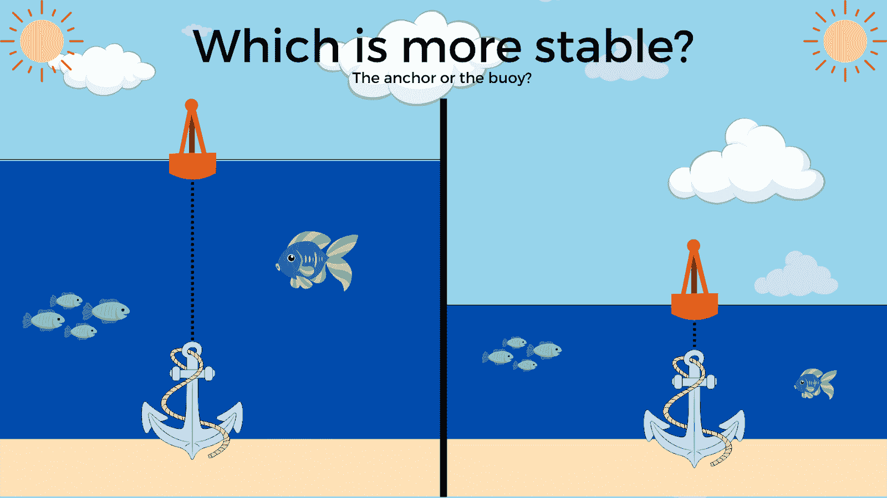

<figcaption id="caption-attachment-4717" class="wp-caption-text">Is it the anchor or the buoy?</figcaption>

如果你问“锚和浮标哪个更稳定”，你会怎么回答？嗯，这取决于你需要它稳定的原因。

如果你在海底寻找稳定，锚会更稳定。但如果你在寻找与海平面相关的稳定，浮标更稳定。

这是一个固定与浮动的类比。人们可能会进一步类比，并问“当临时风暴来临时，浮标会不会开始到处摇摆，上下起伏，使其不稳定？”对此我会说，是的。这就是为什么像 RAI 这样的许多协议都有内置机制来减缓快速的临时变化。想象一个浮标保持在海平面上，除非有风暴。怪异意义上的“魔法浮标”

你甚至可能会问“那么，浮标是不是有点被锚定了，因为它需要被系在某个地方才能呆在同一个地方？”对此我也同意。一种保持购买力的稳定货币几乎可以被认为是一种跟踪某种消费指数或其基础抵押品的长期市场运动的资产。但是我们可能在兔子洞这个类比上走得有点远了。

### 稳定性方法

稳定法就是硬币保持稳定的方法。这是一个由算法来管理的范围，要么是 100%由算法自动化，要么是某种形式的人工干预。

#### 算法的

算法稳定币是任何使用自动算法的硬币，通常以特定的方式铸造或燃烧代币以保持稳定性。

稳定性方法也可以被称为“供给机制”或“铸造和燃烧”机制，因为它们是如此紧密地联系在一起。这些算法在实现方式上也有很大不同。重置基础、供需博弈和其他基于甲骨文的冒险都是许多 stablecoins 今天使用的不同算法。

**算法示例:**戴、、拉伊、

#### 管理

受控稳定币是一种由中央发行者选择何时铸造和焚烧代币的币。现在，这可以被放到一个极端，一个人做铸造和燃烧，但如果有一个 DAO 投票决定何时铸造和燃烧，这可能更符合算法。Maker 协议是一个极好的例子，说明了算法稳定币可以有很多受控制的属性——因为 DAO 控制了协议的大部分操作方式。

很多时候，集中稳定的内容很容易被归入受治理的类别，因为一个单独的链外实体控制着它们的铸造和燃烧。

**被治理的例子:** USDC、USDT、TUSD

#### 摘要

一个令牌可以同时拥有算法机制和治理机制，可以是更加分散的算法机制，也可以是更加集中的治理机制。根据这个定义，DAI 令牌将属于算法范畴。USDC 属于被治理的范畴，是一个高度中央集权的稳定中心。传统上认为像最初的卢娜/UST 这样的算法硬币也会被认为是算法硬币。

 [土路](https://dirtroads.substack.com/p/-40-pruning-memes-algo-stables-are)这篇文章展示了流行的稳定歌曲，以及它们在这个谱系中的位置。他使用“哑”作为算法的反义词，我不认为这是治理的一个坏的替代。 

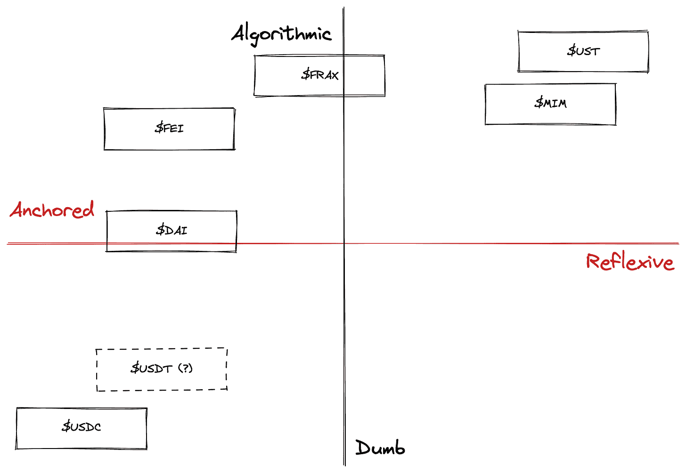

<figcaption id="caption-attachment-4718" class="wp-caption-text">The stablecoin spectrum. [Source](https://dirtroads.substack.com/p/-40-pruning-memes-algo-stables-are).</figcaption>

我们没讨论的部分是他的 **锚定**vs**自反** 谱。然而，接下来是在担保品部分。

如果我们看一看经典分类的“法定抵押”稳定硬币，它们几乎都属于铸造机制的“受管理”一方，因为一些单一实体正在进行铸造。像戴这样的加密担保令牌有一个治理过程，但在算法治理的范围内，更多的是算法 。

### 抵押品类型

稳定硬币的最后也是最重要的分类是它们的附属类型。协议使用两种类型的担保品，再次在光谱上排列，**和 **外源** 。**

 **现在，这两种抵押品类型的定义可能有点棘手，但作为测试，您可以问:

如果稳定币失效，基础抵押品是否也会失效？

如果是，是内生的；如果没有，就是外源性的。内源性大致是指侧枝嵌入方案内，外源性是指侧枝与方案完全不同。人们使用的其他一些好的测试有:

*   如果担保品的唯一目的是成为担保品
*   如果协议拥有基础担保品的发行

**外生例子:** ETH 为戴令牌的抵押品。戴失败了，ETH 就失败了吗？不，ETH 在 DAI 之外仍有智能合同用途，并将继续蓬勃发展。因此，以太络是 **外生** 。

**内生例:** 非常粗略的说，UST 的底层旁系是露娜。为了铸造 UST，你需要烧掉卢娜，反之亦然。它们是在协议级别一起设计的，所以非常“同床异梦”。如果 UST 失败了，卢娜会失败吗？嗯，这已经被证明是真的，所以 UST 有了 **内生** 的旁系月神。

当传统上提到算法稳定积分时，大多数人害怕的就是这种内生方案。

大多数稳定币协议是 1:1 或超额抵押，这意味着它们支持稳定币的潜在价值比创造的资产总和更多，而内生抵押协议通常抵押不足。FRAX 是有趣的，因为它有一个滑动规模的抵押品，并部分不足抵押。根据当前的市场条件，它可能变得更加外生或内生。下图是、戴(马可道)和(特拉)。

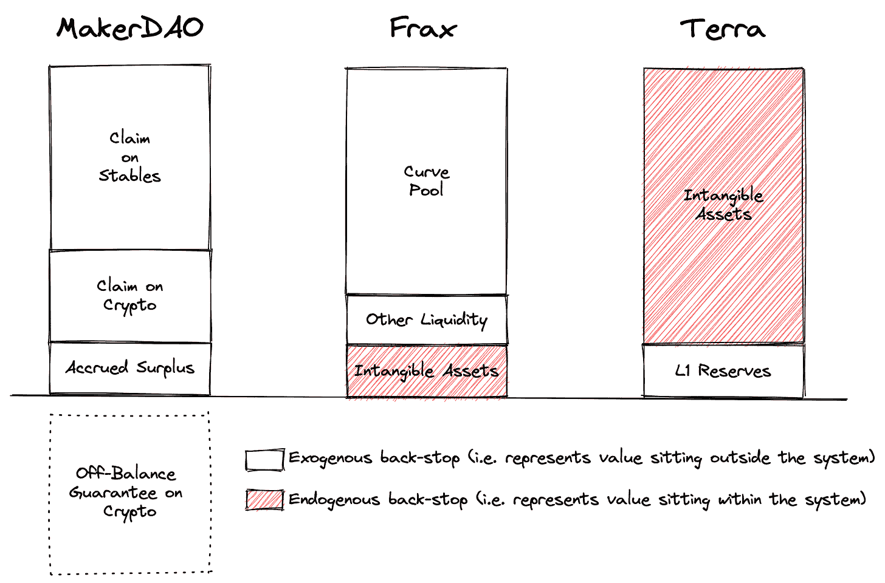

<figcaption id="caption-attachment-4719" class="wp-caption-text">Comparison of stablecoin protocols. [Source](https://dirtroads.substack.com/p/-40-pruning-memes-algo-stables-are).</figcaption>

**内生的例子:** (有点)，UST

**外生例子:** 【戴】【拉伊】

现在，在我们通过查看一些最稳定的货币来将所有这些机制放在一起之前，让我们快速停下来讨论一下铸币税份额。如果这一部分让你有点困惑，可以跳过它。

当您使用内生抵押品时，您可以使用称为 [铸币税股](https://blog.bitmex.com/wp-content/uploads/2018/06/A-Note-on-Cryptocurrency-Stabilisation-Seigniorage-Shares.pdf) 的稳定货币架构。罗伯特·萨姆斯的链接论文是当今最有影响力的论文之一，推动了许多稳定的内容的产生。

## 铸币税份额

铸币税是指创造货币的成本与其价值之间的差额。有了稳定的硬币，协议通常寻求创造一种成本低于硬币价值的硬币，这是 [铸币税份额](https://blog.bitmex.com/wp-content/uploads/2018/06/A-Note-on-Cryptocurrency-Stabilisation-Seigniorage-Shares.pdf) 背后的中心思想。

[铸币税股份](https://blog.bitmex.com/wp-content/uploads/2018/06/A-Note-on-Cryptocurrency-Stabilisation-Seigniorage-Shares.pdf) 背后的想法是，你通常有两个令牌，1 个令牌是稳定的，1 个令牌是“吸收”波动。它源于这样一个想法:令牌对于以下两者都是需要的:

1.  交易价值(交易媒介)
2.  增长投机(价值储存)

对硬币的需求并不是因为它的记账单位效用而产生的——因为你只需要硬币作为基准，而不需要实际持有代币。

这两种对硬币需求的理由是相互冲突的，因为根据理由 1:你希望硬币的购买力保持不变，但根据理由 2，你希望硬币的购买力有一点风险，并有望增加。如果不考虑这两个因素，很难创建令牌。

铸币税份额背后的想法是将一个硬币系统一分为二，一个保持稳定并抓住交易价值需求，另一个本质上不稳定并抓住增长投机。我们已经看到像 UST/露娜和 FRAX/FLX 这样的协议，可能会看到更多。这些协议中有很多也采用了内源性并行途径。

### 内生抵押品是怎么回事？

很多人可能在想:

因此，如果你使用内生抵押品，你基本上是在凭空创造价值。为什么会这样，为什么你想这样做？

1.  东西有价值只要 [他们认为别人认为它有价值](https://bitcoinmagazine.com/culture/an-exploration-of-intrinsic-value-what-it-is-why-bitcoin-doesnt-have-it-and-why-bitcoin-does-have-it)
2.  假设内生系统可以更快地扩展

让我们探讨一下第一点的情景。

## [谢林币](https://messari.io/resource/schelling-point)逻辑

想象你有一种货币，它 100%由黄金担保。事实上，你经营着一家银行，全天候营业，允许人们用你的银行券兑换你金库里的黄金。人们喜欢使用你的钞票而不是随身携带他们的黄金的便利，所以他们把你的货币视为等同于黄金。

现在让我们假设银行现在一周只营业 5 天:无论如何你都需要休息！现在你的纸币可以换成更少的黄金，它们会失去价值吗？可能不会——市场可能根本不会在意。

现在，假设你需要关闭银行一周进行装修。钞票会贬值吗？现在假设你关闭一个月。一年。十年了。永远？

如果你越过了你的封闭点，再也不会把你的钞票换成黄金，你的钞票就变成了货币、价值储存手段、交换媒介和记账单位，而不需要任何东西的支持。

这个场景是为了说明，你可以拥有一种不受任何东西“支持”的货币(只要每个人都同意它有价值)。例如，像美元这样的大多数货币不再由另一种资产支持。然而，有人可能会说，美元是由美国政府对其公民的承诺支持的，这是一种基于制度的协议。

### **缩放速度更快**

对于“内生系统假设可以更快地扩展”的第二点，内生系统可以跳过入职担保这一步。依赖于抵押品的稳定货币系统的最大规模完全取决于所有用户投入系统的外源抵押品的总量。因此，如果有人铸造你的稳定硬币的动机很低，你的系统的整体增长将比内生系统的增长要慢。

另一种说法是，稳定硬币的供应受到对抵押品的杠杆需求的限制——因为人们需要铸造这些稳定硬币来获得抵押品。

因此，很多人喜欢这个想法，并因此试图制造一个内生的稳定硬币。

但同样，我们可以看到这些硬币(维塔利克称它们为 [自动稳定硬币](https://vitalik.ca/general/2022/05/25/stable.html) )可能会有问题，在评估时，我们应该记住它们是否能够有效地减少。

### 一些顶级葡萄酒

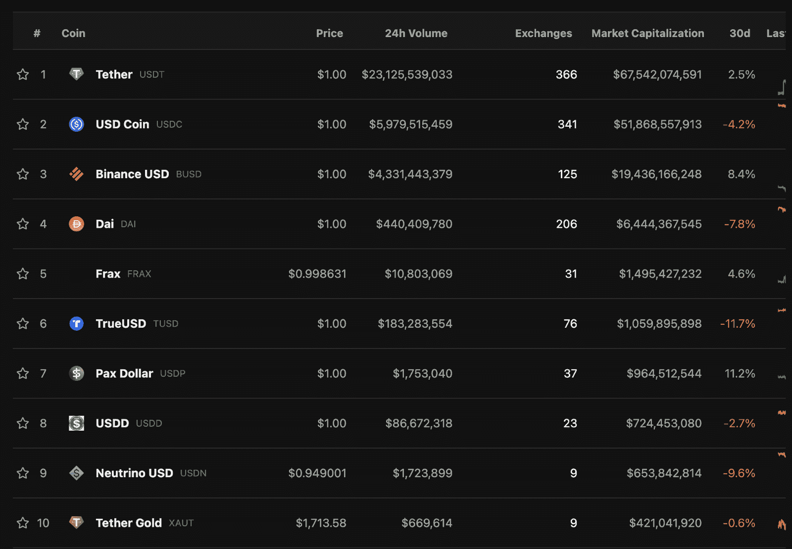

<figcaption id="caption-attachment-4720" class="wp-caption-text">Top Stablecoins from [Coingecko](https://www.coingecko.com/en/categories/stablecoins).</figcaption>

#### 奶妈

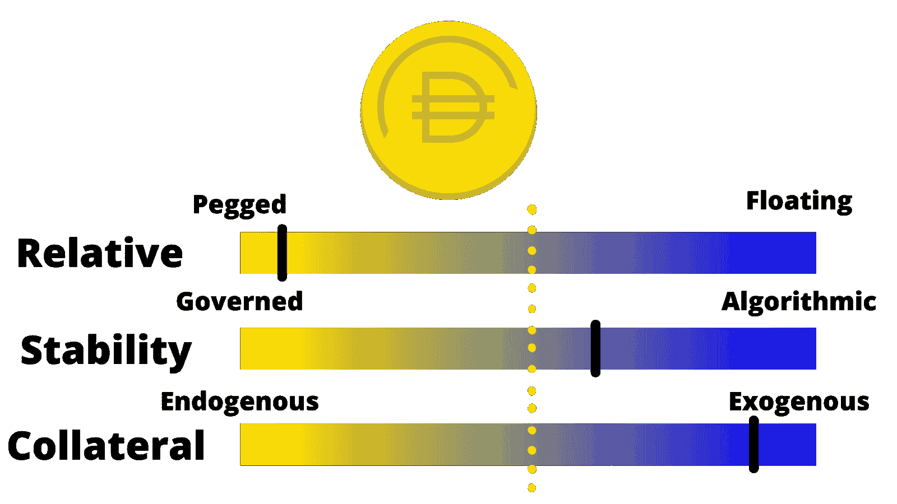

<figcaption id="caption-attachment-4721" class="wp-caption-text">DAI stablecoin categorization.</figcaption>

DAI 令牌是加密中最有影响力的令牌之一，通常被认为是真正引发 DeFi 热潮的协议。戴是革命性的，因为它允许更复杂的金融产品出现在 DeFi 现场。

戴稳定币是一种钉住的、算法的、外生的附属稳定币。请记住，从技术上来说，这是一种算法，但它确实有一个基于代币和铸币利率的治理过程，所以它是在算法到治理的规模上。实际上比你想象的要近得多。现在，投票提案已经通过，甚至允许 [链外抵押品进入系统](https://cryptobriefing.com/makerdao-votes-to-loan-dai-to-us-bank/) ，该系统已经远离算法标记。

通常，创建 DAI 的方式是用户将一些抵押品(如 ETH)存入智能合约。然后用一张 [神谕](https://chain.link/education/blockchain-oracles) ，给你戴那笔总数小于你拿出来抵押的 ETH 的金额。

例如，我写下 1 ETH，在当时，1 ETH 是 1000 美元。我可以铸造 500 戴。我总是不得不铸造少于我的抵押贷款，因此戴是一个 **过度抵押** 系统。“戴”的络是外生的，因为它是像 ETH 和其他密码一样不需要“戴”存在的东西。不过，有人可能会说，如果戴下跌，ETH 的价值也会下跌，所以在滑动尺度上，它们至少是一点点内生的。

当我铸造我的戴时，我被收取一笔持续稳定的费用——通常是每年 2%左右。考虑到这一点，谁持有戴，谁就真的持有别人的债务。每年铸造戴的人要为你持有的戴支付 2%的费用。这就是为什么很多人把戴说成是“债”或“贷”

现在，如果你的抵押品低于某个阈值(通常是你铸造的戴价值的 200%左右)，你就可以得到所谓的。这是戴的偿付能力政策，以确保它作为抵押品的钱永远不会比戴在世界上少。本质上，如果你的抵押品余额太低，其他人可以偿还你铸造的戴，并以一定的折扣获得你的一些抵押品。因此，如果你违约，其他人就有很大的动力来偿还你的戴贷款！

在我们浏览这些稳定的曲线时，请记住这一点。大多数货币是债务的一种形式。

#### USDC
T2】

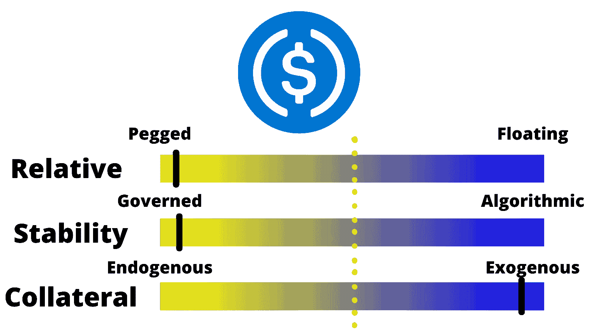

<figcaption id="caption-attachment-4722" class="wp-caption-text">USDC stablecoin categorization.</figcaption>

是 [圈](https://www.circle.com/en/) 和 [【比特币基地】](https://www.coinbase.com/home) 的合资背后的币，是 100%集中的币。硬币背后的团队可以将用户列入黑名单，并被 100%的链外治理。

代币与美元挂钩，应该是 1:1。每一枚 USDC 硬币，在某个地方的银行里就有一美元。有时，他们将这些美元投资于其他资产，因此它甚至可能不是由美元支持，而是由任何东西支持，如房地产、股票、债券等。

许多代币的设置与 USDC 几乎相同，后者是一个铸造和燃烧代币的中央实体，与美元挂钩，声称其代币与美元的比例为 1:1。USDT、TUSD 和 GUSD 等协议都遵循这一蓝图。

#### FRAX

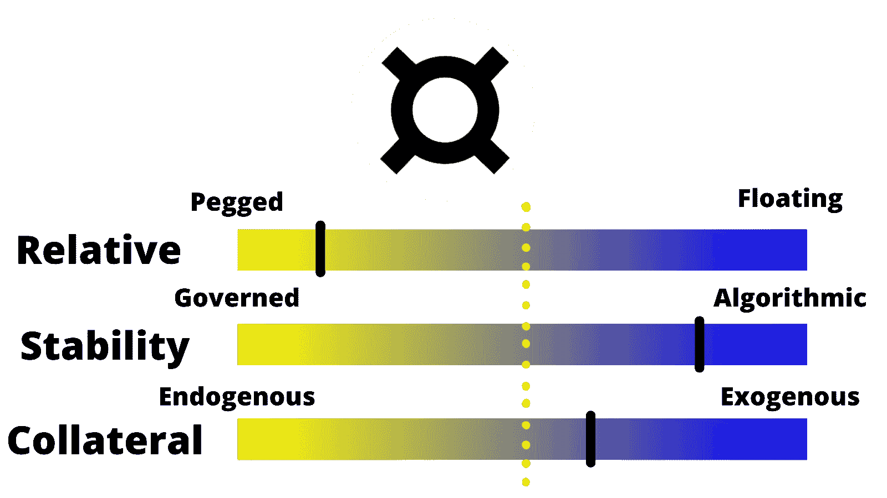

<figcaption id="caption-attachment-4723" class="wp-caption-text">FRAX stablecoin categorization.</figcaption>

现在我们知道得更多了，我们可以看看更多稳定的词汇，并开始更快地理解它们。将其 FLX 治理令牌作为其抵押品的一部分以及其他令牌，并以欠抵押而闻名。这使得代币有点内生，因为如果 FRAX 体系崩溃，其中一个潜在的抵押品(FLX)也会崩溃。它与美元挂钩，本质上是一种算法，由 FLX 币进行一些管理。

FRAX 是我们名单上第一个实施 [铸币税股份](https://blog.bitmex.com/wp-content/uploads/2018/06/A-Note-on-Cryptocurrency-Stabilisation-Seigniorage-Shares.pdf) 版本的代币，但仍有抵押，并使用大量外源性抵押品，以防止 UST 发生的情况。关于 FRAX，特别有趣的是，它需要的外源性和内源性抵押品的数量可以根据当时协议的风险程度而变化。

#### UST(与原来的露娜)

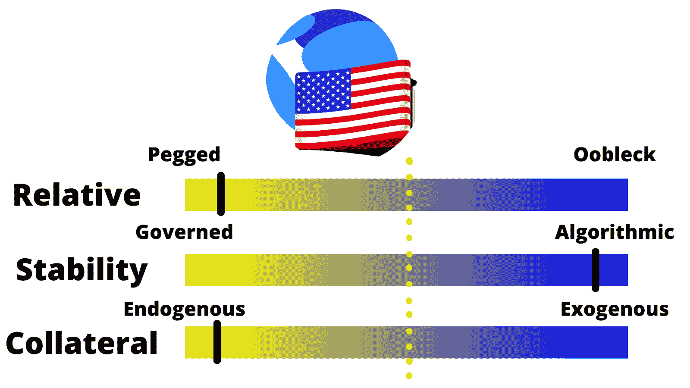

<figcaption id="caption-attachment-4724" class="wp-caption-text">UST categorization.</figcaption>

现在我们知道 UST 崩溃了，但重要的是反思这种稳定的硬币，将其作为一个警示故事，告诉我们算法内生硬币会发生什么。UST 是一种铸币税股份类型的硬币，卢娜吸收了波动性，因此 UST 可以保持稳定。

正如罗伯特·萨姆斯(Robert Sams)的论文中所述，一旦 UST 代币失去了挂钩，当人们为卢娜赎回他们的 UST 时，更多的卢娜股票被铸造出来试图重新找到挂钩。然而，作为一个卢娜持有者，你不喜欢铸造更多卢娜的想法，因为这降低了你的卢娜的价格，所以如果你看到 UST 挂钩下降，你就开始抛售你的卢娜。这使得 UST 的总抵押品下跌，这意味着 UST 失去了它的联系汇率，这意味着更多的卢纳被铸造。更多的卢纳铸币意味着更多的卢纳持有者恐慌性抛售，这意味着 UST 失去了联系汇率制，这意味着更多的卢纳铸币，这意味着更多…

你看到这里的问题了吗？

对于内生令牌的循环逻辑，这些算法系统正确工作存在巨大风险。我们说 UST/露娜在这个意义上是 **自反的** ，因为协议的价值是基于它自身的。

#### 拉爱音乐

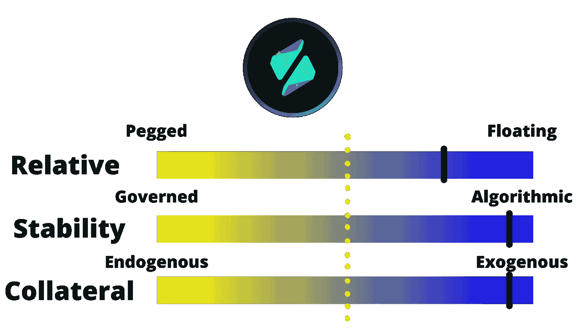

<figcaption id="caption-attachment-4725" class="wp-caption-text">RAI stablecoin categorization.</figcaption>

[RAI](https://reflexer.finance/) 是为数不多的不与其他资产挂钩的稳定资产。它最初是针对 DAI 项目的治理，但 Maker group 决定继续推进我们今天所知的协议，所以许多人开始希望看到类似于的改进

1.  少治
2.  无挂钩
3.  更多“纯”抵押品

如果我们想让 DeFi 自立，我们就不要把我们的货币与世界上的民族国家挂钩。此外，协议中的治理越多，算法越少，并且 信任最小化为 。web3 的目的是制造透明的信任最小化系统，引入的每一个治理都是另一个需要信任的部分。

在不深入研究 RAI 机制的情况下，RAI 是一种关注两种价格的硬币，即硬币的市场价格和赎回价格。RAI 的市场价格是人们买卖硬币的价格，赎回价格是协议购买你的硬币的价格。如果硬币的市场价格太高，基本上赎回价格下降，如果市场价格太低，基本上赎回价格上升。这就是硬币能够保持相对稳定的购买力的原因。

你可以 [在这里](https://medium.com/reflexer-labs/stability-without-pegs-8c6a1cbc7fbd) 了解更多信息，或者，在 [这段视频中](https://www.youtube.com/watch?v=wyr297JjEGY) 用视觉效果将它分解开来。从本质上来说，RAI 的工作方式与 DAI 类似，用户存入 ETH 以获得 RAI，但区别在于 RAI 不与美元挂钩。相反，它使用供求力量(通过一种利率)来创造或抑制需求，并让代币的价值非常缓慢地跟随市场的走向。这意味着，随着时间的推移，你对 RAI 的购买力相对保持不变。

#### 美元

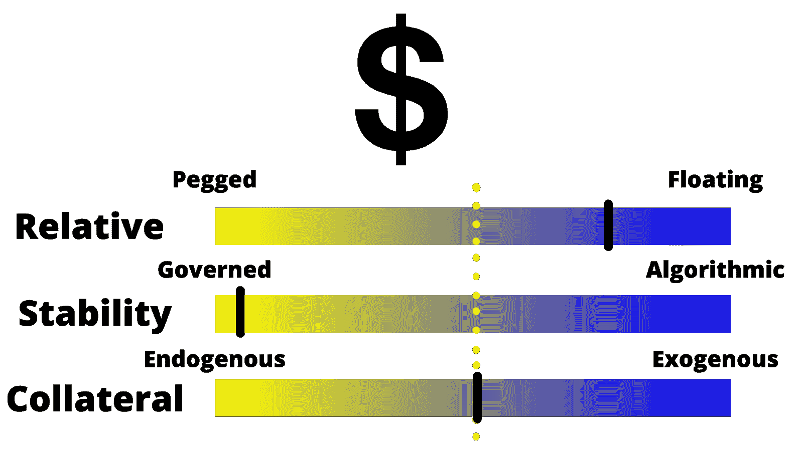

<figcaption id="caption-attachment-4726" class="wp-caption-text">USD categorization.</figcaption>

“拿着电话，帕特里克。美元不是稳定的货币！”

是的，你说得对，但是使用我们上面提出的分类，它们实际上适用于所有稳定型资产，美元就是其中之一。比较起来很有趣，因为我们想在 Web3 中创造一个比 Web2 中现有系统更好的世界。

最容易得到正确答案的类别是它的稳定性——它是 100%受控制的。当然，他们可能会关起门来使用一些算法来决定印刷多少，但美元的货币政策取决于美国政府，句号。

现在抵押品特别有意思，因为美元曾经有黄金做后盾，但 [在上世纪 70 年代脱离了“金本位制”。](https://owninggold.com/gold-standard/) 现在，一美元值……一美元，这意味着美元是自反的，可以说，本质上是内生的。

然而，你可以争辩说答案是否定的，美元受到其他国家资产(政治、军事、技术和地理资源)的支持，这将使其成为外生资产。

所以有时候，很难判断一项资产是由什么支撑的。

## 哪种稳定币最好？

没有一个答案:每一个都有它的权衡。

每个 stablecoin 做出的设计选择使它们彼此大相径庭，但却完成了相似的事情。T 这里没有一个“最好”的系统，我们看到这个行业在不断变化。

## 谁在为 Stablecoins 买单？

既然我们有了所有这些背景信息，我们就可以进入正题了。

这些稳定的硬币不是凭空出现的。有人从他们的创作中赚钱。我在文章开始时告诉过你，稳定的账户很重要，因为我们需要一个交换媒介、价值储存和记账单位——然而，这是针对普通人的。我还说过，像戴这样的稳定货币是一种债务形式:有人承担债务，让这些好货币进入流通。这意味着铸造这些稳定硬币的动机最好是非常好的。

让我们来谈谈那件事。

### 货币(债务)的创造

现在， [货币被创造出来的确切日期](https://en.wikipedia.org/wiki/History_of_money) 仍有争议，但我们可以想象它是这样的。

嘿，我用 10 根胡萝卜换你 50 个西红柿

人 B:听起来不错，但是嘿，我的西红柿已经在我家了。我能给你这 50 块签名的石头作为给你买西红柿的承诺吗？

人甲:当然可以

轰。50 块签名的石头现在是钱了。1 块签名石头= 1 个来自 b 的番茄

现在，A 可以跑来跑去，用这 50 块借据石头交换村子里的其他东西。这些借据代表债务；它们是人 B 的债务。在某个时候，人 B 需要履行他们的债务(即，给签名的石头 1 个番茄的持有者)。

在 DeFi 和 stablecoin 世界中，创建 stable coin 的工作方式完全相同。当你铸造 DAI、RAI 或大多数其他 stablecoins 时，它们代表着你需要在某个时候偿还给系统的债务，否则就有不断支付利息的风险。

奇怪的是，你可以提出同样的论点，认为美元是债务，但是这个论点变得更加复杂。 有人甚至会认为 [所有的钱都是债务。](https://mises.org/library/our-money-based-debt)

#### 创建稳定的内容

因此，如果为了创造一种稳定的货币，我需要承担这笔债务，我为什么要这么做呢？不仅如此，这些稳定硬币的大部分铸造或交换稳定硬币的抵押品都有一些相关的费用！如果我们看看最受欢迎的戴敏婷保险库之一的，我们看到费用超过 2%！如果我们看 RAI， [我们看到它超过了 0.1%](https://app.reflexer.finance/#/) ！甚至 USDC 和 USDT 也需要支付费用来兑换你的美元和他们的代币。

这意味着无论是谁创造了戴、拉伊等，都要多付一点钱。如果我想要 100 美元的戴，我需要交 100 多美元的保证金，还要付大概 2 美元的手续费！为什么会有人这么做？普通用户不可能这么做，因为花 2 美元买一些愚蠢的稳定币似乎不值得。那么谁在铸造这些硬币呢？

嗯，这让我想到了我认为是整篇文章中最重要的部分。

稳定的货币不是因为我们需要一个好的交易媒介、记账单位和价值储存手段而被铸造出来的。它们需要钱来铸造。相反，Stablecoins 是为老练的投资者创造的，让他们进行杠杆化押注或赚取补贴收益。

很有趣。

为什么稳定的硬币很好？——>因为我们需要货币！

为什么要铸造稳定的硬币？——>因为投资者希望进行杠杆化押注。

如果我是一名投资者，我认为 ETH 的价格将会暴涨，我该怎么办？我可以把我的 ETH 作为抵押，借一笔稳定的币，然后用那笔稳定的币去买更多的 ETH！

事实上，最流行的戴敏婷方案向您展示的第一件事就是增加您的 ETH 或 BTC 暴露量！

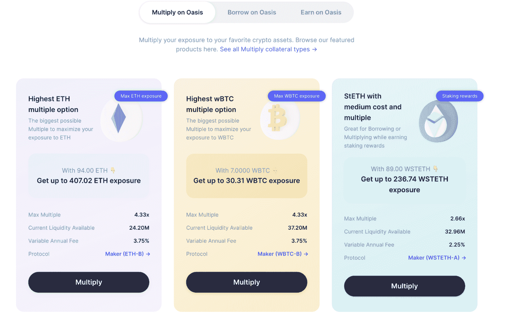

<figcaption id="caption-attachment-4727" class="wp-caption-text">Image from [Oasis.app](https://oasis.app/#product-cards-wrapper).</figcaption>

现在，这是投资者必须进行尽职调查的地方。有了这么多的选择，他们需要了解与每一枚稳定硬币相关的费用，这样他们就可以选择他们认为他们在制造硬币时必须偿还最少的硬币，引用 [卡迪 B](https://en.wikipedia.org/wiki/Cardi_B) ， [资金动向](https://www.youtube.com/watch?v=PEGccV-NOm8) 。

以一种奇怪的方式，一些稳定硬币系统设计可以误导创造者铸造一种更有可能失败的稳定硬币，因为如果硬币失败，他们不必偿还任何东西(就价值而言，因为如果硬币崩溃，价值为 0 美元，他们将能够廉价获得大量硬币)。稳定币的使用者受到激励，以最好的生存机会持有稳定币，这样他们就不会失去他们一生的积蓄，如果他们选择在那里持有它的话。

我所说的所有这些费用呢？这些费用归入稳定币协议金库。这就是为什么我们看到这么多稳定的图标弹出。

## 曲线战争是怎么回事？

接下来，你可能听说过 [曲线战](https://medium.com/bityard/the-curve-wars-explained-2c4e9594617) 。[curve . fi](https://curve.fi/)是 DeFi 的巨兽之一。这是一个 [AMM(自动做市商)](https://blog.chain.link/automated-market-maker-amm/)分散式交易所，使用一种高效的算法来交换稳定的硬币。

这意味着，如果你想让人们购买和使用你的产品，你最好让他们走上正轨。这样，人们可以通过不同的稳定币协议更有效地进出债务头寸，这就是为什么 Curve 是一个怪物。

Curve 使这些稳定连接协议更具组合性。

每个人都想分一杯羹。

## 最后的想法

许多人看到 stablecoins 时会认为有一个的三难困境在上演。

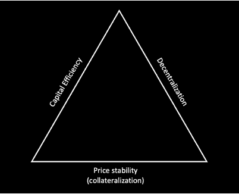

<figcaption id="caption-attachment-4728" class="wp-caption-text">Stablecoin trilemma. From [stablecoins.wtf](https://stablecoins.wtf/resources/the-stablecoin-trillema).</figcaption>

稳定币可以是三种中的两种。我不太确定我是否同意这种三难困境，但我们仍在解决它。

稳定的内容是确保 Web3 正常运行的极其重要的一部分。我们需要一种代币，让人们可以在没有区块链本土资产价格飙升和波动的情况下进行交易。

有许多工作要做。我已经开始创建一个[DeFi-minimal repo](https://github.com/smartcontractkit/defi-minimal/tree/main/contracts/stablecoins)带有一些稳定的币架构，你可以看看并希望从中学习。到目前为止，我们已经有了一个固定的、受管理的、外生的硬币，以及一个固定的、算法的、外生的硬币作为最小的例子。

希望我们能在那里得到更多的例子，开发人员可以做得更好。

谢谢大家，希望你们在这里学到了很多。

*本文中表达的观点仅是作者个人的观点，并不代表链家基金会或链家实验室的观点和信念。T3】*****