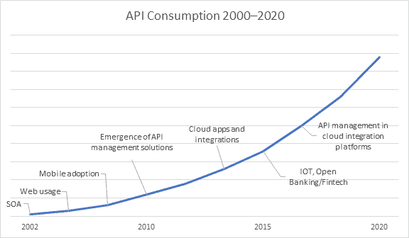

# 了解数据和 API 如何推动下一代经济

> 原文：<https://blog.chain.link/understanding-how-data-and-apis-power-next-generation-economies/>

在前两篇教育系列文章中，我们讨论了作为转移和存储价值的高度安全可靠的新基础设施的[区块链](https://blog.chain.link/what-is-a-blockchain-and-how-can-it-impact-the-world/)和智能合约。就像一台没有互联网的电脑一样，基于区块链的智能合约有其自身的内在价值，比如创造和交换代币。然而，当外部连接到在区块链生态系统之外扎根的大量和加速的数据和 API 经济时，它们变得更加强大。

[智能合同](https://chain.link/education/smart-contracts)如果能够成功利用由数据提供商、web APIs、企业系统、云提供商、物联网设备、支付系统、其他区块链等产生的庞大数据库，就可以成为所有主要市场的主要数字协议形式。

在本文中，我们将更深入地研究数据和 API，特别是:

*   什么是数据，它如何推动数据经济？
*   数据是如何产生的？
*   如何通过 API 交换数据？
*   什么是大数据分析？

了解链外数据经济的全部范围为下一篇文章奠定了基础，在下一篇文章中，我们将探索如何使用称为“[Oracle](https://chain.link/education/blockchain-oracles)”的附加基础设施安全可靠地将智能合同连接到这些资源。

# 数据和数据经济

### 数据

数据是通过观察获得的特征或信息，例如测量室外温度、计算汽车位置或记录用户与在线应用程序的交互。原始数据本身并不特别有价值或可靠；它需要其他数据来使其符合上下文，并确保其有效性和/或准确性。

### [计]元数据

元数据是“关于数据的数据”,主要由基本信息组成，使跟踪和处理数据更加容易。例如，文本消息的发送时间、温度读数的地理位置或电话通话的持续时间都是有助于索引和赋予数据意义的元数据。

### 数据清理

此外，数据需要经过处理和清理，才能足够可靠地供任务关键型应用程序使用。清理过程包括去除异常值，发现不准确之处，忽略不相关的信息；例如将当前温度与历史温度进行比较，以发现并防止异常值的使用。

### 数据经济

数据经济是一个经济生态系统，其中所有类型的数据都以产生有价值的见解的方式进行收集、提炼和交换。这些见解随后被用于最大化社会产出——一个用于存储临床试验的共享健康数据库，以更好地了解医疗状况，或者一家私营公司跟踪其内部运营，以确定并改善效率低下的情况。

不断增长的数据经济正在围绕自动化开辟新的可能性，在自动化中，数据直接导致经济行动的触发，而无需人类中介。例如，创建一个应用程序，一旦三个数据得到确认，该应用程序就会支付货款:货物到达(GPS 数据)、货物状况良好(物联网数据)以及货物通过海关(web API)。

# 数据生产

数据是流程或事件的副产品。它需要一个输入(动作)来生成，一个提取(测量)技术来记录，一个聚合技术(分析)来赋予它意义。由于对特定输入和提取/汇总技术的访问在可访问性方面可能受到限制，因此并非所有数据都是平等的，也不是每个人都有能力创建相同质量的数据。

捕获新数据和原始数据的一些最常见的方法包括:

*   **表单(手动输入)**–用户手动填写公共或私人表单(如参与调查、签署文档和参与社交论坛)时捕获的数据。
*   **应用程序/网站(使用许可)**–数据是通过用户同意应用程序或网站的条款和条件来获取的，这通常会授予法律许可来跟踪某些数据指标，如特定于应用程序的活动、浏览习惯，有时甚至是一般的个人资料信息(性别、年龄等)。
*   **物联网(实时监控)**–**由配备有传感器和执行器的设备捕获的数据，这些设备通过互联网传输数据，包括智能手机、智能家电、健康可穿戴设备、RFID 跟踪商品等。**
***   **专有流程/个人经历(所有权)**–通过公司对业务流程的所有权(拥有专利或成为市场领导者)或从某人独特的个人经历中获取的数据。*   **研究和分析(组合和解释)**-通过获取现有数据集并向其提供一些原始解释而捕获的数据:与历史数据的交叉检查、与其他数据集的交叉引用、新的过滤和计算技术等。**

 **还有一些数据转售商，他们从数据聚合商或有价值的公司大量购买数据，然后转售给最终用户。虽然更昂贵，但数据经销商预处理数据以适应定制的过滤器或格式。

# 数据交换

如果数据将成为下一代应用程序的核心构件，那么行业需要市场来买卖数据，而不是仅仅依赖于内部生产。购买数据可能比生产数据便宜得多。例如，创建自动驾驶汽车算法需要大量关于对象检测、对象分类、对象定位和预测移动的数据。为了获得这些数据，开发人员可以通过行驶数百万英里在内部生成数据，或者通过 API 从外部购买数据。

应用程序接口(API)是关于外部应用程序如何访问系统中特定数据集和/或服务的一组指令。API 是当今买卖数据和服务的标准方法。流行的拼车应用优步使用 GPS API 来管理位置数据(MapBox)，SMS API 来管理消息数据(Twilio)，以及支付 API (Braintree)来管理常见的应用功能，而不是从头开始建立这些服务。

<figcaption id="caption-attachment-843" class="wp-caption-text">API 经济从一开始就处于稳步上升的趋势，许多创新引入了新的 API，并提供了更好的 API 管理方法。来源:软件开发公司 Informatica</figcaption>

API 通常通过订阅计划来实现货币化，在订阅计划中，最终用户按使用付费(计量)，采用标准的月度计划(许可)，或者同意某种形式的分层计费。这为数据提供商提供了生产数据的货币激励，而最终用户无需提供自己的基础设施即可消费数据。它还在 API 提供商和付费用户之间建立了具有法律约束力的合同，以防止恶意活动，如盗版数据和未经许可转售数据，以及让数据提供商对某些性能标准负责。

有各种 API 是开放的，任何人都可以免费访问，包括用于天气数据的 Open Weather Map、用于航班状态数据的 Skyscanner Flight Search 和用于全球人类行为和信仰的 GDELT。此外，作为开放数据计划的一部分，世界各地的政府正在通过开放 API 提供越来越多的数据。

然而，开放 API 不如付费 API 可靠，因为它们缺乏与质量控制和延迟性能相关的财务激励和法律合同。绝大多数高质量数据是通过付费 API 获得的，这些 API 通常可以访问主要数据源，拥有完整的堆栈基础架构，雇佣全职监控团队，并不断创新以与其他数据提供商争夺业务。

# 大数据基础设施和分析

人类已经被以一种他们可以学习和自我改进的方式编程系统的想法迷住了。通过采取行动、接收结果、对照历史数据进行分析，以及获得关于如何在未来更好地实现特定目标的新见解，可以促进学习。因此，围绕构建能够接收大量数据、对其进行过滤、分类并从结果中获得深刻见解的基础设施，已经成为一种大趋势。

西方的脸书、谷歌和亚马逊以及东方的阿里巴巴、腾讯和百度已经成为科技巨头，因为它们广泛使用的互联网应用程序产生了来自用户的海量数据。这些数据构成了世界上最好的数据分析的基础，特别是人工智能(AI)和机器学习(ML)软件。这些技术为消费者行为、社会趋势和市场实践提供了广泛的见解。

同时，商业管理软件帮助企业更好地了解自己的运营。SAP、Salesforce 和 Oracle 等公司构建了企业资源规划(ERP)、客户关系管理(CRM)和云管理软件，通过汇编所有数据和系统来帮助公司管理内部业务流程，从而生成关键见解。

云计算和存储也越来越受欢迎，成为更可靠、更广泛地访问数字基础设施的一种方式。云计算允许许多不同的用户共享存储和处理数据的基础设施，消除了他们每个人供应和运行自己的系统的需要。它改善了应用程序的后端流程，增加了系统之间的共享，并降低了访问 AI/ML 软件的成本。例如，Google Cloud 用户可以利用 BigQuery，这是一种软件即服务，用于对具有内置 ML 功能的数 Pb 数据进行可扩展分析。

# 走向第四次工业革命

当我们将 AI/ML、业务管理软件和云基础设施结合起来时，就会产生更好的工具来增强从数据中获得的洞察力。进一步推动这些趋势的是边缘计算、5G 电信网络和生物技术，它们开辟了越来越实时和生物连接的数据环境。这些系统不断推动经济系统朝着实时数据驱动的决策方向发展，只需更少的人力，尤其是当数据以无缝、更频繁的方式产生和共享时。事实上，许多人将这一大趋势称为第四次工业革命。

## **延伸阅读**

请查看教育系列中关于“Oracle 问题”的下一篇文章，了解更多信息。在 [Twitter](https://twitter.com/Smart_Contract) 上关注我们，获得即将发布的文章通知，并加入我们的[电报](https://t.me/chainlinkofficial)，了解关于 [Chainlink](https://chain.link/) 的最新消息。**