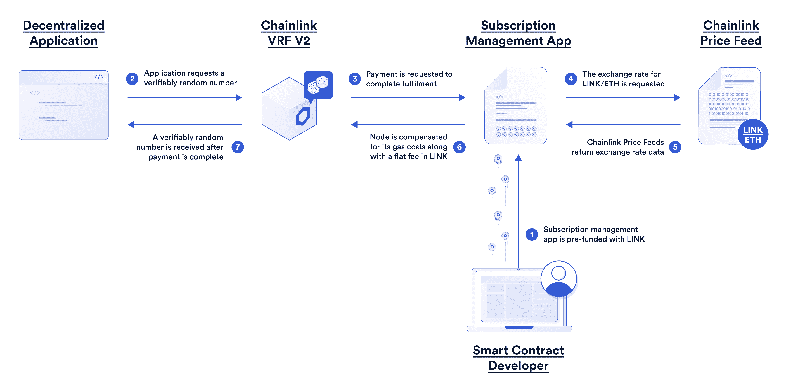
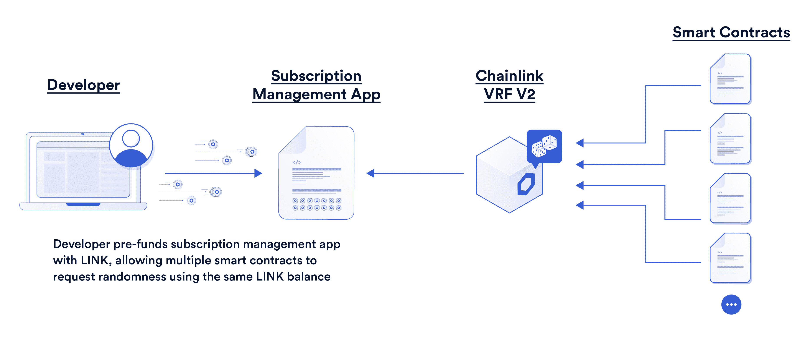
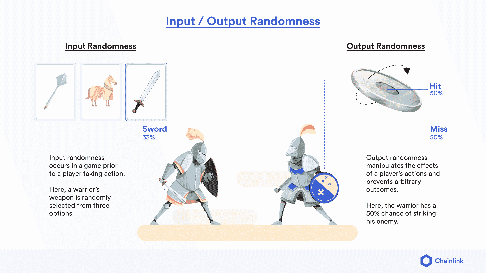
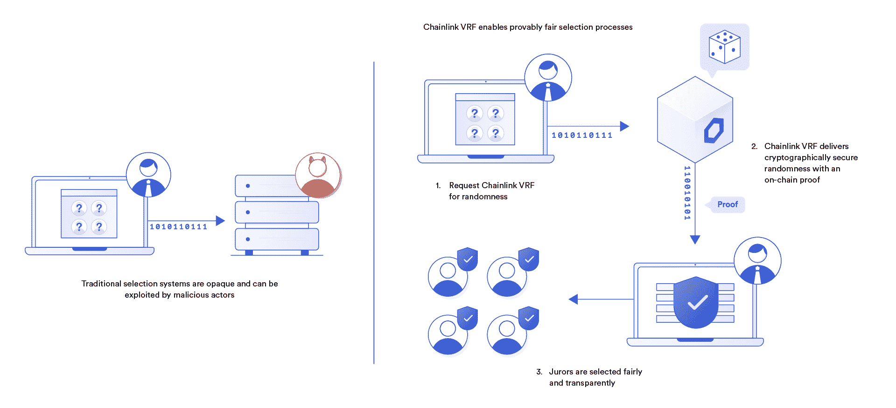

# Chainlink VRF v2 现已在 Mainnet 上上线，为 NFT 和游戏 dApps 提供高度可扩展、可配置和高能效的链上随机性

> 原文：<https://blog.chain.link/vrf-v2-mainnet-launch/>

在过去的一年中， [Chainlink 可验证随机函数(VRF)](https://chain.link/chainlink-vrf) 已成为行业标准随机数生成器(RNG)解决方案，适用于 [智能合约](https://chain.link/education/smart-contracts) 和链外系统，这些系统需要一个密码安全、透明且可证明公平的随机来源。

自推出以来，Chainlink VRF 已经完成了 300 多万笔请求交易，目前为多个区块链网络中的 2，300 多份独特的智能合约提供可验证的随机性，包括以太坊、多边形和币安智能链。通过使用先进的加密承诺方案，Chainlink VRF 为 dApps 提供了防篡改的链上随机性，以帮助保护的铸造和归属，在基于 [【区块链】](https://chain.link/use-cases/nfts-and-blockchain-games) 的游戏中生成公平的结果，并支持跨越[【DeFi】【DAO governance】等广泛的用例。](https://chain.link/education/defi)

经过广泛的研究和用户反馈，我们自豪地宣布推出 Chainlink VRF v2，这是广泛使用的 RNG 解决方案的新的改进版本。Chainlink VRF v2 为智能合约开发商提供了更好的随机性解决方案，为他们提供了一种更简单的方式来配置和扩展随机性请求，同时将请求交易成本降低高达 60%。Chainlink VRF v2 还代表了创建一个更加自助式的模型来构建、访问和管理 Chainlink 分散式服务的初步尝试。

[Explore the Chainlink VRF subscription app](https://vrf.chain.link/)

Chainlink VRF v2 已经在以太坊主网([开发者文档](https://docs.chain.link/docs/chainlink-vrf/))上上线，计划部署到 Chainlink 已经支持或即将支持的其他领先上。这些部署支持各种新的链上游戏、NFT 和链外应用，这些应用对用户来说是公平、安全和令人兴奋的。在这篇博文中，我们将探索 VRF v2 版本中引入的主要改进，并提供通过可验证的随机性而成为可能的示例用例。

## 链环 VRF v2 的五大优势

 **### 1.规模化现收现付:成本有效的随机性要求

Chainlink VRF v2 推出了一款订阅管理应用，允许智能合约应用使用单个链接令牌余额为多个随机请求预先提供资金。这一改进通过消除为每个单独请求传输链接令牌的需要，帮助 VRF 请求减少高达 60%的汽油费用。

在以太坊上实现可验证的随机性后，计算需要支付响应交易气费的 ETH 金额，使用 LINK/ETH 汇率的 [Chainlink 价格馈送](https://chain.link/data-feeds)将其转换为 LINK，并与固定的每次请求费用一起计入订阅合同。因此，用户只需转移一次链接令牌即可填满其订阅余额，从而减少了摩擦和成本，尤其是对于高频应用。

<figcaption id="caption-attachment-3312" class="wp-caption-text">The subscription management app enables pre-funding of VRF v2 requests.</figcaption>

### 2.可变回调气体限制:开发商手中更大的灵活性

Chainlink VRF v2 为用户提供了调整回拨气体限制的能力，当可验证的随机性被交付给他们的智能合同应用时。这使得消费契约能够在同一个事务中执行更复杂的逻辑，从而获得可验证的随机性。因此，即使在区块链网络极度拥堵的情况下，也可以执行涉及随机性的关键任务，从而为 dApp 开发人员带来更高的可靠性和灵活性。

该参数可设置为 2M 气体的最大值，比 VRF v1 限值高 10 倍。这种功能是通过预付费订阅模式实现的，其中每次随机呼叫收取的链接费用可以随交付过程中消耗的汽油量而变化。参数将根据 VRF 链节所使用的基础区块链而有所不同。

### 3.可配置性:在定义安全参数方面有更多的用户控制

Chainlink VRF v2 使用户能够定义在请求交易完成后，在生成可验证的随机性并在链上交付之前必须通过多少个块确认，范围从所有测试网和主网的最小 3 个块到最大 200 个块。在 VRF 版本 1 中，以太坊的这个值被固定在 10 个街区。

可配置的块确认参数使开发团队能够在安全性(防止块重组)和性能(从请求到响应的延迟)之间达到理想的平衡，以满足他们自己应用的特定需求。有关如何安全设置该参数的更多信息，请参考 [安全注意事项文档](https://docs.chain.link/docs/vrf-security-considerations/#choose-a-safe-block-confirmation-time-which-will-vary-between-blockchains) 。

### 4.每个请求的随机性更大:单个请求中有多个随机输出

Chainlink VRF v2 使用改进的 VRF 协调器合同，为用户提供一种无缝、低成本的方式，通过单个链上交易请求多个随机数(多字)。此外，还可以通过单个事务处理来实现供应链上的随机性，从而进一步降低成本并减少响应延迟。

通过将多个请求和响应批处理到单个事务中，需要多个随机值的用户可以显著节省汽油。这种成本效益的提高对于交易费用较高的区块链高频应用尤其有利。

### 5.统一计费:将订购余额分配给多个地址

Chainlink VRF v2 允许多个智能合约地址(最多 100 个)从订阅所有者管理的单个链接订阅余额中为其可验证的随机性请求提供资金。

这使得管理多个需要随机性的智能合同的开发商能够简化资金管理并降低天然气成本。通过使 Chainlink VRF 更便宜和更可定制，开发人员可以开始在各种领先的区块链中构建更高级的用例，具有更高的成本效益。

<figcaption id="caption-attachment-3311" class="wp-caption-text">A single LINK subscription balance can be used for multiple smart contracts.</figcaption>

## VRF 链家支持的常见使用案例

有关如何在您的应用中使用新的和改进的 Chainlink VRF 的灵感，请查看我们最近的博客， [通过 Chainlink VRF](https://blog.chain.link/blockchain-rng-use-cases-enabled-by-chainlink-vrf/) 实现的 35+区块链 RNG 用例。下面是一些最流行的用例的简要总结。

### 公平 NFT 铸币

创造者越来越多地使用 VRF 链节作为 NFT 薄荷糖行业标准设置的一部分，特别是对于具有众多属性和特征组合以及不同稀有程度的非功能性薄荷糖。Chainlink VRF 有助于确保每个人都有公平的机会铸造具有潜在增值价值的稀有 NFT。

<figcaption id="caption-attachment-3306" class="wp-caption-text">Polychain Monster NFTs each have three characteristics, with various potential traits for each characteristic based on probability and randomness from Chainlink VRF.</figcaption>

### 随机 NFT 和战利品箱下降

创作者和游戏开发者也使用 Chainlink VRF 进行涉及艺术收藏和游戏内物品的 NFT 空投。Chainlink VRF 用于确定用户在投递过程中收到哪个 NFT，有助于防止任何人能够影响或篡改分发机制。

<figcaption id="caption-attachment-3308" class="wp-caption-text">Axie Infinity used Chainlink VRF to mint provably rare Origin Axie NFTs.</figcaption>

### 幸运抽奖和社区赠品

各种抽奖和赠品使用 VRF chain link 从一组合格的参与者中选出获胜者。Chainlink VRF 为获胜者的评选过程带来了前所未有的透明度，这在闭门进行的传统抽奖中是没有的。

<figcaption id="caption-attachment-3310" class="wp-caption-text">PoolTogether uses Chainlink VRF to select random winners of its weekly prize draw.</figcaption>

### 玩家对玩家(PvP)战斗

开发人员正在利用 Chainlink VRF 为游戏或 NFT 皇家战役竞赛中的玩家牵线搭桥，以及确定格斗游戏中致命一击的威力。Chainlink VRF 有助于确保游戏的公正性和防篡改性，这在为赢家提供金钱奖励的 [即玩即赚游戏](https://blog.chain.link/what-is-play-to-earn/) 中至关重要。

<figcaption id="caption-attachment-3307" class="wp-caption-text">Chainlink VRF enables input/output randomness for more competitive and transparent gameplay.</figcaption>

### 队列排序

Smart contracts 正在部署 Chainlink VRF，以公平地确定游戏、销售、活动或各种轮流过程中的顺序，在这些过程中，顺序在结果中发挥作用。Chainlink VRF 是有助于确保没有球员得到特殊的访问，因为他们的地位或银行余额。

<figcaption id="caption-attachment-2571" class="wp-caption-text">Chainlink VRF brings transparency to previously opaque selection processes.</figcaption>

## 用 VRF 链开始建造

随着 Chainlink VRF v2 的显著成本效益和可用性改进，开发人员构建具有真正不可预测的结果和可证明的公平游戏的高级智能合约应用程序变得前所未有的简单。虽然我们已经提供了一些关于可验证的随机性的例子，但是还有无限多的用例可以探索。

如果你是一名开发人员，想要快速将你的应用连接到 [【链接 VRF](https://chain.link/solutions/chainlink-vrf) ，访问 [开发人员文档，](https://docs.chain.link/docs/chainlink-vrf/) 试用[订阅管理应用](https://vrf.chain.link/)，并加入 [不和谐](https://discordapp.com/invite/aSK4zew) 中的技术讨论。如果您想安排一个电话来更深入地讨论您的整合， [联系专家](https://chainlinkcommunity.typeform.com/to/OYQO67EF?page=announcement) 。

[Explore the Chainlink VRF subscription app](https://vrf.chain.link/)

我们还鼓励开发者将 Chainlink VRF v2 与其他 Chainlink 分散式服务结合到他们的应用程序中，例如[chain link Automation](https://chain.link/automation)用于根据预定义的条件(例如在特定时间开始/结束游戏回合)自动进行链上交易，[chain link Price Feeds](https://data.chain.link/)用于确定市场上游戏内资产的当前价值， [Chainlink 数据馈送](https://chain.link/data-feeds) 基于外部事件(例如，影响 NFT 艺术展示的当前天气或体育比赛结果)增强游戏内流程，以及即将推出的 [跨链互操作性协议(CCIP)](https://blog.chain.link/introducing-the-cross-chain-interoperability-protocol-ccip/) 跨不同的区块链[meta versus](https://chain.link/education/metaverse)移动资产并创建跨链智能合约。

*我们要感谢所有的 VRF v2 beta 测试人员，其中包括:*

*Ether.cards、TreasureKey、机械化抽象、Polyroll、分散游戏、Aavegotchi、Coin98、PolyWantsACracker、Gains Farm、PoolTogether、Yarloo、BetSwirl、Magic Beasties、Fantasy Arena、黑眼星系、加密独角兽、JayPigs、Elemon、0xCord、DigiBudz、BiFrost、PolyFight、DogeVille、MGG、Ridotto、LuckyChip、DexKit、HexTech、InuWars、destiny DaoT3】***