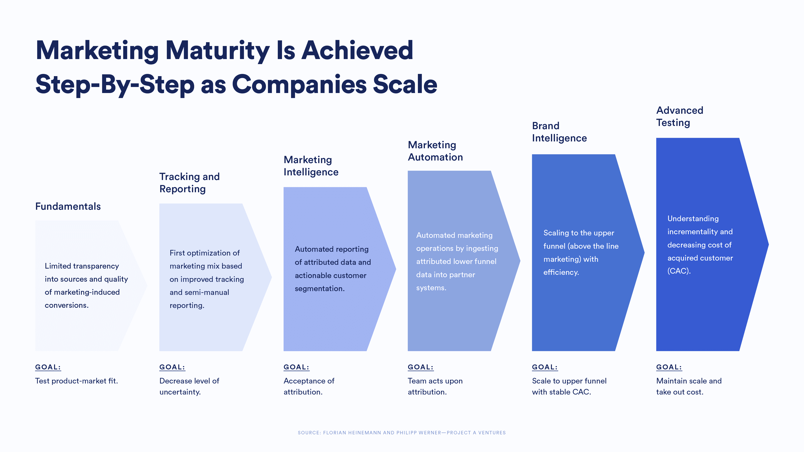
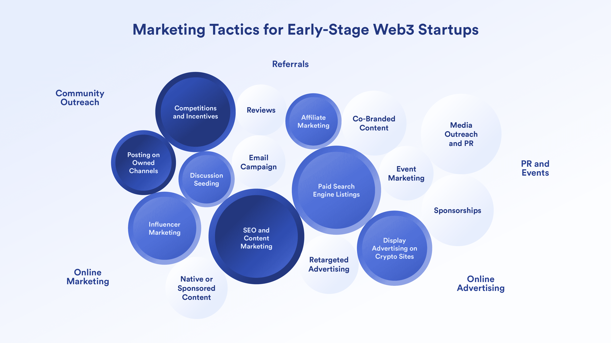
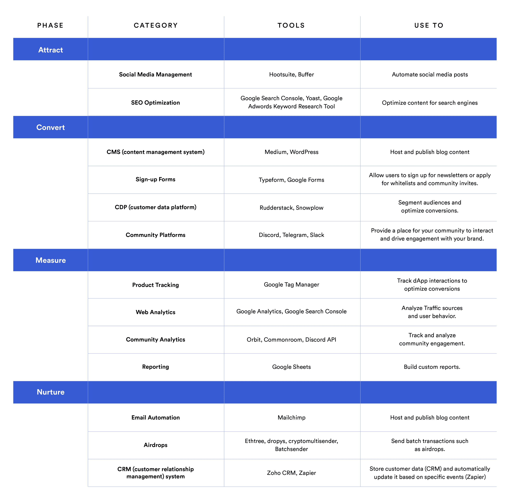

# 早期 Web3 创业公司的营销策略、工具和指标

> 原文：<https://blog.chain.link/web3-marketing-tactics-tools-metrics/>

自密码产业早期以来，营销策略已经发生了变化。在以前的市场周期中，Web3 项目经常积极地追求即时的病毒式传播和社区增长的一夜高峰——通常在任何产品出现之前。这个行业已经成熟，Web3 初创公司已经学会放慢脚步，在营销工作中更加有条不紊。更多的人才从 Web2 进入 Web3，这导致 Web3 初创公司采用更传统的 Web2 营销方法。尽管如此，仍然有一些重要的细微差别将 Web3 的营销策略与 Web2 的营销策略区分开来，尤其是对于早期创业公司而言。在本指南中，我们将仔细研究这些细微差别。

关键要点:

*   随着创业公司的成熟，营销的复杂性也需要发展。
*   无论在哪个行业，目标设定都是成功的关键。
*   早期的客户获取和参与需要类似的策略。
*   Web3 初创公司并不总是需要在营销上花费巨资。
*   传统营销指标在 Web3 中仍然至关重要。
*   Web3 为细分和归属带来了独特的挑战。

[https://www.youtube.com/embed/ZXvtRRn_AK4?feature=oembed](https://www.youtube.com/embed/ZXvtRRn_AK4?feature=oembed)

## 什么是营销成熟度，它是如何演变的？

营销成熟度描述了一家初创公司在营销实践方面达到的复杂程度。最有力的成熟度指标是初创公司处理数据的方式。早期创业公司收集的数据非常少，或者以非结构化的方式收集。他们的努力往往是低效的，因为他们没有充分了解什么是有效的，什么是无效的。随着创业公司的成熟，它学会收集更多的数据，整合数据，并利用数据获得更精细的见解，如获得新客户的成本或现有客户的终身价值。更成熟的创业公司可以将收入归属于特定的营销渠道，这有助于他们优化资源。

下图总结了传统 B2C 或交易型初创企业走向营销成熟的历程。

<figcaption id="caption-attachment-4394" class="wp-caption-text">Each step of the marketing sophistication framework has a different focus—[source](https://www.youtube.com/watch?v=vn1CMLnvGmE)</figcaption>

## 在决定策略之前设定营销目标

一些没有经验的团队根据其他人的做法来选择他们的营销策略，但这可能是一种有风险的方法。每个项目都不同，营销目标也略有不同。这些目标通常分为两大类:“客户获取”和“客户参与”。换句话说，让人们试用你的产品，让他们对你的品牌保持忠诚。这些首要的类别提供了更细粒度的目标，比如让 X 数量的人注册一个 Discord 或注册一个 NFT 白名单。

对于 Web3,“客户获取”和“客户参与”等类别根据其所处的阶段有所不同，可能包含如下目标:

*   **寻找早期投资者** 这往往发生在种子前期和产品前期。有人可能会说，没有产品，就无法获得客户。然而，在 Web3 中，初创公司往往更积极地推动验证其产品概念的行动，例如推动人们注册产品前社区。在这里，收购和参与受到超越创始人个人网络的草根营销策略的刺激。项目本身并不是在寻找“客户”，而是寻找支持者。然而，他们的策略将类似于他们以后用来寻找客户的策略。
*   **获取用户与产品互动并给出反馈** 在 testnet 上上线的更成熟的 Web3 项目可以致力于获取“用户”。请注意，用户和客户之间的区别不仅仅是语义上的。用户是与产品互动但不一定提供任何收入的人，而顾客通常是为产品付费的人。不是每个人都同意这种区分——前 Twitter 首席执行官杰克·多西曾想把 Twitter 用户称为顾客——但这对于 Web3 营销来说是一种有用的区分。成为一些 Web3 服务(基础设施工具或免费游戏)的用户而不为一个项目创造收入是可能的，尤其是当它处于第一次迭代的时候。
*   **获取社区成员带动网络效应** 通常，获取创收用户并不是最直接的目标。Web3 比任何其他行业都更依赖网络效应，在早期阶段，初创公司的营销资源完全集中在这个目标上。这意味着让人们谈论他们的项目，参与他们的品牌，并参与他们的社区。这建立了一个可持续的网络，然后可以进一步产生收入。

**支付收购费用时，首先确定目标市场** 明确的目标受众有助于塑造营销活动的方方面面，从内容创作到影响者选择。在早期阶段，许多 Web3 初创公司忽略了在有意义的细节层次上定义目标受众，而是通常瞄准任何对加密感兴趣的人。当一家初创公司还没有进行任何付费营销时，这是一个无害的错误。然而，一旦一家初创公司开始投入营销预算，就有必要更详细地定义目标受众。这将在我们稍后讨论优化营销绩效时详细讨论。

## 早期的 Web3 创业公司应该使用什么样的营销策略？

通常，一家初创公司的策略是特定于他们的商业模式和垂直市场的，但是 Web3 初创公司作为一个整体倾向于选择不同于 Web2 的渠道。例如，在 Web2 世界中，影响者营销是一种在某些垂直行业(如时尚和化妆品)中大量使用的策略，但在其他行业(如 SaaS 工具和网上银行)中使用较少。然而，在 Web3 中，影响者营销是相当普遍的。这可能是因为更需要专家来帮助观众驾驭技术复杂、拥挤和快速变化的 Web3 市场。

下图概述了 Web3 中最受欢迎的传统营销策略。深色圆圈代表与早期初创公司最相关的策略，较大的圆圈代表策略对流量和用户获取的潜在影响。

<figcaption id="caption-attachment-4421" class="wp-caption-text">Early-stage Web3 startups tend to prefer slightly different tactics to those in Web2</figcaption>

请注意，像影响者营销这样的策略可能会很昂贵。尚未获得资金的 Web3 初创公司最好先尝试免费或低成本的营销策略。如果他们还不确定谁是他们的目标受众，这一点尤其有效。

### 低成本营销战术

与付费广告不同，这些策略通常围绕为受众提供某种价值的内容(如教育、娱乐或灵感)。由于其固有的价值，这种内容倾向于有机传播。它回答人们在搜索引擎中输入的问题，或者激励人们分享他们的网络。

#### 创建关于你所在生态系统中流行主题的内容

研究并涵盖一个与搜索查询相匹配的主题，与你的项目目标相一致，并在不同的加密社区中保持一致。这可以通过各种不同的格式完成，例如:

*   **博客文章** 在传统的 Web2 世界中，博客是一种有效但具有挑战性的策略，原因很简单，那就是大量的内容在争夺相同的受众。在 Web3 中，竞争有所减少，尽管这种情况正在迅速改变。即使是现在，Web3 初创公司也不太可能通过一般的列表文章或含糊的三段意见文章获得好结果。许多团队会从写他们的愿景和路线图开始，这很好，但不太可能带来大量的流量。相反，创始人应该专注于为目标受众增加价值的内容。例如，开发人员出身的营销人员 Martin Gontovnikas 谈到了“ [内容产品](https://gon.to/2018/12/13/content-products-the-new-way-of-doing-content-marketing/) ”的概念，这种产品包括有助于说明概念的交互式小部件。虽然他关注的是面向开发者的内容，但同样的原则也可以应用于其他受众。
*   **长篇社交帖子** 传统社交媒体平台如 LinkedIn 和 Quora 拥有大量受众，帖子字数限制也很宽松(200-600 字)。这意味着创业公司可以通过以小块形式提供内容来获得曝光，作为长篇博客的替代。 例如，[life defied](https://www.linkedin.com/company/lifedefied/)，一家有 Chainlink 参与者的初创公司，开展了一个“DeFi 每日一词” 活动，他们提供了关于 DeFi 生态系统的小块可消化的解释性内容。目的是帮助教育他们的目标受众，创造良好的意愿和品牌资产，而不是直接宣传他们的产品。LifeDeFied 通过为大学生提供教育实习来降低成本，让他们通过写帖子来学习和获得网络 3 方面的经验。一个帖子引起了一个人脉很广的用户的注意，他在自己更广的网络中分享了这个帖子。两周内，他们的白名单上的用户从 1000 人增加到了 16000 人。

#### 发挥您的内容优势

文字内容之所以受欢迎，是因为它能吸引有机的搜索引擎流量，但不一定非要独家使用。许多创始人发挥他们的优势，以他们最习惯的方式创作内容。其他格式可能包括视频、音频甚至一系列动画 gif。重要的是，传达的信息清晰且切中目标。

例如，Cardano 创始人查尔斯·霍斯金森(Charles Hoskinson)通过定期直播直接向他的社区发表演讲。在他的视频内容中，他表达了对更广泛主题的看法，这些主题远远超出了 Cardano 生态系统的未来。虽然他的内容并不适合所有人，但他已经找到了自己的内容定位，并很好地利用了它。

#### 早在就认真对待 SEO

大多数创业公司都明白 SEO 在抽象层面上的重要性，但倾向于推迟投资，直到他们拥有足够的内容。在早期，他们完全专注于尽可能快地获取内容，不愿意实施可能会减慢他们速度的流程。对一些人来说，依靠社交媒体上分享的内容比让它在搜索引擎结果中排名更高更容易。这是一个巨大的错失的机会。当然，找到正确的关键词，获得足够的反向链接，建立域名权威以排在最前面的结果可能需要很长时间，但这是非常值得的努力，从长远来看，可以带来更多的流量。

在 Web3 中，排名靠前的一个流行捷径是使用 Medium 或 Hackernoon 等第三方平台发布长篇内容。这些平台入门容易，域权限高，获得大量有机流量。一些专家建议不要使用 Medium，因为它不会为初创公司自己的网站带来流量或域名授权。为了规避这个问题，创业公司通常会先在自己的网站上发布内容，然后在他们的媒体出版物上转贴，同时将原始文章的 URL 配置为 [规范链接](https://help.medium.com/hc/en-us/articles/360033930293-Set-a-canonical-link) 。

#### 在其他社区发表深思熟虑的帖子

秘密社区被自我推销所困扰。项目团队非常清楚 Web3 生态系统是如何相互关联的，并致力于利用这一点。只要这些互动增加了价值，这种策略本身就很好。这就是为什么遵循与你的主要教育内容相同的原则是很重要的，在不积极宣传你的项目的情况下提供价值。回答问题并帮助人们理解与您的项目相关的概念(例如，区块链国家间的交流)。

另外，确保人们知道你在为谁工作。例如，数据转换工具 dbt 因其蓬勃发展的 Slack 分析工程师社区而闻名。该社区还包含许多供应商，他们的目标与 dbt 一致，并希望影响他们的社区成员。为此，dbt 有非常 [的厂商参与](https://www.getdbt.com/community/vendor-guidelines/) 的具体指导方针。例如，要求供应商在他们的配置文件名称中用括号括起他们的公司名称，例如“Alice (MyDataTool)”。这些指导方针确保社区成员知道谁为供应商工作，允许供应商建立一点品牌认知度，并鼓励供应商增加价值。

### 付费营销策略

一旦一家初创公司获得了一些初始种子资金，它就可以建立一个营销预算，并考虑如何最好地分配这笔预算。

#### **联盟营销**

在联盟营销中，内容制作者通过将读者引向初创公司的网站而获得佣金。然而，这些佣金可以是有条件的。通常，佣金是在被推荐的用户执行一些特定的操作后支付的，例如填写特定的注册表格或进行购买。例如，亚马逊以其联盟计划而闻名，该计划鼓励内容创作者在亚马逊上评论产品并链接到这些产品。联盟营销需要复杂的跟踪来自动归属和支付佣金，这就是为什么出版商通常使用第三方提供商。目前，很少有专门从事 Web3 的附属技术提供商，尽管像 [【魔方】](https://magicsquare.io/next-gen-affiliate-promotion/) 这样的新兴创业公司正在寻求利用这个 Web3 移动应用的机会。在任何情况下，联盟营销可以是一个强大的方式来产生线索。主要的加密品牌如币安、比特币基地和 Kucoin 都有蓬勃发展的内部附属程序

#### **影响者营销**

如前所述，这种方法在 Web3 中非常流行，因为它可以快速生成大量线索。不过，也可以是 [冒险战术](https://bdc.consulting/blog/opinion/influence-marketing-can-generate-roi-700-consider-risks) 。很多创业公司尝试的太早，浪费了流量和预算。这是因为他们没有考虑影响者的受众与他们自己的目标受众的兼容性。选择质量影响者需要时间，当初创公司与兼容的 [微影响者](https://builtin.com/marketing/micro-influencer) 建立长期关系时，这种策略最有效。向一个拥有大量追随者的超级影响者付费来提及你的项目似乎是一个快速的胜利，但这很少会带来可持续的增长。

#### **参与激励**

Web3 营销剧本的另一个经典策略是以某种方式提供参与项目的激励。有许多不同种类的激励措施，每一种都取决于项目的商业模式。  例如:

*   DeFi 协议可以激励用户通过支付利息来提供流动性。
*   NFT 项目可以通过将用户加入 NFT 空投的白名单来激励用户提交他们的联系方式。
*   L1 协议可以通过提供交易费用的份额来激励用户保护网络并成为验证者。
*   Web3 游戏项目可以通过建立“玩即赚”的经济学来激励玩家玩游戏。

应该谨慎使用激励策略，如奖励在社交媒体上执行规定任务的人。本质上，这种策略是另一种形式的有偿推广。此外，规定的任务很容易自动化，因此可以进行游戏。这导致低质量的社交媒体活动，很少产生长期的网络效应。当奖励自发地给予使用产品的忠实用户时，效果会更好。

## 早期的 Web3 创业公司应该跟踪哪些营销指标？

由于早期创业公司的目标是以尽可能低的成本提高知名度和销售线索，所以重点应该是了解如何获得新用户和社区成员。

### 流量来源

一开始，一个未知的项目通常是通过搜索引擎和非付费社交媒体提及等有机来源发现的。如果创业公司有预算，他们可能会加入付费推广。然而，最终更多的流量应该来自项目网络本身，这意味着项目自己的 Discord 服务器或 Twitter 账户将把流量导向他们的 dApp，而不是其他人的。本质上，初创公司需要增加直接流量或来自自己领域和账户的流量的比例。

### 有机获得的用户或社区成员的百分比

因为所有的 Web3 项目都依赖于网络效应，所以目标是获得那些被项目本身的使命所激励的用户。用户发现项目或社区是有机的，这一事实是一个更强的信号，表明他们可能会更忠诚。为流量付费是一种可以接受的策略，可以在一开始获得动力，但随着项目的成熟，创业公司应该减少对流量的依赖。从长期来看，过度依赖付费收购是一个信号，表明由于项目、其营销或目标市场本身的问题，项目没有实现网络效应。

### 获客成本(CAC)

这个指标旨在量化初创公司平均花费多少来获得每个访问者或用户。许多早期的 Web3 创业公司在评估营销绩效时不考虑 CAC，因为他们还没有为流量付费。在一个非常基本的层面上，如果一家初创公司向一个有影响力的人支付 5000 欧元来推广他们的项目，而他们的 dApp 在相关时间段内获得了 1000 个额外的独立用户，那么 CAC 是每个用户 5 欧元。如前所述，这一指标取决于什么是真正的“客户获取”。请注意，运营成本(如支付作家创作内容)通常不包括在 CAC 计算中。然而，空投和其他激励措施在技术上被算作付费采购，因此它们应该被包括在任何 CAC 计算中。CAC 的目的是帮助创业公司更有效地分配有限的营销预算。这个想法是确定具有最低 CAC 的战术，并消除 CAC 过高的战术。

## Web3 创业公司如何发展他们的营销策略？

随着一家初创公司的成熟，它开始变得越来越清楚在哪里投入营销资源。开始时，许多团队尝试“喷雾和祈祷”的方法，他们瞄准大量受众，并希望其中一些人成为用户(垃圾邮件显然是这种策略的一个极端例子)。在后期阶段，初创公司学会减少浪费，专注于真正带来成果的东西。

他们可以通过几种不同的方式实现这种成熟:

### 更精确地定义目标受众

最终，Web3 创业公司需要超越简单地瞄准“加密人”。在传统营销中，受众是根据人口统计、地理、行为和心理特征来划分的。Investopedia [以“生活在寒冷气候中的 35 岁至 55 岁的中产阶级女性”](https://www.investopedia.com/terms/t/target-market.asp) 为例，将其作为一家休闲服装公司的潜在目标。

总的来说，这些细分市场也适用于 Web3，但有一些细微差别。这是因为整个加密市场仍然偏向男性，并严重偏向千禧一代和 Z 世代(尽管[X 世代加密买家的支出显然超过 Z 世代和千禧世代买家](https://www.stilt.com/blog/2021/03/vast-majority-crypto-buyers-millennials-gen-z/) )。尽管范围较窄，但仍有许多地理和行为模式可以作为目标。

加密市场也是高度互联的，所以创业公司需要考虑与其他 Web3 社区的密切关系作为潜在的目标标准。这个 [子编辑分析器](https://anvaka.github.io/sayit/?query=) 是快速找到对齐社区的便利工具。Reddit 在许多加密社区中非常受欢迎，该工具可以分析除了主要目标社区之外，用户还在哪些社区中发布帖子。

一般来说，每个社区都有特定的人口构成，这与占主导地位的“年轻和男性”用户不同。例如，在购买艺术品 NFT 的收藏者中，女性占到了三分之一以上(这里的重点更多是艺术家本人，而不是 NFT 品牌)。因此，如果一个 Web3 项目想要针对 Z 世代或千禧一代女性，营销策略可以是在评论 NFT 艺术收藏的出版物上投放广告。

最重要的一点是，除非你详细地定义你的目标市场，否则任何营销活动都有极其浪费的风险。提问如下问题:

*   你的目标市场有多大？Z 世代，千禧一代，X 世代？
*   他们对 Web3 的兴趣是什么？DeFi 爱好者？游戏赚钱的玩家？无聊的人猿爱好者？Algonaut 还是以太坊忠诚者？
*   他们在 Web3 生态系统中的角色是什么？开发商还是收藏家？
*   他们的一般兴趣是什么？体育博彩，网络游戏，艺术收藏，电子音乐？

### 尝试新的频道和格式

许多创业公司长期坚持同样的可靠营销渠道。当一个营销团队不断尝试新的渠道和形式时，它更有可能成熟。这就需要创业公司在营销预算中拨出一定的一部分用于测试和多样化。

这可能意味着在 Stack Overflow 等新频道上开展一场小型付费活动，或者尝试一种新的竞赛形式，比如让用户有机会命名下一个 NFT 系列。

这里的最终目标是减少对某个特定渠道的依赖，如影响者，并确保不同的营销策略以更均匀分布的方式推动用户获取。这使得初创公司更能适应可能扰乱某些营销渠道的变化(如对加密广告的监管力度加大)。

### 更好地跟踪和自动化

跟踪是推动所有形式的数字营销的命脉。大多数早期的 Web3 团队知道谷歌分析的重要性，并至少在基本层面上监控他们的网站流量。然而，有效的营销团队的区别在于他们能够将不同的数据源结合起来，以获得对谁是他们的客户以及特定营销活动如何进行的更细致的了解。这是通过复杂的运动归因实现的。换句话说，如果一个用户在 NFTs 上花了 1000 美元，那么这个用户是如何获得的？他们对付费广告有反应吗？他们一路上看到你的内容了吗？

这种技术被称为 [多点触摸归因](https://insights.project-a.com/how-to-set-up-a-multi-touch-attribution-model-a24c4d8e6b8d) ，它旨在量化每个营销渠道对用户转化之旅的影响。然而，它需要一定程度的数据科学和开发技能来设置。在 Web3 中，初创公司仍在试图解决技术障碍，在不损害钱包安全的情况下，将链上活动与链下用户数据联系起来。

通常，初创公司会建立定制的内部数据管道，以方便详细的活动归属。这并不总是必要的，因为有第三方工具，如[【HubSpot】](https://blog.hubspot.com/marketing/attribution-reports-definition)仍然有助于跟踪链外转换(即用户注册)。然而，无论使用哪种工具，这种复杂程度都要求初创公司将数据分析和跟踪作为一种独特的内部技能组合进行投资(而不是依赖代理机构或顾问)。

### 投资可靠且经济高效的营销技术组合

可靠的营销技术体系不一定要包括 Salesforce 或 Segment 等高端营销系统。刚起步时，初创公司可以使用更便宜的开源替代产品或免费的成熟营销工具。

不管具体的工具是什么，将营销工具集想象成一个组件的“堆栈”有助于推动用户通过 [营销漏斗](https://www.hotjar.com/blog/marketing-funnel/) 。任何数据驱动的营销团队的目标都是尽可能地将这些组件联系起来，以获得尽可能好的洞察力。

下表总结了营销漏斗的每种状态，并提出了一些早期创业公司可以用来在每个阶段做得更好的负担得起或免费的工具:

虽然您可能已经熟悉了其中的一些工具，但请考虑一下，这些工具中有多少可以更好地连接起来，以获得更精细的洞察力。例如，您可以将通过注册表单获得的客户数据与通过社区平台获得的数据联系起来。

## **Web3 的营销人员仍然可以从 Web2 中学到很多东西**

尽管 Web3 引入了全新的商业模式和技术范式，但 Web3 的营销人员仍有许多可以向 Web2 的同行学习的地方。对于 dApp 或分散的 NFT 社区来说,“获得客户”的概念可能感觉像是一个陌生的概念，但其背后的目标仍然是相关的。如果一个团队有意识地花费时间和资金来吸引用户，他们需要找出哪种策略能带来最好的结果。没有人有无限的时间或资金花在营销上。在某种程度上，营销策略需要被优先考虑，无效的被丢弃。这只能通过更好的数据管道和跟踪实践来实现。虽然许多 Web3 老手可能会对更深入的用户跟踪的想法感到愤怒，但这是随着行业成熟(以及监管和机构参与的增加)而出现的许多权衡之一。如果 Web3 技术供应商能够在更好的分析和账户安全之间找到正确的平衡，Web3 初创公司将处于有利地位，可以达到营销成熟的后期阶段，并达到与 Web2 技术品牌相同的复杂程度。但是，即使链外和链内用户数据目前仍然脱节，Web3 营销人员仍然可以利用现有的 Web2 技术来优化他们的营销策略，更有效地刺激增长。

## **适用于带链环的启动**

[Startup with chain link](https://chainlinklabs.com/startup)专为支持 Web3 创始人而打造，为他们提供世界一流的资源，协助他们踏上创业之旅。该项目帮助初创公司从最初的构思和验证到建立一个工作系统和培养社区。

正在打造独特而有趣的产品、服务或产品的 Web3 创始团队被邀请到 [申请](https://chainlinklabs.com/startup) 。 更多的 Web3 启动资源直接发送到你的收件箱 ， [注册 Chainlink 简讯](https://pages.chain.link/subscribe) 。