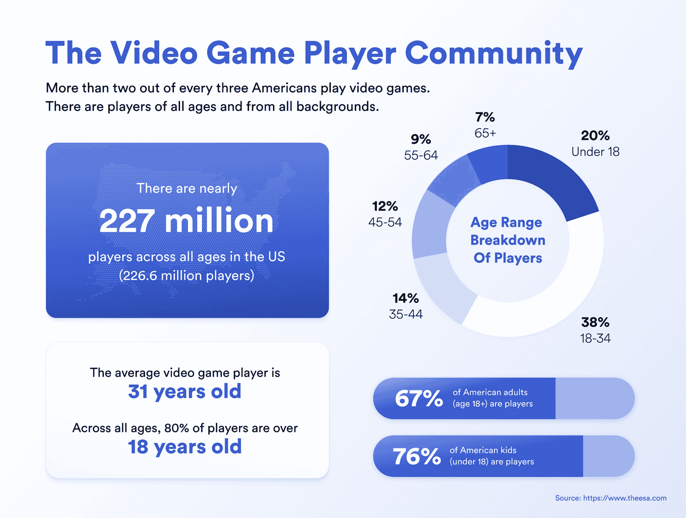
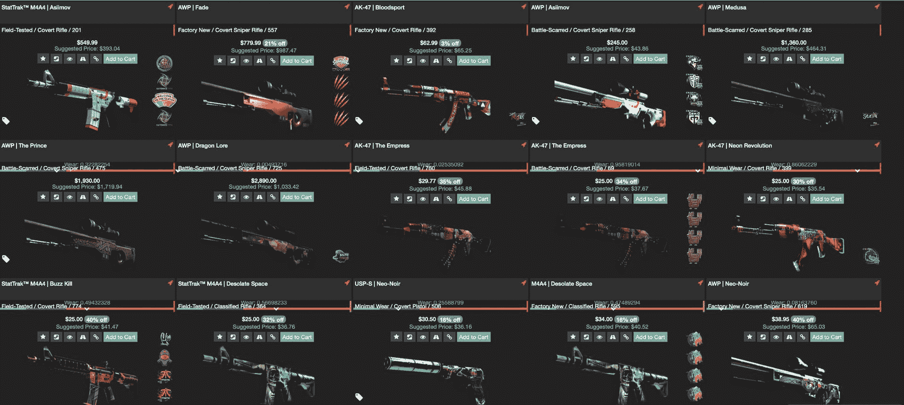
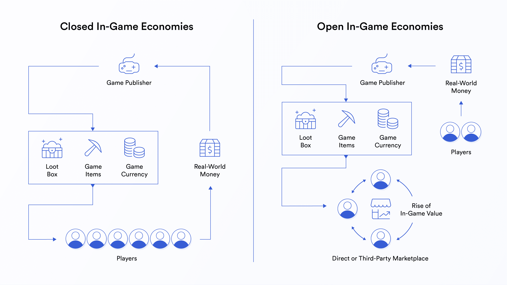
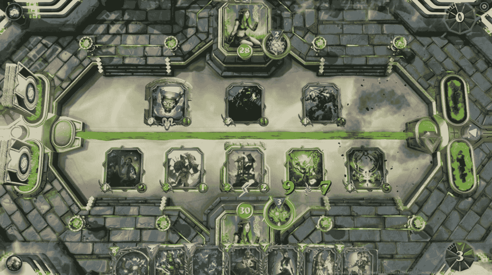
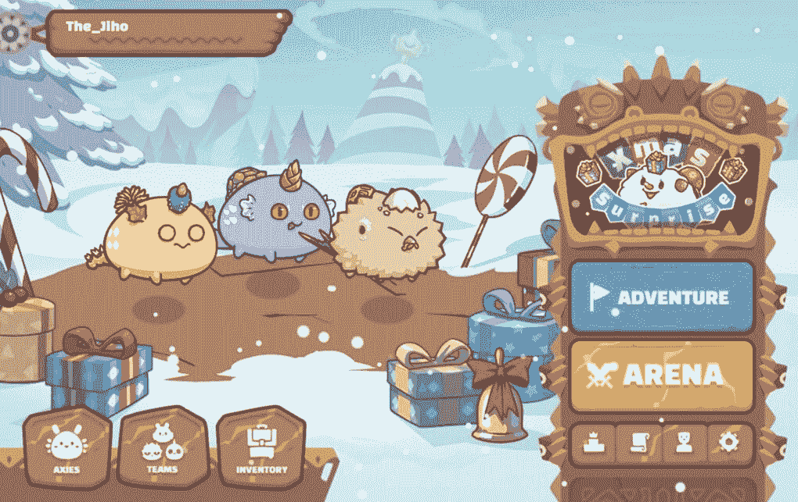
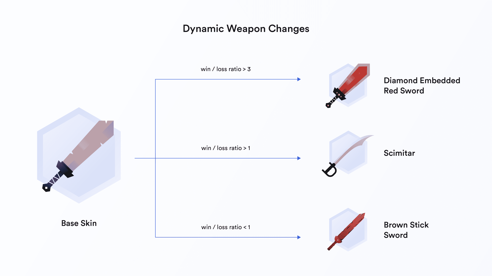
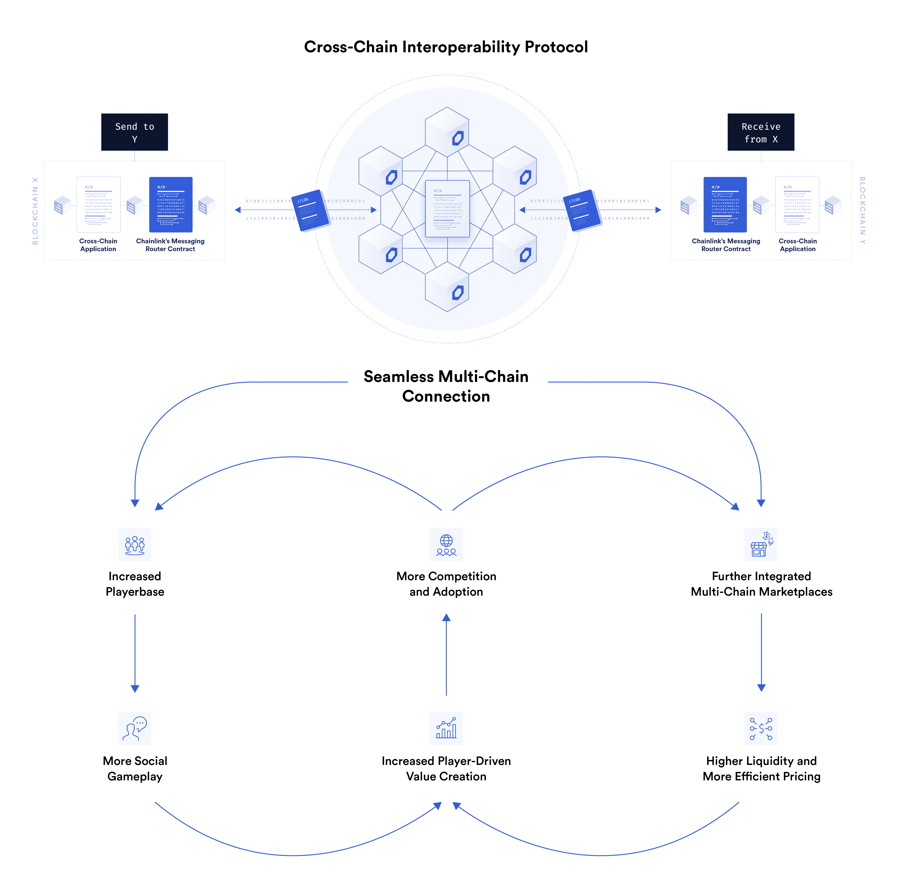

# 什么是玩赚？

> 原文：<https://blog.chain.link/what-is-play-to-earn/>

视频游戏已经改变了整整一代人的娱乐偏好。自 1958 年引入双人网球以来，游戏风靡全球，像《英雄联盟》、《堡垒之夜》和《《我的世界》》这样的游戏有全球数百万玩家在玩。

2018 年， [路透社宣布](https://www.reuters.com/article/sponsored/popularity-of-gaming) 游戏在收入方面已经超过了电影、电视和音乐等其他娱乐媒体，并且这种快速增长没有任何放缓的迹象。娱乐软件协会(ESA)估计有 2 . 27 亿美国人玩电子游戏，约占全国人口的 66%。跨越无数类型和设备，视频游戏是文化和娱乐的巨大力量。

视频游戏开发人员已经构建了种类繁多的数字世界，部署了大量的游戏机制、视觉美学和叙事体验。无论是通过引人入胜的故事、像素级完美的游戏，还是基于技能的多人动态，视频游戏都为玩家提供了其他媒体难以复制的高度参与的互动体验。

在过去的几年里，一种新的游戏体验在区块链的生态系统中得到了发展，这种体验被称为“游戏赚钱”(P2E)。这种新兴的游戏类别提供了内置的游戏内货币和物品的所有权，通过加密货币和 [【不可替代代币】](https://chain.link/education/nfts) 实现，这些货币与更大的互联数字经济有着直接的联系，具有现实世界的价值。

本文探讨了这种从玩到赚游戏的根本性转变对区块链的影响，玩家投入游戏的时间、精力和金钱会得到切实的回报。

## 理解游戏价值

游戏内价值是指游戏内物品具有现实世界价值的现象。对于种类繁多的热门游戏来说，游戏内价值已经成为不可阻挡的趋势。事实上，传统的游戏经济模型已经证明，如果有合适的背景和环境，玩家会集体赋予视频游戏的内容价值，从游戏功能到功能性和纯粹装饰性的游戏内物品。

《反恐精英:全球攻势》(CS:GO)、《Valorant》、《魔兽世界》(World of Warcraft)、《Genshin Impact》等游戏中稀有游戏物品的强劲市场和不断增长的估值，展示了玩家在多种类型的各种视频游戏中创造价值的增长趋势。

CS:GO 是一款广受欢迎、竞争激烈的多人第一人称射击游戏。在传统模式中，玩家加入一个五人团队与另一个五人团队对抗。配备了一些可供所有玩家平等使用的精选项目，那些具有最佳游戏意识和瞄准精度的玩家将上升到排行榜的首位。

CS:中一些最有价值的化妆品皮肤可以在游戏外的市场上卖到数万美元。在游戏平台内，玩家还可以购买“箱子”，或战利品箱，分发各种随机的游戏内物品。这些物品纯粹是装饰性的，但稀有物品受到 CS:GO 玩家群体的高度重视。

其他视频游戏类型，如大型多人在线角色扮演游戏(MMORPGs ),提供给玩家游戏内优势的项目。这些游戏通常采用“付费赢”模式，其中花费最多金钱和时间的玩家拥有游戏中最强的属性或最强大的物品。

然而，与《CS:GO》不同的是，MMORPGs 在很大程度上缺乏与现实世界经济的正式联系——尽管它们通常既有强劲的游戏内市场，也有未经批准的市场，在那里游戏内的商品可以兑换成真实的货币。未经批准的交易很常见，玩家在游戏之外进行交流，以进行点对点交易或使用第三方网站，这有助于在未经游戏提供商批准的情况下进行交易。这可能会导致游戏中的惩罚，玩家通过参与这种行为来承担风险。然而，需求是存在的，许多参与者都参与了这些地下市场。

在像 Genshin Impact 这样的“gachapon 游戏”中，为了获得最好的物品和角色，游戏中的价值占了游戏开发商收入的相当大一部分，这种游戏激励玩家不断地在战利品盒上花费现实世界的钱。极受欢迎的 Genshin Impact 的 gachapon 模型导致这款游戏在第一年带来的收入超过了，展示了游戏内商品作为价值驱动因素的力量——即使对于没有内置玩家市场的游戏也是如此。

无论是当玩家在基于技能的 FPS 中消灭敌人时的酷酷的新皮肤，还是通过游戏中的 MMORPG 或加查邦战利品盒获得最强的物品，一个明确的事实是，这些游戏中物品的真正价值是由玩家创造和延续的。通过决定购买游戏中的物品或战利品盒，玩家以一种非常真实的方式赋予一个无形的数字物品价值。

## 是什么驱动了游戏价值？

对于非游戏玩家来说，游戏内价值的概念常常令人困惑。为什么玩家如此看重游戏内物品？

一个核心原因是同伴竞争、社交等社会动机构成了玩家玩电子游戏 [的很大一部分](http://www.arise.mae.usp.br/wp-content/uploads/2018/03/Videogame-uses-gratification-aula.pdf) 的动机，此外还有逃避现实、刺激等因素。玩家通常围绕游戏建立最能满足这些内在需求的社区，由内而外创造价值。

这可以通过传统体育运动如高尔夫球的例子来理解。在基本水平上，高尔夫可以单独进行。找一套球杆，找一门课程，你就可以开始了。这是单人高尔夫。

然而，单人高尔夫在多人模式中获得了额外的动力。和一群朋友一起，高尔夫成为一种竞争和社交体验。每一杆都要与其他杆进行比较，标准杆成为标准，技能等级也变得明显。朋友(或敌人)建立了，社会等级开始形成，游戏作为一种有意义的消磨时间的方式对玩家变得越来越重要。

高尔夫背景下的社会地位是通过球杆和服装等物品来体现的，这两种物品在价值上强调并超越了纯粹的实用性。在单人模式下，只有让球员击球更好、更有力或更准确的高尔夫球杆才是有价值的。现在，考虑到社会动态和竞争游戏的加入，这些高尔夫俱乐部甚至更有价值。在这种新的动态下，职业球员的签名 t 恤和帽子等商品成为一种地位形式，其社会和现实世界的价值越来越高。

这在 [热门职业竞技行业](https://cryptoslate.com/dez-bryant-to-launch-dynamic-nfts-that-track-players-stats-with-support-from-chainlink-data-feeds/) 中普遍得令人难以置信。从运动员赞助的鞋子到签名球衣和游戏中的设备，世界各地的粉丝都在这些收藏品中找到了价值，其中许多都没有实用价值。流行的视频游戏正经历着完全相同的效果，表现为游戏中有价值的物品和货币。

作为一个集体，玩家们涌向最适合他们需求的游戏，无论是娱乐还是社区。无论是提供一个有趣的竞争体验，提供一个受欢迎的分心，还是满足其他一些核心需求，游戏内的价值是通过结合游戏和玩家来建立的。通过在正确的环境中进行功能整合，玩家和游戏共同努力构建游戏价值的坚实基础。

然而，很少有游戏真正达到这种协同平衡。  

## 不平衡的权力动态:控制价值创造

在当前主流视频游戏行业的模式中，游戏内容由单一实体控制。这个实体拥有游戏的开发、对游戏的访问以及游戏固有的特性。这通常被称为集权——控制权集中在一个政党或一小组政党手中。

在这种情况下，从这些在线多人游戏中创造的游戏价值大部分由游戏开发商或发行商获得和调节，尽管在某些情况下，这些价值在有限的程度上是共享的。此外，对于所有在线多人游戏，对价值的控制是游戏开发者固有的权利。

### 封闭的经济和开放的市场

通过比较当今流行的两个多人视频游戏:Valorant 和 CS:GO，可以看到一个明显的例子。两者都是基于技能的 FPS 游戏，其中所有游戏内的物品都是纯粹的装饰，在游戏本身内没有任何效用。然而，由于许多开放的第三方市场提供商和出售物品的固有能力，CS:GO 玩家有更多的机会积累价值并从他们投入游戏的资源中受益。相比之下，Valorant 不允许游戏内物品的第三方市场。

在《CS:GO》中，精心设计的游戏机制、强大的竞技玩家社区和第三方推动的开放市场相结合，构建了巨大的游戏内价值。每一个游戏中的物品都有一个市场价格，玩家得到了物品所有权的实实在在的回报，游戏开发商也从玩家对游戏中物品的热情所带来的持续收入中获益。

开放市场的重要性怎么强调都不为过。在没有市场的封闭系统中，游戏中的价值仅限于特定游戏中物品的初始购买价格，如 gachapon games 的例子所示。一个类似的例子是，一家公司出售稀有贵重的鞋子，但完全禁止所有第三方交易。通过向自由市场开放这些项目，基于社区需求的强劲经济可以起到货币乘数的作用。游戏公司像以前一样指定一个固定的价格，但玩家现在可以在市场上出售它，以便来回交易多次。

<figcaption id="caption-attachment-3251" class="wp-caption-text">Open economies provide a foundation for catalyzing player-generated value from in-game goods.</figcaption>

Valorant 使用一个封闭的系统，商品完全与市场活动隔绝。交易、购买或销售的途径为零。玩家可以用真钱购买游戏积分，以获得只能在一个账户上获得的物品。不允许形成游戏内经济——机制不存在，除非游戏背后的实体构建了功能，否则它们也不可能存在。

从自由市场的角度来看，这限制了游戏价值的增长。所有 Valorant 物品都是静态定价的，游戏中的价值永远没有机会像在 CS:GO 市场中那样增长。无论物品多么稀有或有价值，玩家都没有办法在最初的物品发行的基础上建立并创建具有递增价值的物品层级，最终使玩家和游戏开发者都受益。

在今天的视频游戏行业中，视频游戏背后的中央实体可以取消玩家对某个物品的所有权，或者从一开始就决定禁止游戏中的物品交易，为自己获取最初的游戏价值，并消除玩家创造增长的潜力。虽然玩家在在线多人游戏中创造了大部分价值，但他们无法控制物品或游戏中货币的价值。

这就是加密货币和 NFT 在增加玩家控制和为所有视频游戏利益相关者建立公平竞争环境方面变得绝对重要的地方。在以主权物品所有权为特色的游戏中，重点不仅仅是玩家通过玩游戏赚钱的能力，而是通过无许可市场和可验证的数字资产所有权引领集体玩家自治——释放游戏内价值的无限潜力。

## 通过游戏赚钱建立玩家拥有的经济

许多基于区块链的新兴游戏正致力于通过 NFTs 为玩家提供游戏中物品的可验证的数字所有权，并通过代币将游戏中的货币与现实世界的市场联系起来。这些游戏能够通过无许可、玩家所有的经济为玩家提供公平、公正、切实有益的游戏体验。

通过区块链，游戏可以成为赚钱的游戏，玩家驱动的价值累积允许强劲、独特和正规经济的诞生。虽然从开发的角度来看，游戏元素可能仍然是集中的，但是 NFTs 形式的游戏内物品和玩家市场都是不允许的。在这些开放平台中，没有实体可以取消交易物品的能力或从玩家那里拿走游戏中的物品。

区块链和 NFTs 建立在透明、去中心化和集体决策的基础上，可以作为一个基础起点，让新游戏在铭记这些价值的基础上从头开始构建，或者让现有游戏开始走向一个更加平等和公平的系统，为真正的玩家拥有的游戏开辟机会。  

### 模拟例子:交易纸牌游戏

交易卡牌游戏(tcg)中可以找到一个可验证所有权的绝佳例子，比如口袋妖怪(Pokemon)和游戏王(Yugioh ),这些游戏中有价值的卡牌，可以在现实生活中相当于战利品的盒子中购买:卡牌包。购买这些包的玩家随机获得稀有卡片，并成为包中物品的唯一所有者和受益者。

随着 Pokemon、Yugioh 和类似游戏如《万智牌》的流行，游戏设计者和玩家都受益了。游戏设计者从第三方市场活动的最初销售和网络效应中获利，而玩家则受益于收到有出售或交易选择权的珍贵和稀有卡片。与大多数数字物品不同，从玩家购买随机卡片包的那一刻起，他们就拥有该物品的专属所有权，并有能力出售或交易该物品以获得实际价值。这种模式已经为万智牌发行商《海岸巫师》在 2021 年带来了行业领先的收入，并且在许多基于收藏的游戏中仍然保持着成功。

除了数字产品，NFT 提供了同样明确的所有权。通过使用区块链技术将游戏中的物品表现为 NFT，玩家能够从他们集体投入的金钱、时间和精力中获益。事实上，以区块链为基地的 tcg 已经存在，如 [【诸神被解放】](https://godsunchained.com/)[夹板王国](https://splinterlands.com/) 等游戏，并且更为玩家提供明确的卡牌所有权。 

在以区块链为基地、用 NFT 牌进行交易的纸牌游戏中，玩家不仅拥有游戏中资产的所有权，还能与更大的经济体直接联系起来。热情的社区成员能够创建具有强大流动性来源和市场定价的市场，最终催化游戏价值的上升。

### 区块链驱动的 MMORPGs

像 MMORPGs 这样以社交为重点的游戏类型可以从区块链技术的实施中获益匪浅。从历史上看，这些游戏通常都有自己强大的游戏内市场，玩家可以通过完成各种不同的游戏活动(如杀死怪物、清除地牢、完成任务等)来购买和出售游戏内货币。

狂热的 MMORPG 玩家通常全心全意地致力于提升他们的角色，但他们的努力只会在游戏中得到回报。然而，由于玩家对游戏的重视， [地下交易很常见](https://dl.acm.org/doi/pdf/10.1145/2018436.2018484) ，玩家在未经许可的市场上用现实世界的钱购买有价值的物品，因为没有正式的方法将游戏中的价值转移到现实世界的价值。

对于 MMORPG 玩家来说，一款基于区块链技术的游戏可以消除障碍，增加更多功能。游戏中的货币可以在全球市场上自由赚取和出售，让最好的玩家甚至可以通过玩游戏赚到可以维持生活的工资。无许可市场意味着，只要对这些数字商品有持续的需求，玩家在游戏中的物品，以 NFT 的形式，以及可替换的游戏内货币，将有一个确定的市场价值。  

### NFT 如何支持基于技能的游戏

技能型游戏的玩家也可以从 NFTs 中获益。纯粹装饰性的物品对其他玩家来说无疑是有价值的，更正式的市场和经济可以让这些游戏更上一层楼。

像 CS:GO 这样的游戏已经有了促进游戏内物品和外部世界交易的市场，可以从更低的费用和更友好的用户体验中受益。此外，在没有游戏开发公司参与的情况下，NFT 的所有权和转让也是可能的，这有助于建立基于可验证所有权的抵制审查的生态系统，如第三方市场和使用相同 NFT 的新产品。

## “玩赚”和区块链游戏的现状

在区块链的生态系统中，向以游戏挣钱的模式转变已经开始。在过去的一年里，一波兴起的“玩即赚”游戏变得越来越引人注目。在经济增长的背景下，最受欢迎的游戏是[【Axie Infinity】](https://axieinfinity.com/)，这是一款基于可爱的 NFT 战士 Axies 的交易和战斗游戏。

Axie Infinity 秉承区块链科技的核心价值观，旨在变得越来越分散。Axie Infinity 背后的实体 Sky Mavis 已经制定了通过其本地 AXS 治理令牌向 [社区治理](https://whitepaper.axieinfinity.com/d-a-o) 发展的计划。围绕 NFT 市场的未来、国库资金的流动以及向 Sky Mavis 员工支付报酬的重大决策将由基于链上治理的多数投票决定。

在这个系统中，随着更多的 AXS 代币交付给活跃的玩家，社区作为一个集体获得了越来越多的权力，将决策权交给了那些对游戏投入最多的人，并开创了玩家拥有游戏的理念。

在游戏层面上，玩家从公开市场购买 Axie 以组成 Axie 团队，然后可以在冒险模式下玩或与其他玩家对战。作为玩游戏的回报，玩家可以获得光滑的爱情魔药代币(SLP)，这是 ERC-20 代币，与底层以太坊网络和浪人侧链有内在联系。这些代币可以直接出售或用于繁殖 Axies，Axies 可以根据它们的统计数据和元游戏的当前状态出售。

<figcaption id="caption-attachment-4241" class="wp-caption-text">Once they own a team of three Axies, players can participate in both multiplayer and single-player gameplay to earn rewards.</figcaption>

  Axie Infinity 玩家因参与游戏而直接获得奖励，在游戏中获得每日 SLP 奖励。Axie NFTs 的可验证所有权意味着玩家可以从进入游戏的初始成本中保留一些价值，这些成本根据市场而波动。如果他们选择繁殖他们的 axe，他们可以出售或保留这些新的 axe，并根据 axe 的稀有性潜在获利。Axie Infinity 是目前在这个快速发展的行业中最广泛采用的即玩即赚游戏。事实上，在菲律宾的 [内有大量的人积极地玩](https://www.cnbc.com/2021/05/14/people-in-philippines-earn-cryptocurrency-playing-nft-video-game-axie-infinity.html) 游戏以换取金钱奖励。

各种各样的区块链项目已经提出了他们自己的游戏赚钱概念。交易卡牌战斗游戏，如《被解放的上帝》,允许玩家通过玩游戏赢得随机的数字卡牌包，从而绕过了对 SLP 等可替换代币的需求。然后，玩家可以在市场上出售有价值的 NFT 卡，为他们的时间和努力赢得奖励。

这就是为什么区块链博彩和玩游戏赚钱在很大程度上是同义词。几乎所有基于区块链的游戏都是为了赚钱，因为它们都提供游戏中物品和货币的可验证所有权，这些物品和货币具有现实世界的价值。任何类型的游戏都可以适应这种形式。Axie Infinity、Gods Unchained、My DeFi Pet 等游戏让世界第一次体验了“玩即赚”的游戏。

重要的是要记住，分散治理并不是一种保证。玩家必须明白，可核实的数字资产所有权只是拼图的一部分——在基本层面上，这些游戏让玩家能够进入开放的市场，并为游戏中的物品赋予现实世界的价值。当从游戏性和实用性的角度来控制这些游戏内资产时，区块链在文化和技术方面不仅为玩家所有的经济，也为促进真正的玩家所有的游戏的公共治理提供了一个良好的起点。

## Chainlink 在即玩即赚游戏经济中的作用

作为行业标准的去中心化甲骨文网络，[chain link](https://chain.link/)提供多种服务，进一步为游戏内价值创造提供一个公平、可靠、更具互动性的竞技场。

### 在区块链游戏中使用 Chainlink VRF

考虑一个 MMORPG，其中一个战利品箱有 0.001%的几率掉落游戏中迄今为止最强大的物品。如果玩家或游戏开发者可以操纵用于分发该物品的随机数生成器(RNG ),支撑强大社区和价值观的公平感将被破坏。

[【chain link 可验证随机函数(VRF)](https://docs.chain.link/docs/chainlink-vrf/) 为区块链游戏提供了一种防篡改和公开审计的随机形式，限制了任何实体操纵的可能性，并有助于确保打开战利品箱和获得极其罕见的 NFT 游戏物品的机会对所有参与者都是公平的。链式 VRF 离线生成随机数和加密证明，然后在消费应用程序接受随机数之前，在链上验证加密证明。通过使用这种机制，游戏平台可以变得更加公平，并保护它们的完整性。

<figcaption id="caption-attachment-2565" class="wp-caption-text">Gameplay aspects based upon RNG can benefit from transparent and auditable randomness.</figcaption>

[Axie Infinity 使用 Chainlink VRF](https://blog.chain.link/what-is-play-to-earn/) 向玩家提供可验证的保证，即原始 axis 的特性——通过不同的稀有性、实用性和合意性影响其现实世界的价值——是以可证明的随机方式产生的。

任何随机事件，即使对最终结果有很小的影响，如决定伤害输出的 RNG 和玩家间战斗的获胜者，都可以从 VRF 链结提供的透明随机性中受益。作为许多视频游戏的核心部分，防篡改和可验证的随机性对于公平和有趣的游戏来说是必要的——特别是在游戏赚钱的游戏中，一切都有有形的货币价值。

### 通过 Chainlink 数据源为游戏提供数据

区块链游戏可以使用[chain link Data Feeds](https://data.chain.link/)以动态 NFTs 的形式围绕游戏内物品建立社区，并根据现实事件创建独特的游戏内情境。

想象一款游戏，游戏中的物品会根据预设条件自动变化。例如，一个基本的装饰性武器皮肤会根据特定的游戏统计数据而变化，例如玩家进了多少个球，或者角色在使用基本武器时死亡的频率。

在这个例子中，武器皮肤的变化对于玩家的特定属性来说是完全独特的。玩家越是被打败，输的越多，皮肤就变得越不让人印象深刻，越没有价值。一个玩家获得的成功和胜利越多，它就变得越令人印象深刻，越有价值。Chainlink 数据馈送使链上 NFT 游戏资产可以很容易地连接到游戏的后端系统或网络，以一种防篡改、经济高效和透明的方式获取玩家信息。  

<figcaption id="caption-attachment-3254" class="wp-caption-text">Dynamic NFT items can change based on personalized player stats, building immersive and interactive experiences.</figcaption>

Chainlink 数据馈送还可用于让智能合约访问 NFT 估值数据，释放其他区块链的效用。例如，一个拥有 10，000 美元物品的玩家可以用它作为区块链 [分散金融(DeFi)](https://chain.link/education/defi) 贷款的抵押，这种方式完全可以防止篡改并实现自动化——这是当前视频游戏和游戏内物品永远不可能实现的。这里的一个例子是 JPEG'd，这是一个分散的借出协议，它在 Chainlink 数据馈送的支持下，通过底层 NFT 来制作本地 stablecoins [作为抵押。](https://chainlinktoday.com/jpegd-integrating-chainlink-oracles-to-bridge-the-gap-between-nfts-and-defi/)

### 可靠的自动化

任何成功的游戏都需要在所有功能上做到天衣无缝，玩家期望可靠性，以最大限度地提高游戏性能。区块链游戏开发者需要工具来帮助他们提高性能，克服区块链带来的一些限制，例如需要触发才能执行的智能合同。

[chain link Automation](https://chain.link/automation)可以为关键值支持功能提供可靠的自动化，例如确保游戏回合的开始和结束准时发生。如果根据特定的游戏结果来分配奖励，Chainlink Automation 可以自动触发智能合同来奖励各自的获胜者，从而进一步提高保持玩家参与的关键服务可靠性。

### 跨链游戏

即将发布的[【CCIP】](https://chain.link/cross-chain)】跨链互操作性协议是一种针对区块链互操作性的开源标准，它将通过允许这些游戏以无缝的方式在区块链各地桥接其数据和资产，释放利用 NFT、加密货币和社区治理的大型视频游戏的潜力。

从在各种区块链之间转移 NFT 游戏资产，在各种底层网络上的不同游戏之间桥接 NFT，到跨链同步游戏状态，以及促进跨链 NFT 市场，CCIP 有潜力使开发者和用户在多链环境中的居住变得更简单。

这有可能在良性循环中创造游戏内价值、竞争和采用的指数增长，区块链环境的互联使游戏发行商能够获得更大的玩家基础，这反过来又会导致更多的社会外部性，最终推动游戏内价值。类似地，由 CCIP 支撑的多链市场的出现可以允许更多的流动性和更好的项目定价，这也有助于更有效的游戏经济。

游戏价值的这种潜在增长可能会导致游戏发行商之间的竞争加剧，他们希望在不断扩大的市场中分得一杯羹，随着新游戏的推出，玩家会更多地采用新游戏。随着越来越多的游戏被开发出来，越来越多的玩家进入生态系统，社交游戏的增加和多链市场的扩张可以再次导致游戏内价值的进一步增加，从而延续这种采用的良性循环。

<figcaption id="caption-attachment-3255" class="wp-caption-text">A virtuous cycle of adoption given seamless cross-chain functionality.</figcaption>

## 从玩到赚的模式转变

玩即赚游戏的全部潜力尚未完全实现。用于点对点信息传输的社交媒体平台的流行见证了白手起家的影响者、音乐家和流媒体工具形成了基于数字广告、微支付和订阅模式的全新经济。同样，play to earn 有能力通过集体决策和可验证的数字资产所有权实现全新经济，从而改变视频游戏行业的游戏规则。

随着玩家能够分享他们游戏时间的价值，游戏赚钱的潜力是无限的，NFTs、加密货币和去中心化 oracle 网络是强大的工具，可以为这种新一代视频游戏提供更高的效率、机会和结构。

这些实施才刚刚开始。虽然不可能确切知道未来会是什么样子，但区块链技术的核心原则指向通过公平、所有权和向所有人开放的市场来增强游戏玩家的能力。

—

如果您想现在就开始构建一个区块链游戏应用程序，并且需要某种类型的外部数据或计算，请参考我们的 [文档](https://docs.chain.link/) ，在[Discord](https://discord.com/invite/aSK4zew)中询问一个技术问题，或者 [与我们的一位专家建立一个通话](https://chainlinkcommunity.typeform.com/to/OYQO67EF?page=homepage&typeform-source=blog.chain.link) 。有关 oracle 用例的更多信息，请查看我们的 [NFT 和区块链游戏网页](https://chain.link/use-cases/nfts-and-blockchain-games) 。

要了解 Chainlink 的最新动态，请访问 chain.link，订阅 [Chainlink 简讯](https://pages.chain.link/subscribe) ，并在[Twitter](https://twitter.com/chainlink?ref_src=twsrc%5Egoogle%7Ctwcamp%5Eserp%7Ctwgr%5Eauthor)、[YouTube](https://www.youtube.com/chainlink)和[Reddit](https://www.reddit.com/r/Chainlink/)上关注 Chainlink。