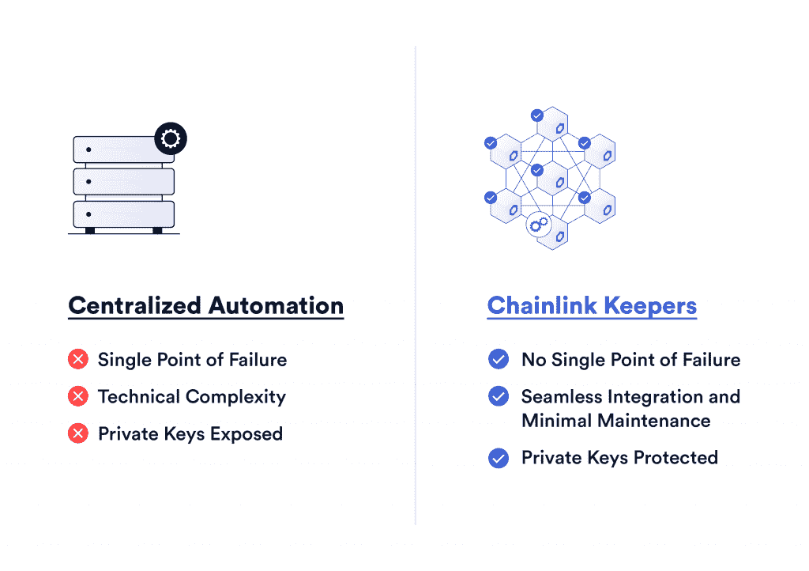
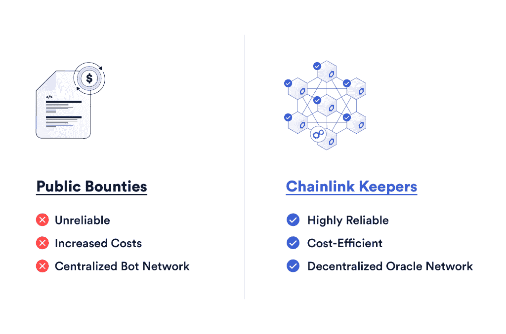
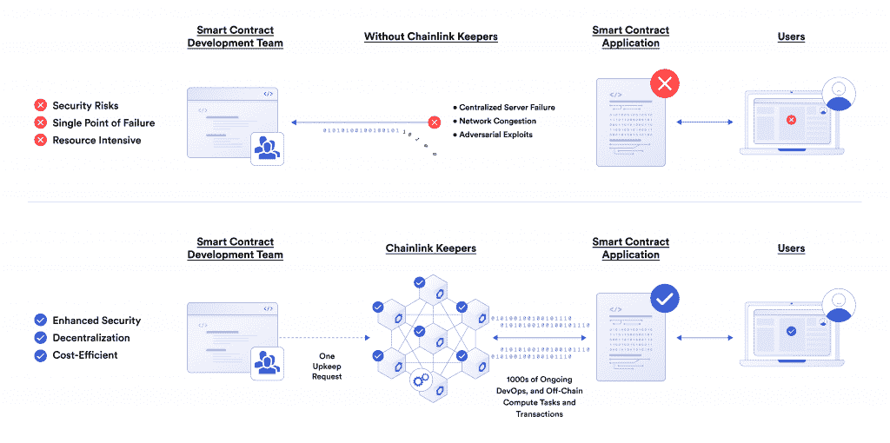

# 为什么 Web3 项目需要分散自动化

> 原文：<https://blog.chain.link/why-web3-projects-need-decentralized-automation/>

区块链生态系统已经从基于区块链的代币发展成为一系列由混合 [智能合约](https://chain.link/education/smart-contracts) 支持的高级分散式应用。然而，智能合约有一个关键问题:使 [【区块链】](https://blog.chain.link/what-is-blockchain/) 如此安全的闭环架构阻止了智能合约能够执行它们自己的功能，这意味着它们无法基于预定义的条件触发合约运行，例如代币达到特定价格、贷款变得抵押不足或仅仅是一天中的时间。如果没有智能合约自主执行的能力，许多高级用例仍然遥不可及。

为了解决这个问题，一些开发人员一直依赖于集中自动化解决方案，或者直接在他们的协议中建立激励机制，以鼓励外部拥有的帐户触发特定的功能。然而，这带来了一系列的风险，并破坏了最初使基于区块链的应用程序如此有价值的安全保证。例如，在第一个智能合同自动化解决方案之一的 [以太坊闹钟](https://ethereum-alarm-clock.readthedocs.io/en/latest/index.html) 中部署的激励系统，意味着可能根本不会执行【交易】。

值得庆幸的是，有一个高度安全的 [分散自动化](https://chain.link/keepers) 解决方案，开发人员可以使用它来自动触发智能合同，而无需部署集中式机器人或依赖奖金。[chain link Automation](https://chain.link/automation)使智能合约能够以高度可靠、经济高效、分散的方式自动触发，并且已经为数以万计的自动化交易提供了动力。

这使得自动化成为 Web3 基础设施的重要组成部分，因为它允许开发人员利用智能合同自动化来构建功能丰富的端到端完全分散的 dApps，帮助他们实现 [Web3](https://chain.link/education/web3) 的承诺。

## 使用集中式解决方案实现智能合同功能自动化的问题

自动化智能合约的集中式解决方案会给 dApps 带来一系列风险，并进一步减少智能合约开发人员已经有限的资源。

<figcaption id="caption-attachment-3749" class="wp-caption-text">Chainlink Automation provides several advantages over centralized solutions.</figcaption>

### 单点故障

自动化智能合同功能的集中式解决方案引入了单点故障，使得协议容易受到操纵和技术故障的影响。无论这些集中式自动化解决方案是依赖于在集中式服务器上运行的脚本，还是依赖于 DevOps 团队手动监控条件并调用链上合同，这些实践都会引入一个中心故障点，从而导致协议破产、交易失败和用户资金损失。本质上，集中式解决方案为智能合约引入了信任依赖元素，而智能合约完全缺乏智能合约所提供的安全性、可靠性和透明性保证。

除了安全问题之外，不一致的正常运行时间仍然是依赖集中式解决方案的开发运维团队持续关注的问题。例如，集中式云提供商多次出现离线，导致许多依赖其服务的 dapp[停机](https://www.businessinsider.in/investment/news/aws-outage-shows-that-dexs-arent-are-decentralised-as-expected/articleshow/88186644.cms) 。这影响了最终用户，因为他们无法与应用程序交互，最终损害了许多协议的声誉。

### 耗时

设置和运行集中式自动化解决方案比大多数人想象的要困难和耗时得多。例如，如果您正在使用基于云的作业调度器或 cron 作业智能契约等 Web2 技术构建一个集中式自动化解决方案，您将需要检查每个事务块、监听事件、考虑链中的重组、在令牌余额变低时发送警报等等。更不用说您还需要处理远程过程调用(RPC)无响应，这对于多链应用程序来说尤其具有挑战性。此外，多链应用程序可能需要为部署应用程序的每个链提供单独的自动化架构。

所有这些努力消耗了开发时间和资源，而这些时间和资源原本可以支持吸引更多用户的新功能的实现。

### 私钥暴露

对于智能合约开发人员来说，保护私钥至关重要。然而，当从集中式服务发起事务时，开发人员冒着暴露他们的私钥的风险。由于区块链确保只有私钥持有者才能访问存储在相应区块链地址的资金，这给协议库的安全性带来了很大的风险。

## 使用公共奖金实现智能合同自动化的问题

集中式自动化系统的一种替代方案是通过提供奖金将自主执行直接集成到协议中，奖金是分配给第一个在满足特定条件时调用链上功能的自动化机器人的财务奖励。

<figcaption id="caption-attachment-3750" class="wp-caption-text">Chainlink Automation is more reliable, cost-efficient, and decentralized than offering public bounties.</figcaption>

### 不可靠

平衡奖金激励结构对开发者来说尤其具有挑战性。如果你把奖金设置得太低，它将永远不会被调用，但是如果你把奖金设置得太高，你会破坏你的协议。

公共奖金没有为协议提供任何保证或承诺，即自动化机器人将持续运行，尤其是在最需要它们的时候。当市场极度波动或网络拥塞时，自动化机器人可能无法运行以避免支付高昂的天然气价格或耗尽资金——你的交易可能根本不会执行。

对于需要管理清算的 DeFi 协议来说，这一点尤为重要，因为自动化流程的失败会给他们留下抵押不足的贷款，从而导致破产和用户资金损失。

### 成本增加

提供自主奖励的方法的另一个问题是它增加了协议的运行成本。dApps 从他们的收入中支付奖金(即奖励)给首先调用该函数的人。随着自动化机器人在赢家通吃的竞争中结束并推动优先天然气拍卖(PGA)竞标战，这一成本随之增长。随着自动化机器人提高他们愿意支付的天然气价格，以便让矿工首先处理他们的交易并赢得奖金，总成本增加，因为大多数工作都包括基本成本加天然气费。

最终，这些成本落在最终用户身上，他们必须支付更高的费用。取而代之的是，协议可以使用链式自动化来在他们的协议和国库中保持更多的利润。

### 集中式 Bot 网络

随着时间的推移，对公共奖金的竞争可能会导致集中化，因为资金充足的行为者会长期提交极具竞争力的价格，赶走竞争对手，垄断市场。随着越来越少的自动化机器人监控和提交事务，dApps 的可靠性会大大降低。

## 开发人员选择 Chainlink Automation 的四个原因

Chainlink Automation 借助智能合约自动化，使开发人员能够解锁各种 [用例](https://blog.chain.link/smart-contract-automation-use-cases-powered-by-chainlink-keepers/) ，同时提供了优于上述替代方案的几个优势。

<figcaption id="caption-attachment-3751" class="wp-caption-text">Chainlink Automation offers enhanced security, decentralization, and cost-efficiency.</figcaption>

### 增强的安全性

Chainlink 节点以信任最小化的方式执行维护，让开发人员和用户相信，他们的智能合约将完全按照预期执行，不会受到任何外部实体的操纵。通过使用分散的基础设施，自动化有助于确保用户定义的服务协议在链上实施。

当节点自己签署链上事务时，自动执行是可能的，而不会在任何点暴露私钥。这增强了整个协议的安全性，因为它消除了集中式自动化解决方案的主要风险之一。

### 权力下放

自动化使用 Chainlink 的分散式 oracle 网络来执行维护，这意味着开发人员可以依赖相同的防 Sybil、防篡改节点，这些节点已经负责帮助保护 DeFi 数百亿美元的安全。由于每个链有多个自动化节点，并且循环节点选择过程提供了额外的冗余，自动化将继续保持完全去中心化。

### 效率提高

Chainlink Automation 有几个 gas 优化功能，包括一个旋转节点选择过程，这有助于防止 PGA 竞标战，并降低最终用户的成本。自动化还为 DevOps 团队节省了数百小时的工作，并提高了项目的效率。通过简单地插入具有自动化兼容合同的 Chainlink Automation 基础设施和 [注册维护](https://automation.chain.link/) ，开发人员可以放心，当满足预定义的条件时，他们的合同将继续执行。这最终使得更多的资源可用于开发和发展他们的协议。

### 可靠性和长期可持续性

Chainlink Automation 在网络极度拥堵和高油价时期继续提供分散式自动化，并且不受集中式解决方案失败的集中式基础设施中断的影响。即使在网络不稳定的情况下，自动化也会继续成功地触发清算，帮助维护协议的偿付能力，并为许多其他用例提供可靠的支持。

## Chainlink Automation 为构建功能丰富且安全的应用提供关键的分散式基础设施

通过去中心化实施的安全保障是智能合约的 [核心优势](https://blog.chain.link/what-crypto-is-really-about/) 之一。通过引入单点故障，集中式自动化解决方案破坏了这一关键优势:如果 dApp 可以由单个实体操纵，那么在 dApp 上获得数百万美元的意义何在？无论是直接的黑客攻击还是微妙的操纵，这些安全风险在 Web3 的核心基础设施中都没有位置。

Chainlink Automation 使开发人员能够构建自动化的 dApps，而不必依赖集中式服务器，使其成为 Web3 基础设施的核心部分。最终，Chainlink Automation 是实现 Web3 社区和最终用户所期望的高级、完全去中心化、信任最小化的 dApps 不可或缺的一部分。

要将自动化集成到您的 dApp 中，请查看如何开始使用 Chainlink Automation 或 [浏览文档](https://docs.chain.link/docs/chainlink-automation/introduction/) 。